# Cart and checkout audit — ZVY-55

The audit records **ten findings: eight confirmed issues (including one previously accepted accessibility exception) and two usability hypotheses**. Three are P1: losing the cart before payment verification, the hidden mobile delivery-picker exit, and discarded server validation feedback. Seven are P2. Proposed improvements await ZVY-57 screen review; this package changes documentation and local audit helpers only.

[ZVY-55](https://linear.app/zvychajna/issue/ZVY-55/audit-cart-and-checkout-on-desktop-and-mobile) · [Approved shared baseline — ZVY-52](https://linear.app/zvychajna/document/storefront-screen-baseline-zvy-52-desktop-and-mobile-015d372f40b2) · [Local shared reference](../storefront-baseline/REFERENCE.md) · [Evidence index](index.html) · [Discovery audit](../storefront-discovery/REPORT.md) · [Selection audit](../storefront-selection/REPORT.md).

Status: ready for owner completeness/correctness review and ZVY-56 consolidation. Owner review remains pending; publication and pipeline status are tracked on ZVY-55 and its pull request. ZVY-40 is planned payment-confirmation work, not an implemented success screen. This report observes the current handoff and does not present a mock return as payment success.

## Environment and evidence

Captured 2026-10-04 using the Codex in-app Chromium browser on Windows. Browser version is not exposed by its interface. These are responsive desktop-browser views, not real phones.

| View | Configured CSS viewport |
| --- | --- |
| Desktop | 1440 × 900 |
| Mobile | 390 × 844 |
| Narrow mobile | 360 × 844 |
| Reduced-height supplement | Each width above × 500 |

Frontend source base: `5373680bcb29b2b7a49a315897f9e6bc0d81653a`, updated `main`, branch `codex/zvy-55-cart-checkout-audit`. Node24.11.1, Next.js16.3.4, React19.2.8. Frontend `http://127.0.0.1:3100`, loopback audit API `http://127.0.0.1:4100`. Backend source was inspected for the validation contract but the backend was not run or modified.

Most evidence was captured in development mode. The development badge/error counter is tooling. Production-build checks separately confirmed cart/promo restoration after reload, corrected-field errors, narrow promo clipping and the mobile picker close-control behavior; production captures are marked in their setup. A development-only reload lost cart state, so restoration was retested in production and that development observation is excluded from defect findings.

The API double uses the frozen ZVY-52 catalog snapshot and checked-in image paths. Normal Звичайна prices are paper499 and electronic199 UAH. Controlled discount data uses paper399 and electronic149; the effective paper price was inspected in the cart and checkout, while the electronic149 variant is fixture coverage only. These values describe controlled evidence, not current stock/prices. Synthetic names and `audit55@example.invalid` were used. No real invoice, payment, database write, email, digital delivery or notification was triggered. The embedded public Nova Post picker contacts its provider.

The package has **35 desktop/mobile/narrow state comparisons, 105 original browser exports and 145 recorded checks**. Native image bytes are preserved. Some exports omit scrollbar space; `captures.json` records actual pixel dimensions, CSS viewport, UTC, route, setup, byte count and SHA256. Measurements use DOM CSS geometry with DPR approximately1, not screenshot pixels. `capture-journal.ndjson` preserves replacement history; the manifest uses the latest entry per original filename. Derived `paired/` and `qa/` images are review aids, not original captures. `upload-manifest.json` is a local inventory; nothing was uploaded.

## Exploratory journeys before structured review

| Journey | Observed outcome and limit | Check |
| --- | --- | --- |
| Desktop physical | Product → paper quantity2 → cart998 → blank validation → synthetic details → branch search. Later fresh picker opening loaded the branch list. No branch selection or physical invoice completed. | J-DESKTOP-PHYSICAL-VALIDATION; J-DESKTOP-DELIVERY-SEARCH |
| Mobile390 digital | Electronic199 → cart → names/email/note → one local invoice request → unverified loopback return. Cart was already cleared. | J-MOBILE-DIGITAL; J-MOBILE-DIGITAL-HANDOFF; invoice-evidence.json |
| Narrow360 mixed | Paper499 + electronic199 → separate format lines → cart → keyboard checkout; mixed blank validation later confirmed physical requirements. | J-NARROW-MIXED; SCR-05-mixed; EXPLORATORY-ORDER |

The first journeys preceded systematic cart, promo and form checks. Initial narrow-journey logging captured the cart just before the transition; subsequent checkout captures document the reached state. Browser click/resize timing was resolved through keyboard activation and is not reported as a storefront defect.

## Structured screen/state coverage

All named state groups have desktop1440, mobile390 and narrow360 originals and a paired comparison. Cart and checkout are overlays retaining the product route `/books/zvychajna`; they have no separate URL. The local handoff returns to `/?audit-handoff=unverified`.

| Area | Reviewed states and observable result |
| --- | --- |
| Empty and populated cart | Empty state and disabled checkout; paper, digital and mixed lines; format labels, images, unit prices and quantities. Paper increment/decrement respects minimum1; electronic has no quantity controls; remove actions and promo removal work. |
| Totals and price rules | Paper2 + electronic1 subtotal1197. AUDIT10 total1077 with per-unit whole-UAH rounding. PAPER10 total1097. ONE10 summary total1147 but line amounts sum1127: F-CHECK-010. Global FIXED50 total1147. AUDIT100 displays zero in cart and checkout. Controlled paper discount399 carries into checkout. |
| Promo interaction | Entry, invalid/expired-shaped404, successful apply/remove, restricted items, remaining-use response, fixed/percentage/100% discounts, loading and503 outage/retry. Invalid and service-failure feedback are indistinguishable: F-CHECK-008. Narrow input/action clipping: F-CHECK-003. |
| Customer and delivery | Physical/mixed checkout shows phone/branch; digital omits them. Required markers and labeled inputs; order summary and delivery note; picker search/list/desktop exit; mobile exit problem: F-CHECK-002. Actual shipping charging policy remains unknown: F-CHECK-007. |
| Notes | Optional note present for each format; browser clamps to500 characters at all widths; counter updates. Controlled request evidence and existing regression tests confirm trimming and omission when empty. |
| Client validation | Blank physical and digital submission gives field feedback without extra invoice requests. Errors have alert/description semantics. Corrected fields retain stale errors until resubmission: F-CHECK-004. |
| Server and request failure | Controlled500 and400 ProblemDetails preserve the form/cart and show the same generic retry toast. Field/item errors are discarded: F-CHECK-005. Retrying unchanged cannot resolve the deterministic400. |
| Pending and close/reopen | Submit disables and shows loading; reopening pending checkout resets fields while request remains active. Closing does not cancel the request; late success clears cart and navigates. One request recorded, no duplicate: F-CHECK-001/006. |
| Continuity and return | Cart/promo persist across production reload: paper399 ×2 =798, discount80, total718. Opening checkout resets its draft. Local unverified return has no success confirmation and an empty cart. Real payment cancellation/back/failed/pending/success recovery remains untested. |

Normal promo arithmetic is reported as observed frontend behavior, not verification of backend monetary allocation. Zero-total display does not prove the real backend's free-order shortcut. Restricted/limited-use fixture responses exercise the UI contract without consuming a real promotion. Initial picker no-results is not an outage finding: the list loaded on a later fresh opening.

## Accessibility and mobile checks

Keyboard-only cart/checkout entry, Tab/Shift+Tab wrapping and Escape/focus return were inspected at all three widths. Existing automated checks also cover named dialogs, field descriptions, validation announcements and keyboard purchase navigation. Invalid submission leaves focus on Submit; corrected fields remain `aria-invalid=true`, and wrapped labels include stale error text. No screen reader was run, so speech quality is unverified. Desktop picker Escape was checked from its host close control; keys inside the cross-origin provider were not verified.

Inputs use16px text and about42.7px height; labels16px. Delivery helper14.4px, note helper12.8px and counter10.7px. These smaller texts deserve readability review without a claim of a minimum-font-size violation. Enabled purchase controls have white on `#f09b30`, approximately2.23:1, below the normal-text4.5:1 criterion; orange totals on white have the same contrast. The existing owner-approved exception remains recorded, not changed. Authored translucent focus rings are present but faint (calculated approximately1.51:1 on white); this is not a full focus-indicator compliance assessment. Existing axe tests exclude color contrast. [WCAG contrast guidance](https://www.w3.org/WAI/WCAG22/Understanding/contrast-minimum.html), [non-text contrast guidance](https://www.w3.org/WAI/WCAG22/Understanding/non-text-contrast.html).

Measured mobile cart targets include quantity26×26, item removal24.6×35, close35.2×44 and checkout height48.3 CSS px. Promo removal is approximately21.9×28; assess spacing exceptions as well as dimensions before concluding compliance. Targets were inspected through DOM geometry and mouse/keyboard, not real touch. The WCAG2.2 minimum target criterion generally uses24×24 CSS px with exceptions; small targets should not automatically be called failures from dimensions alone. [Target-size guidance](https://www.w3.org/WAI/WCAG22/Understanding/target-size-minimum.html).

No general page overflow was observed in recorded normal cart/form layouts. At360 the promo action extends about9 CSS px beyond the cart and is clipped;390 and desktop fit. Reduced-height500px captures and focused-field checks exercise vertical scrolling only. They do **not** represent an actual mobile software keyboard, keyboard obstruction, Safari viewport behavior or touch scrolling.

A browser zoom shortcut was attempted, but measurements remained unchanged; verified200% text enlargement was unavailable. `TEXT-ENLARGEMENT-ATTEMPT` and `TEXT-ENLARGEMENT-LIMIT` record that limitation. No resize-text pass is claimed. [Resize-text guidance](https://www.w3.org/WAI/WCAG22/Understanding/resize-text.html).

## Explicitly untested boundaries

- Real Monobank redirect, successful/failed/pending payment, cancellation, browser-back return, receipts, digital fulfillment and free orders. The mock home return is an unverified handoff only.
- A completed physical invoice and selected branch. The browser interface rejected safe delivery of iframe selection/key actions; host exit/list display remain evidenced. No provider keyboard-trap assertion is made.
- Carrier tariff/payer, geolocation denial, genuine carrier outage or unavailable branch after selection.
- Real server availability changes, sold-out cart reconciliation and genuine promo expiry/exhaustion enforcement. The unavailable scenario is reproducible fixture support, not an additional captured stock journey.
- iOS/Android devices, Safari, actual touch, software keyboard, assistive-technology speech and confirmed200% text enlargement.
- Analytics/abandonment, user comprehension and conversion impact. Those implications remain hypotheses where appropriate.

## Reproduction and local verification

Run from the frontend repository root. Keep each server in its own terminal; use only the loopback API for this reproduction.

```powershell
node docs/storefront-checkout/capture-api.mjs
```

```powershell
$env:NEXT_PUBLIC_API_URL = 'http://127.0.0.1:4100'
$env:NEXT_PUBLIC_SITE_BASE = 'http://127.0.0.1:3100'
$env:REVALIDATION_SECRET = 'zvy55-local-capture'
$env:NEXT_TELEMETRY_DISABLED = '1'
npm.cmd run dev -- --hostname 127.0.0.1 --port 3100
```

Open `/books/zvychajna`, choose formats through the UI and use synthetic customer details. Change scenario with:

```powershell
Invoke-RestMethod -Method Post -Uri 'http://127.0.0.1:4100/__control/scenario' -ContentType 'application/json' -Body '{"scenario":"invoice-validation"}'
Invoke-RestMethod -Uri 'http://127.0.0.1:4100/__control/state'
```

Available scenarios: normal, discount, unavailable, invoice-error, invoice-validation, invoice-loading, promo-error, promo-loading. Scenario changes reset recorded request arrays; export state before switching if preserving requests. Delayed responses wait10seconds and retain their request-time scenario. The synthetic400 contains `Items[0].ProductId` and `Customer.Phone` errors; it deliberately rejects the fixture request and is not a claim about deployed rejection of valid customer data.

For changed product data, invalidate cache then reload before selecting products:

```powershell
Invoke-RestMethod -Method Post -Uri 'http://127.0.0.1:3100/api/revalidate' -Headers @{'x-revalidation-secret'='zvy55-local-capture'} -ContentType 'application/json' -Body '{"slug":"zvychajna"}'
```

For production confirmation, stop development, run `npm.cmd run build` with these same environment values, then `npm.cmd run start -- --hostname 127.0.0.1 --port 3100`. Populate cart/promo through the UI and reload. Existing audit captures are immutable evidence; recapturing requires adding corresponding journal/check metadata. Rebuild derived evidence with `node docs/storefront-checkout/assemble-reference.mjs`.

| Check | Result |
| --- | --- |
| Audit API fixture tests | `node --test docs/storefront-checkout/capture-api.test.mjs`: 4 passed; isolation, promo contract, invoice recording/outcomes, pending scenario continuity. |
| Existing product fixtures | `npm.cmd run test:fixtures`: 4 deterministic fixtures validated. Sandbox account lookup failed initially; rerun outside sandbox passed. |
| TypeScript | `npm.cmd run typecheck`: passed. |
| Lint | `npm.cmd run lint`: passed. Initial concurrent run collided with test-result cleanup; sequential rerun passed. |
| Production build | `npm.cmd run build` against loopback API: passed. Browser regression harness also built its local production app successfully. |
| Existing browser regressions | `npm.cmd run test:e2e -- accessibility keyboard-navigation purchase-flow checkout-money checkout-order-note --project=desktop-chromium`: 20 passed, exit0. Windows server cleanup required stopping only this run's mock/app processes after tests completed. These regression tests do not cover every new audit finding. |
| Evidence integrity/visual review | Assembly verifies hashes, export dimensions, all three widths and finding/check paths. Contact sheets and finding originals are reviewed for readable state/context. |
| Remote pipeline | No remote pipeline result is asserted by this report; consult the linked PR checks for publication-time status. Backend checks are out of scope because backend source is unchanged. |

## Acceptance criteria and handoff

| ZVY-55 criterion | Evidence and assessment |
| --- | --- |
| Desktop1440/mobile390/narrow360 and environment | Reviewed; dimensions, source base, runtime, browser limitations and105 originals recorded. |
| Exploratory journeys then structured state review | Reviewed; initial3 journeys and subsequent state matrix/check timestamps. Physical submission boundary explicitly untested. |
| Stable reproducible findings/hypotheses | Ten stable IDs with reproduction, expected/actual, impact, priority, classification and evidence. Two intentional-policy/usability questions remain hypotheses. |
| Relevant accessibility/mobile assessment with limits | Keyboard, focus, labels, readability/contrast, target geometry and overflow reviewed. Text enlargement and real-phone/iframe limits are explicit. |
| Linked issue/shared reference and consolidation | Local report/index linked from the shared REFERENCE.md and ZVY-55 ticket. Ready for ZVY-56; owner correctness review remains pending. |

Prioritize F-CHECK-001/002/005 in consolidation. Join handoff/recovery work with [ZVY-40](https://linear.app/zvychajna/issue/ZVY-40/add-payment-success-confirmation-pagepopup) and related F-BOOK findings; consolidate brand/focus exceptions with F-DISC/F-BOOK findings. F-CHECK-010 needs a limited-use mixed-cart display regression when an approved fix is implemented. Shipping disclosure and draft retention require owner policy decisions before design changes. Proposed fixes remain subject to ZVY-57 screen review.

Self-review: source and API evidence distinguish client validation from server rejection, correct total allocation from incorrect item display, invoice creation from payment verification, production persistence from development refresh behavior, and a loaded provider list from earlier no-results. All evidence remains local per the existing owner preference. UI/application behavior is unchanged.

## Files in this change

Modified: `docs/storefront-baseline/REFERENCE.md` links this audit into the shared local reference.

Added under `docs/storefront-checkout/`: REPORT.md (review/handoff); findings.json (stable findings); checks.json (145 observations); capture-journal.ndjson (capture history); capture-api.mjs and capture-api.test.mjs (controlled boundary and four tests); assemble-reference.mjs (integrity checks, comparisons/index); captures.json (105 native exports with hashes/dimensions); index.html (offline evidence viewer); upload-manifest.json (35 local comparison entries); invoice-evidence.json, invoice-evidence-after-validation.json, invoice-error-evidence.json, invoice-validation-evidence.json, invoice-loading-evidence.json and promo-outage-evidence.json (six controlled request records). Every original, paired comparison and QA contact sheet is listed in the generated inventory below. Runtime build/test outputs are ignored and not deliverables.

## Findings by screen

<!-- GENERATED-FINDINGS -->

### Payment handoff and recovery

#### F-CHECK-001 — Invoice handoff clears the cart before any payment is verified

**P1 · confirmed defect** · proposed; ZVY-57 screen review required

Screens: SCR-05-submitting, SCR-06-unverified-return, SCR-04-handoff-cleared. Routes: /books/zvychajna, /?audit-handoff=unverified. Devices: desktop 1440x900, mobile 390x844, narrow mobile 360x844. Scenario: normal / invoice-loading.

1. Add an electronic book and complete checkout with the synthetic audit customer.
2. Submit to the loopback invoice fixture, which returns an unverified redirect URL.
3. On the local home return, open the cart.
4. For the delay variant, close and reopen checkout while submission is pending; observe its late completion.

**Actual:** A successful invoice-creation response closes checkout and clears cart/promo before navigation. The unverified return shows an empty cart and no order/payment status. Closing pending checkout does not cancel its request; its late response still redirects and clears the cart. The production source performs clearCart before window.location.href; production refresh separately preserves a populated cart when there has been no handoff.

**Expected:** Keep enough order/cart context to recover from an unverified, failed or cancelled payment and reconcile the eventual outcome without presenting a false success state.

**Customer impact:** The customer loses selected items and discounts on an unverified return and must reconstruct the purchase to retry. Actual provider cancellation and resulting abandonment were not exercised or measured.

**Proposed improvement:** Review persistence of pending-order context and restoration/retry rules together with ZVY-40. Make the pending-request close behavior clear; distinguish verified success from other outcomes.

**Limits:** Confirmed loss of context at invoice handoff, not a claim of a real payment failure, provider UI test, receipt or fulfillment. The local fixture returns home and never confirms payment.

**Related findings and issues:** ZVY-40: planned payment confirmation; not implemented, F-BOOK-005: digital delivery explanation.

**Evidence:** [paired/SCR-04-handoff-cleared.jpg](paired/SCR-04-handoff-cleared.jpg) · [paired/SCR-06-unverified-return.jpg](paired/SCR-06-unverified-return.jpg) · [paired/SCR-05-submitting.jpg](paired/SCR-05-submitting.jpg) · `checks.json#J-MOBILE-DIGITAL-HANDOFF` · `checks.json#RETRY-HANDOFF-AFTER-CLOSE` · `checks.json#SUBMITTING-REOPEN` · [invoice-evidence.json](invoice-evidence.json) · [invoice-loading-evidence.json](invoice-loading-evidence.json) · [../../src/components/organisms/NavBar.tsx](../../src/components/organisms/NavBar.tsx)

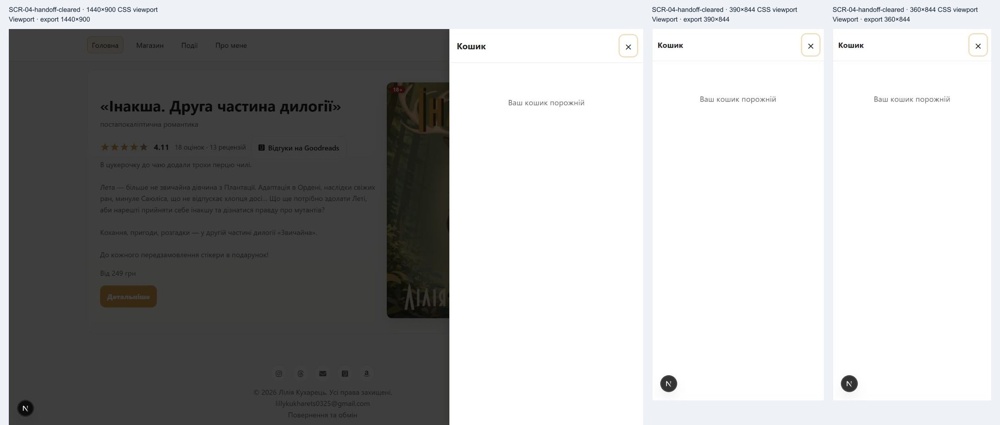


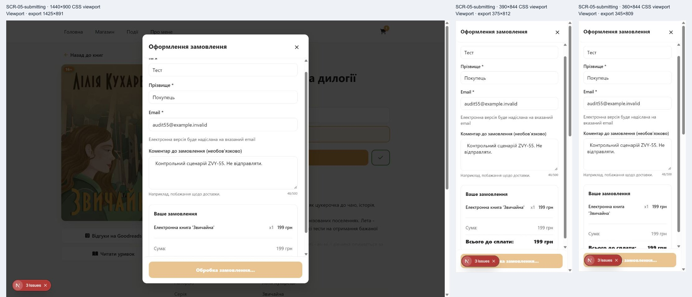

### Delivery selection and checkout continuity

#### F-CHECK-002 — Mobile delivery picker hides the host close control

**P1 · confirmed defect** · proposed; ZVY-57 screen review required

Screens: SCR-05-delivery-picker, SCR-05-delivery-picker-loaded, SCR-05-delivery-picker-production. Routes: /books/zvychajna. Devices: desktop 1440x900 (control comparison), mobile 390x844, narrow mobile 360x844. Scenario: physical checkout; live public Nova Post widget.

1. Open physical checkout and choose the delivery-branch field.
2. Compare the picker at desktop, mobile and narrow widths.
3. Inspect the loaded list or a search with no results and look for an exit without selecting a branch.

**Actual:** Desktop shows a named close button and Escape from the host close control returns to checkout. At both mobile widths the host header, title and close button are display:none and the widget fills the screen. The inspected provider list/search has no visible cancel/close action. Production captures confirm the hidden host control.

**Expected:** Provide a visible, accessible exit that returns to checkout without requiring branch selection or navigation away.

**Customer impact:** Customers who open the picker accidentally or cannot find a branch have no clear visible way back. Real-phone back-button and keyboard behavior remain unverified.

**Proposed improvement:** Review a persistent mobile close/back control and focus return, including no-results and provider-failure states.

**Limits:** The public branch list loaded on a later fresh opening; the earlier no-results search is not evidence of a provider outage. Branch selection and Escape inside the iframe could not be delivered safely by the browser tool, so a successful physical invoice journey and a keyboard trap inside the provider are not claimed.

**Related findings and issues:** none.

**Evidence:** [paired/SCR-05-delivery-picker-loaded.jpg](paired/SCR-05-delivery-picker-loaded.jpg) · [paired/SCR-05-delivery-picker-production.jpg](paired/SCR-05-delivery-picker-production.jpg) · `checks.json#J-NARROW-PICKER-RECOVERY` · `checks.json#PICKER-DESKTOP-ESCAPE` · `checks.json#DELIVERY-SELECTION-LIMIT` · [../../src/components/organisms/NovaPoshtaWidget.module.css](../../src/components/organisms/NovaPoshtaWidget.module.css)


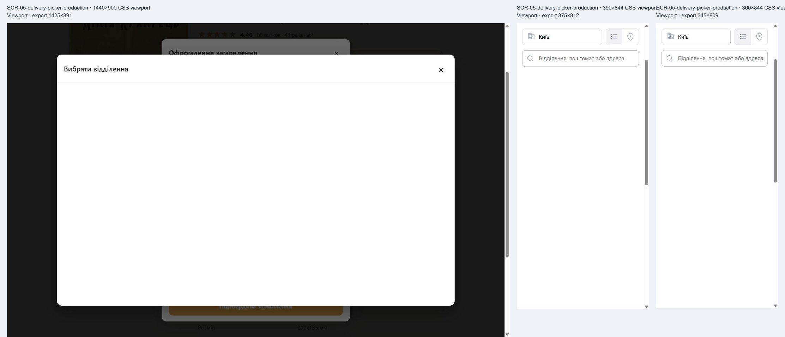

#### F-CHECK-006 — Returning to edit the cart resets all checkout details

**P2 · usability hypothesis** · proposed; ZVY-57 screen review required

Screens: SCR-05-corrected-errors, SCR-05-mixed-promo. Routes: /books/zvychajna. Devices: desktop 1440x900, mobile 390x844, narrow mobile 360x844. Scenario: normal; close and reopen checkout.

1. Enter customer details and an optional note.
2. Close checkout to return to the cart.
3. Open checkout again, optionally after editing a quantity or promo.

**Actual:** Every opening resets names, email, phone, selected branch, note, errors and touched state. The cart/promo survives the transition; there is no dedicated back-to-cart action in checkout. While submission is pending, reopening also resets the fields but keeps the submit button disabled until the original response resolves.

**Expected:** Support cart edits without unexpectedly losing the customer's current checkout draft, subject to an agreed privacy/reset policy.

**Customer impact:** Customers may have to re-enter details after correcting an order, increasing effort and possible mistakes. Resetting on open is deliberate in the source; actual abandonment and user expectations were not measured.

**Proposed improvement:** Review a back-to-cart action and draft continuity within a purchase session, with explicit reset/expiry behavior.

**Limits:** This is a usability proposal around an observed intentional reset, not a claim that a documented functional requirement was violated. No cross-device draft storage is proposed by this audit.

**Related findings and issues:** F-CHECK-001: pending request and recovery context.

**Evidence:** `checks.json#REOPEN-RESET-1440` · `checks.json#REOPEN-RESET-390` · `checks.json#REOPEN-RESET-360` · `checks.json#SUBMITTING-REOPEN` · [../../src/components/organisms/CheckoutForm.tsx](../../src/components/organisms/CheckoutForm.tsx)


#### F-CHECK-007 — The physical-order total does not explain delivery charges

**P2 · usability hypothesis** · proposed; ZVY-57 screen review required

Screens: SCR-05-paper, SCR-05-summary, SCR-05-mixed-promo. Routes: /books/zvychajna. Devices: desktop 1440x900, mobile 390x844, narrow mobile 360x844. Scenario: physical and mixed checkout.

1. Open a physical or mixed checkout.
2. Read the delivery note and scroll to the order summary.
3. Check what is included in 'Всього до сплати' and who pays delivery.

**Actual:** The form names Nova Post and asks for a branch. The summary labels the product sum minus discounts as the total payable but has no delivery-fee line or explanation of whether delivery is included or paid separately.

**Expected:** Customers can understand the scope of the displayed total and any delivery charges before committing.

**Customer impact:** Customers may interpret a product-only total as the full order cost and be surprised later. No shipping overcharge or measured misunderstanding was observed.

**Proposed improvement:** Confirm the actual delivery charging policy with the owner, then review a concise disclosure beside the physical-order total.

**Limits:** The carrier tariff, who pays it, and a completed physical purchase were not verified. This finding does not invent a shipping price or require a shipping calculator.

**Related findings and issues:** none.

**Evidence:** [paired/SCR-05-summary.jpg](paired/SCR-05-summary.jpg) · [paired/SCR-05-paper.jpg](paired/SCR-05-paper.jpg) · `checks.json#SCR-05-summary-390` · [../../src/components/organisms/CheckoutForm.tsx](../../src/components/organisms/CheckoutForm.tsx)

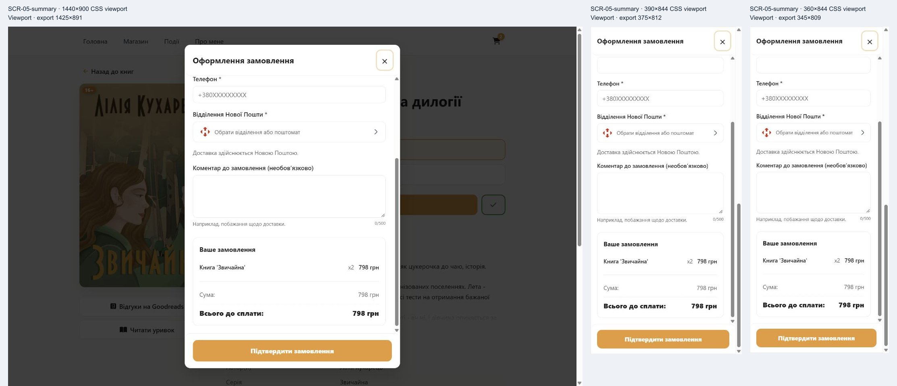

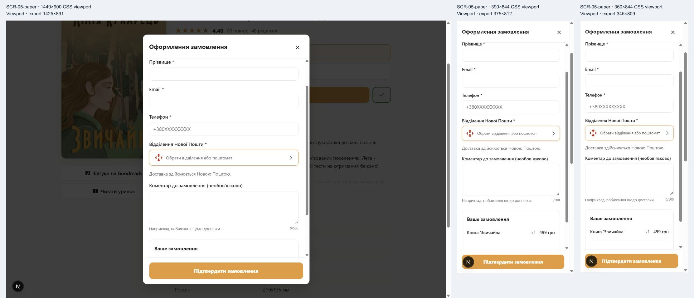

### Cart and promotions

#### F-CHECK-003 — The promo application button is clipped at 360 px

**P2 · confirmed defect** · proposed; ZVY-57 screen review required

Screens: SCR-04-promo-entry. Routes: /books/zvychajna. Devices: desktop 1440x900 (fits), mobile 390x844 (comparison), narrow mobile 360x844 (clipped). Scenario: normal and discount; no applied promo.

1. Open a populated cart with no applied promo.
2. Enter AUDIT10 without applying it.
3. At 360 px inspect the input/button row and compare it with 390 px and desktop.

**Actual:** At 360 px the apply button's right edge extends beyond the viewport and the cart clips its right side. The measured row overflow is about 9 CSS px. The input has a flexible width with an intrinsic minimum; the button retains its width/padding. Production reproduces the clipping. Keyboard Enter still applies the promo.

**Expected:** The complete input and application action fit in the visible cart at the supported narrow width.

**Customer impact:** The promo action is visually cut off and provides less visible target area on narrow screens. It did not block keyboard application; actual touch errors were not measured.

**Proposed improvement:** Review a shrinkable input or stacked narrow-screen promo row with a fully visible action.

**Limits:** Geometry is from DOM CSS measurements; exported screenshots can omit scrollbar space and must not be used directly as CSS measurements. No universal 390 px overflow defect is asserted.

**Related findings and issues:** none.

**Evidence:** [paired/SCR-04-promo-entry.jpg](paired/SCR-04-promo-entry.jpg) · `checks.json#SCR-04-promo-entry-360` · [../../src/components/organisms/ShoppingCart.module.css](../../src/components/organisms/ShoppingCart.module.css)

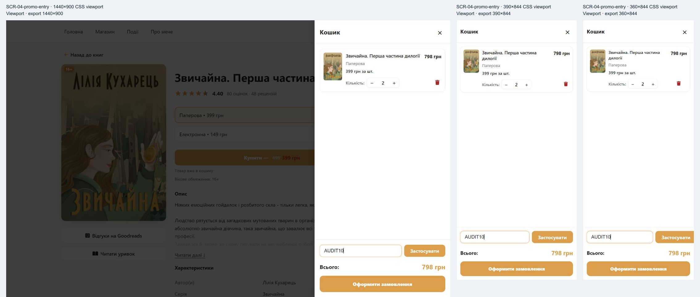

#### F-CHECK-008 — A promo-service outage is reported as an invalid code

**P2 · confirmed defect** · proposed; ZVY-57 screen review required

Screens: SCR-04-promo-invalid, SCR-04-promo-outage, SCR-04-promo-loading. Routes: /books/zvychajna. Devices: desktop 1440x900, mobile 390x844, narrow mobile 360x844. Scenario: promo-error / promo-loading / normal.

1. Enter the fixture's valid AUDIT10 code.
2. Set promo-error and apply it; the API returns503.
3. Compare the toast with rejection of INVALID.
4. Restore promo-loading/normal and apply AUDIT10 again.

**Actual:** HTTP503 and invalid-code HTTP404 both show 'Невірний або недійсний промокод'. The value remains editable. A recovered service accepts the unchanged code. Loading disables the apply button and displays a spinner.

**Expected:** Distinguish temporary validation-service failure from an invalid/expired code and offer a suitable retry.

**Customer impact:** Customers may abandon a valid discount or assume the promotion is unavailable, rather than retrying a temporary failure.

**Proposed improvement:** Review separate invalid-code and temporary-failure messages with retained input and clear retry behavior.

**Limits:** Confirmed using a controlled503; no production promo outage is claimed. Expiry/restriction enforcement in the real backend was not tested.

**Related findings and issues:** none.

**Evidence:** [paired/SCR-04-promo-outage.jpg](paired/SCR-04-promo-outage.jpg) · [paired/SCR-04-promo-invalid.jpg](paired/SCR-04-promo-invalid.jpg) · `checks.json#PROMO-OUTAGE-RECOVERED` · [promo-outage-evidence.json](promo-outage-evidence.json) · [../../src/components/organisms/ShoppingCart.tsx](../../src/components/organisms/ShoppingCart.tsx)

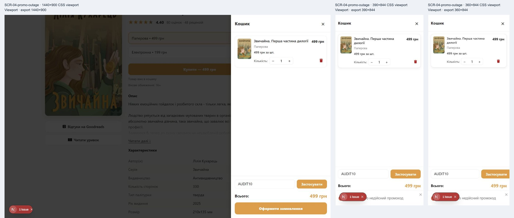

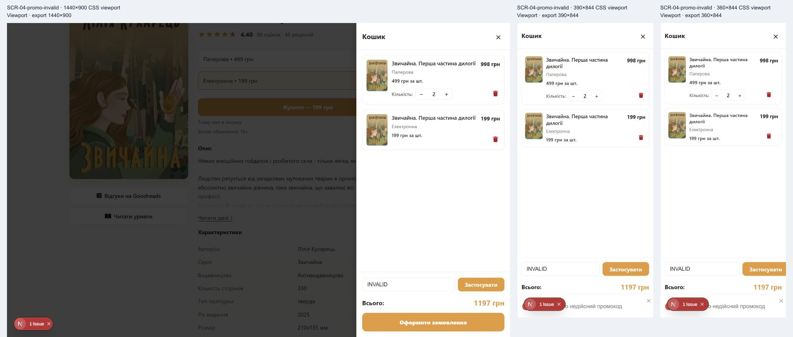

#### F-CHECK-010 — Limited-use promo item prices do not add up to the cart total

**P2 · confirmed defect** · proposed; ZVY-57 screen review required

Screens: SCR-04-promo-one10. Routes: /books/zvychajna. Devices: desktop 1440x900, mobile 390x844, narrow mobile 360x844. Scenario: normal; ONE10 with remainingUsages=1.

1. Add two paper copies at 499 UAH and one electronic copy at 199 UAH.
2. Apply the controlled ONE10 percentage promo with one remaining discounted unit.
3. Compare the displayed discounted item amounts with the discount summary and total.

**Actual:** The paper line shows 948 UAH and the electronic line shows 179 UAH, adding to 1127 UAH. The cart summary correctly allocates the single discount to one paper unit and shows discount50 and total1147. CartProvider passes an absent map entry as undefined for the electronic item; calculateItemDiscount defaults undefined to the full item quantity. The total calculation instead supplies zero for an absent entry.

**Expected:** All item-level discounts use the same eligible-unit allocation as the cart total. The electronic line remains199 and the displayed lines add to1147.

**Customer impact:** Customers see an apparent20 UAH discrepancy between discounted items and the amount payable, undermining confidence in the promotion and order total.

**Proposed improvement:** Review consistent item and total discount allocation, including eligible items with zero discounted units. Add a mixed-cart limited-use regression case when the approved fix is implemented.

**Limits:** The display defect is confirmed with a controlled API response matching the frontend promo contract and inspected source. No real limited-use promo was consumed, and no incorrect payment amount or backend allocation defect is claimed.

**Related findings and issues:** none.

**Evidence:** [paired/SCR-04-promo-one10.jpg](paired/SCR-04-promo-one10.jpg) · `checks.json#SCR-04-promo-one10-1440` · `checks.json#SCR-04-promo-one10-390` · `checks.json#SCR-04-promo-one10-360` · [../../src/components/molecules/CartProvider.tsx](../../src/components/molecules/CartProvider.tsx) · [../../src/lib/promocode.helper.ts](../../src/lib/promocode.helper.ts)


### Customer details and validation

#### F-CHECK-004 — Corrected fields keep stale error messages and invalid semantics

**P2 · confirmed defect** · proposed; ZVY-57 screen review required

Screens: SCR-05-validation, SCR-05-corrected-errors. Routes: /books/zvychajna. Devices: desktop 1440x900, mobile 390x844, narrow mobile 360x844. Scenario: normal; production confirmation with discount scenario.

1. Submit an empty physical checkout.
2. Fill valid first name, last name, email and phone.
3. Leave each field and inspect its message and aria-invalid state before submitting again.

**Actual:** All four corrected fields retain their old errors and aria-invalid=true after blur. Validation runs only on Submit, so another submission is required to clear them. Error text also becomes part of the input's wrapped-label accessible name. Invalid submission leaves focus on Submit rather than moving to the first invalid field. The corrected-error behavior also reproduces in production.

**Expected:** Corrected fields no longer report outdated failures; validation feedback helps the customer reach and resolve remaining errors.

**Customer impact:** The UI tells customers that correct entries are still invalid, creating uncertainty and extra attempts. Screen-reader speech and abandonment were not measured.

**Proposed improvement:** Review clearing/revalidating touched fields after changes and blur, separate label/error descriptions, and first-error focus or an error summary.

**Limits:** Client validation blocks blank invoice submission and error elements have role=alert and descriptions. This finding concerns stale feedback, not missing validation altogether. Actual assistive-technology output was not tested.

**Related findings and issues:** none.

**Evidence:** [paired/SCR-05-corrected-errors.jpg](paired/SCR-05-corrected-errors.jpg) · [paired/SCR-05-validation.jpg](paired/SCR-05-validation.jpg) · `checks.json#SCR-05-corrected-errors-390` · `checks.json#SCR-05-validation-360` · [../../src/components/organisms/CheckoutForm.tsx](../../src/components/organisms/CheckoutForm.tsx)

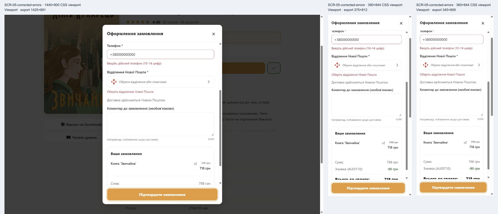

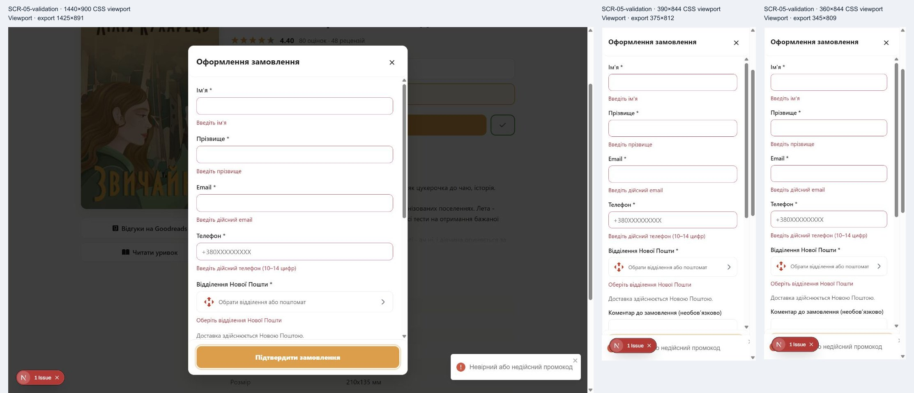

#### F-CHECK-005 — Checkout discards actionable server validation errors

**P1 · confirmed defect** · proposed; ZVY-57 screen review required

Screens: SCR-05-server-validation, SCR-05-invoice-error. Routes: /books/zvychajna. Devices: desktop 1440x900, mobile 390x844, narrow mobile 360x844. Scenario: invoice-validation / invoice-error.

1. Complete digital checkout with synthetic valid details.
2. Set the local API to invoice-validation and submit.
3. Compare the generic toast with the fixture's HTTP400 errors object.
4. Retry unchanged and compare the feedback with an HTTP500 submission failure.

**Actual:** HTTP400 ProblemDetails with item/field paths produces only 'Помилка при оформленні замовлення. Спробуйте ще раз.' Checkout does not display the specific rejection or associate it with a field/item. HTTP500 uses the same message. The form remains available but an unchanged retry of a deterministic rejection returns the same error.

**Expected:** Explain a correctable server rejection and identify the relevant field/offer; distinguish it from a transient service failure.

**Customer impact:** Customers receive a retry instruction without learning what must change, and can repeatedly submit an unrecoverable request.

**Proposed improvement:** Review mapping API validation paths to checkout fields and cart lines, preserving entered details and providing actionable recovery for unavailable offers.

**Limits:** The error values are controlled fixture data, not evidence that the backend rejects these synthetic valid customer values. Backend source confirms the ValidationProblemDetails path contract; its deployed validation/availability behavior was not exercised.

**Related findings and issues:** F-BOOK-002: unavailable suggestion enters cart.

**Evidence:** [paired/SCR-05-server-validation.jpg](paired/SCR-05-server-validation.jpg) · [paired/SCR-05-invoice-error.jpg](paired/SCR-05-invoice-error.jpg) · `checks.json#SCR-05-server-validation-1440` · [invoice-validation-evidence.json](invoice-validation-evidence.json) · [invoice-error-evidence.json](invoice-error-evidence.json) · [../../src/components/organisms/NavBar.tsx](../../src/components/organisms/NavBar.tsx) · [../../src/lib/api.helper.ts](../../src/lib/api.helper.ts)

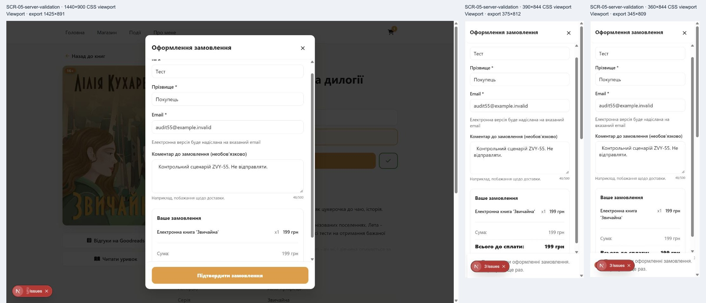

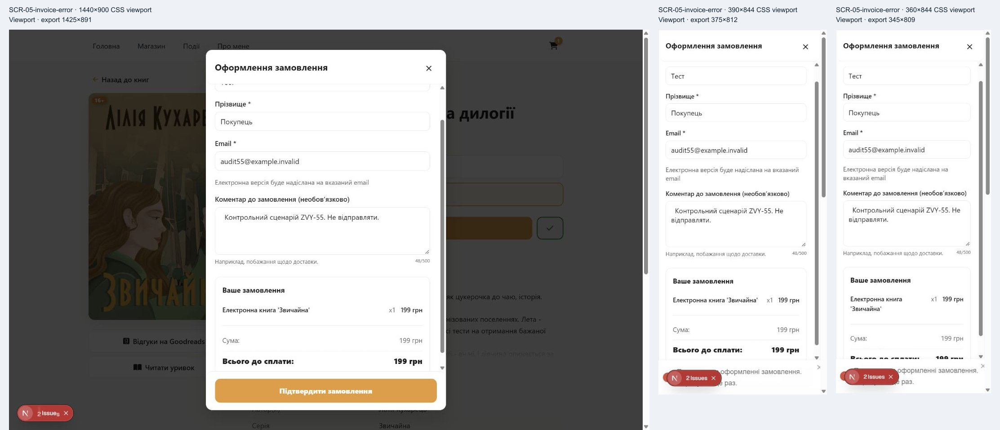

### Shared accessibility

#### F-CHECK-009 — Purchase actions retain the accepted low-contrast brand treatment

**P2 · confirmed defect; existing accepted accessibility exception** · accepted exception recorded; changes require owner screen review

Screens: SCR-04-paper, SCR-04-promo-entry, SCR-05-summary. Routes: /books/zvychajna. Devices: desktop 1440x900, mobile 390x844, narrow mobile 360x844. Scenario: enabled cart/checkout actions.

1. Inspect enabled checkout, submit and promo-apply actions at the recorded widths.
2. Read computed foreground/background colors and compare their contrast with the existing accessibility exception.

**Actual:** Enabled actions use white text on #f09b30, approximately2.23:1. The current submit text is16px on desktop and15.2px on mobile. Orange totals on white have the same ratio. Authored translucent focus rings are present but faint; their appearance also overlaps earlier audit findings. ACCESSIBILITY.md explicitly accepts the brand text-contrast exception, and existing axe tests skip color-contrast.

**Expected:** Readable action text and clearly visible focus indicators under the reviewed accessibility policy; acceptance of a product exception must not be reported as standards compliance.

**Customer impact:** Low-contrast purchase labels and totals may be hard to read for people with reduced contrast sensitivity or under glare. Actual impairment simulations and outdoor phone use were not tested.

**Proposed improvement:** Carry the accepted exception and affected checkout controls into consolidation; review any treatment change with the owner while preserving the established brand color unless separately approved.

**Limits:** The text-contrast shortfall is confirmed from computed colors, not JPEG sampling. The product owner previously accepted it; this audit does not authorize palette changes or claim a complete accessibility conformance assessment.

**Related findings and issues:** F-DISC-007, F-BOOK-007, F-DISC-008, F-BOOK-008.

**Evidence:** [paired/SCR-05-summary.jpg](paired/SCR-05-summary.jpg) · `checks.json#SCR-05-summary-390` · `checks.json#CONTRAST-CALCULATION` · [../../ACCESSIBILITY.md](../../ACCESSIBILITY.md)


## Generated evidence inventory

- [screenshots/SCR-04-digital-1440x900.jpg](screenshots/SCR-04-digital-1440x900.jpg)
- [screenshots/SCR-04-digital-360x844.jpg](screenshots/SCR-04-digital-360x844.jpg)
- [screenshots/SCR-04-digital-390x844.jpg](screenshots/SCR-04-digital-390x844.jpg)
- [screenshots/SCR-04-effective-discount-1440x900.jpg](screenshots/SCR-04-effective-discount-1440x900.jpg)
- [screenshots/SCR-04-effective-discount-360x844.jpg](screenshots/SCR-04-effective-discount-360x844.jpg)
- [screenshots/SCR-04-effective-discount-390x844.jpg](screenshots/SCR-04-effective-discount-390x844.jpg)
- [screenshots/SCR-04-empty-1440x900.jpg](screenshots/SCR-04-empty-1440x900.jpg)
- [screenshots/SCR-04-empty-360x844.jpg](screenshots/SCR-04-empty-360x844.jpg)
- [screenshots/SCR-04-empty-390x844.jpg](screenshots/SCR-04-empty-390x844.jpg)
- [screenshots/SCR-04-handoff-cleared-1440x900.jpg](screenshots/SCR-04-handoff-cleared-1440x900.jpg)
- [screenshots/SCR-04-handoff-cleared-360x844.jpg](screenshots/SCR-04-handoff-cleared-360x844.jpg)
- [screenshots/SCR-04-handoff-cleared-390x844.jpg](screenshots/SCR-04-handoff-cleared-390x844.jpg)
- [screenshots/SCR-04-mixed-quantity-1440x900.jpg](screenshots/SCR-04-mixed-quantity-1440x900.jpg)
- [screenshots/SCR-04-mixed-quantity-360x844.jpg](screenshots/SCR-04-mixed-quantity-360x844.jpg)
- [screenshots/SCR-04-mixed-quantity-390x844.jpg](screenshots/SCR-04-mixed-quantity-390x844.jpg)
- [screenshots/SCR-04-paper-1440x900.jpg](screenshots/SCR-04-paper-1440x900.jpg)
- [screenshots/SCR-04-paper-360x844.jpg](screenshots/SCR-04-paper-360x844.jpg)
- [screenshots/SCR-04-paper-390x844.jpg](screenshots/SCR-04-paper-390x844.jpg)
- [screenshots/SCR-04-persisted-production-1440x900.jpg](screenshots/SCR-04-persisted-production-1440x900.jpg)
- [screenshots/SCR-04-persisted-production-360x844.jpg](screenshots/SCR-04-persisted-production-360x844.jpg)
- [screenshots/SCR-04-persisted-production-390x844.jpg](screenshots/SCR-04-persisted-production-390x844.jpg)
- [screenshots/SCR-04-promo-applied-1440x900.jpg](screenshots/SCR-04-promo-applied-1440x900.jpg)
- [screenshots/SCR-04-promo-applied-360x844.jpg](screenshots/SCR-04-promo-applied-360x844.jpg)
- [screenshots/SCR-04-promo-applied-390x844.jpg](screenshots/SCR-04-promo-applied-390x844.jpg)
- [screenshots/SCR-04-promo-entry-1440x900.jpg](screenshots/SCR-04-promo-entry-1440x900.jpg)
- [screenshots/SCR-04-promo-entry-360x844.jpg](screenshots/SCR-04-promo-entry-360x844.jpg)
- [screenshots/SCR-04-promo-entry-390x844.jpg](screenshots/SCR-04-promo-entry-390x844.jpg)
- [screenshots/SCR-04-promo-fixed50-1440x900.jpg](screenshots/SCR-04-promo-fixed50-1440x900.jpg)
- [screenshots/SCR-04-promo-fixed50-360x844.jpg](screenshots/SCR-04-promo-fixed50-360x844.jpg)
- [screenshots/SCR-04-promo-fixed50-390x844.jpg](screenshots/SCR-04-promo-fixed50-390x844.jpg)
- [screenshots/SCR-04-promo-invalid-1440x900.jpg](screenshots/SCR-04-promo-invalid-1440x900.jpg)
- [screenshots/SCR-04-promo-invalid-360x844.jpg](screenshots/SCR-04-promo-invalid-360x844.jpg)
- [screenshots/SCR-04-promo-invalid-390x844.jpg](screenshots/SCR-04-promo-invalid-390x844.jpg)
- [screenshots/SCR-04-promo-loading-1440x900.jpg](screenshots/SCR-04-promo-loading-1440x900.jpg)
- [screenshots/SCR-04-promo-loading-360x844.jpg](screenshots/SCR-04-promo-loading-360x844.jpg)
- [screenshots/SCR-04-promo-loading-390x844.jpg](screenshots/SCR-04-promo-loading-390x844.jpg)
- [screenshots/SCR-04-promo-one10-1440x900.jpg](screenshots/SCR-04-promo-one10-1440x900.jpg)
- [screenshots/SCR-04-promo-one10-360x844.jpg](screenshots/SCR-04-promo-one10-360x844.jpg)
- [screenshots/SCR-04-promo-one10-390x844.jpg](screenshots/SCR-04-promo-one10-390x844.jpg)
- [screenshots/SCR-04-promo-outage-1440x900.jpg](screenshots/SCR-04-promo-outage-1440x900.jpg)
- [screenshots/SCR-04-promo-outage-360x844.jpg](screenshots/SCR-04-promo-outage-360x844.jpg)
- [screenshots/SCR-04-promo-outage-390x844.jpg](screenshots/SCR-04-promo-outage-390x844.jpg)
- [screenshots/SCR-04-promo-paper10-1440x900.jpg](screenshots/SCR-04-promo-paper10-1440x900.jpg)
- [screenshots/SCR-04-promo-paper10-360x844.jpg](screenshots/SCR-04-promo-paper10-360x844.jpg)
- [screenshots/SCR-04-promo-paper10-390x844.jpg](screenshots/SCR-04-promo-paper10-390x844.jpg)
- [screenshots/SCR-04-zero-total-1440x900.jpg](screenshots/SCR-04-zero-total-1440x900.jpg)
- [screenshots/SCR-04-zero-total-360x844.jpg](screenshots/SCR-04-zero-total-360x844.jpg)
- [screenshots/SCR-04-zero-total-390x844.jpg](screenshots/SCR-04-zero-total-390x844.jpg)
- [screenshots/SCR-05-corrected-errors-1440x900.jpg](screenshots/SCR-05-corrected-errors-1440x900.jpg)
- [screenshots/SCR-05-corrected-errors-360x844.jpg](screenshots/SCR-05-corrected-errors-360x844.jpg)
- [screenshots/SCR-05-corrected-errors-390x844.jpg](screenshots/SCR-05-corrected-errors-390x844.jpg)
- [screenshots/SCR-05-delivery-picker-1440x900.jpg](screenshots/SCR-05-delivery-picker-1440x900.jpg)
- [screenshots/SCR-05-delivery-picker-360x844.jpg](screenshots/SCR-05-delivery-picker-360x844.jpg)
- [screenshots/SCR-05-delivery-picker-390x844.jpg](screenshots/SCR-05-delivery-picker-390x844.jpg)
- [screenshots/SCR-05-delivery-picker-loaded-1440x900.jpg](screenshots/SCR-05-delivery-picker-loaded-1440x900.jpg)
- [screenshots/SCR-05-delivery-picker-loaded-360x844.jpg](screenshots/SCR-05-delivery-picker-loaded-360x844.jpg)
- [screenshots/SCR-05-delivery-picker-loaded-390x844.jpg](screenshots/SCR-05-delivery-picker-loaded-390x844.jpg)
- [screenshots/SCR-05-delivery-picker-production-1440x900.jpg](screenshots/SCR-05-delivery-picker-production-1440x900.jpg)
- [screenshots/SCR-05-delivery-picker-production-360x844.jpg](screenshots/SCR-05-delivery-picker-production-360x844.jpg)
- [screenshots/SCR-05-delivery-picker-production-390x844.jpg](screenshots/SCR-05-delivery-picker-production-390x844.jpg)
- [screenshots/SCR-05-digital-1440x900.jpg](screenshots/SCR-05-digital-1440x900.jpg)
- [screenshots/SCR-05-digital-360x844.jpg](screenshots/SCR-05-digital-360x844.jpg)
- [screenshots/SCR-05-digital-390x844.jpg](screenshots/SCR-05-digital-390x844.jpg)
- [screenshots/SCR-05-effective-discount-1440x900.jpg](screenshots/SCR-05-effective-discount-1440x900.jpg)
- [screenshots/SCR-05-effective-discount-360x844.jpg](screenshots/SCR-05-effective-discount-360x844.jpg)
- [screenshots/SCR-05-effective-discount-390x844.jpg](screenshots/SCR-05-effective-discount-390x844.jpg)
- [screenshots/SCR-05-invoice-error-1440x900.jpg](screenshots/SCR-05-invoice-error-1440x900.jpg)
- [screenshots/SCR-05-invoice-error-360x844.jpg](screenshots/SCR-05-invoice-error-360x844.jpg)
- [screenshots/SCR-05-invoice-error-390x844.jpg](screenshots/SCR-05-invoice-error-390x844.jpg)
- [screenshots/SCR-05-mixed-1440x900.jpg](screenshots/SCR-05-mixed-1440x900.jpg)
- [screenshots/SCR-05-mixed-360x844.jpg](screenshots/SCR-05-mixed-360x844.jpg)
- [screenshots/SCR-05-mixed-390x844.jpg](screenshots/SCR-05-mixed-390x844.jpg)
- [screenshots/SCR-05-mixed-promo-1440x900.jpg](screenshots/SCR-05-mixed-promo-1440x900.jpg)
- [screenshots/SCR-05-mixed-promo-360x844.jpg](screenshots/SCR-05-mixed-promo-360x844.jpg)
- [screenshots/SCR-05-mixed-promo-390x844.jpg](screenshots/SCR-05-mixed-promo-390x844.jpg)
- [screenshots/SCR-05-note-limit-1440x900.jpg](screenshots/SCR-05-note-limit-1440x900.jpg)
- [screenshots/SCR-05-note-limit-360x844.jpg](screenshots/SCR-05-note-limit-360x844.jpg)
- [screenshots/SCR-05-note-limit-390x844.jpg](screenshots/SCR-05-note-limit-390x844.jpg)
- [screenshots/SCR-05-paper-1440x900.jpg](screenshots/SCR-05-paper-1440x900.jpg)
- [screenshots/SCR-05-paper-360x844.jpg](screenshots/SCR-05-paper-360x844.jpg)
- [screenshots/SCR-05-paper-390x844.jpg](screenshots/SCR-05-paper-390x844.jpg)
- [screenshots/SCR-05-production-summary-1440x900.jpg](screenshots/SCR-05-production-summary-1440x900.jpg)
- [screenshots/SCR-05-production-summary-360x844.jpg](screenshots/SCR-05-production-summary-360x844.jpg)
- [screenshots/SCR-05-production-summary-390x844.jpg](screenshots/SCR-05-production-summary-390x844.jpg)
- [screenshots/SCR-05-server-validation-1440x900.jpg](screenshots/SCR-05-server-validation-1440x900.jpg)
- [screenshots/SCR-05-server-validation-360x844.jpg](screenshots/SCR-05-server-validation-360x844.jpg)
- [screenshots/SCR-05-server-validation-390x844.jpg](screenshots/SCR-05-server-validation-390x844.jpg)
- [screenshots/SCR-05-short-viewport-1440x500.jpg](screenshots/SCR-05-short-viewport-1440x500.jpg)
- [screenshots/SCR-05-short-viewport-360x500.jpg](screenshots/SCR-05-short-viewport-360x500.jpg)
- [screenshots/SCR-05-short-viewport-390x500.jpg](screenshots/SCR-05-short-viewport-390x500.jpg)
- [screenshots/SCR-05-submitting-1440x900.jpg](screenshots/SCR-05-submitting-1440x900.jpg)
- [screenshots/SCR-05-submitting-360x844.jpg](screenshots/SCR-05-submitting-360x844.jpg)
- [screenshots/SCR-05-submitting-390x844.jpg](screenshots/SCR-05-submitting-390x844.jpg)
- [screenshots/SCR-05-summary-1440x900.jpg](screenshots/SCR-05-summary-1440x900.jpg)
- [screenshots/SCR-05-summary-360x844.jpg](screenshots/SCR-05-summary-360x844.jpg)
- [screenshots/SCR-05-summary-390x844.jpg](screenshots/SCR-05-summary-390x844.jpg)
- [screenshots/SCR-05-validation-1440x900.jpg](screenshots/SCR-05-validation-1440x900.jpg)
- [screenshots/SCR-05-validation-360x844.jpg](screenshots/SCR-05-validation-360x844.jpg)
- [screenshots/SCR-05-validation-390x844.jpg](screenshots/SCR-05-validation-390x844.jpg)
- [screenshots/SCR-05-zero-total-1440x900.jpg](screenshots/SCR-05-zero-total-1440x900.jpg)
- [screenshots/SCR-05-zero-total-360x844.jpg](screenshots/SCR-05-zero-total-360x844.jpg)
- [screenshots/SCR-05-zero-total-390x844.jpg](screenshots/SCR-05-zero-total-390x844.jpg)
- [screenshots/SCR-06-unverified-return-1440x900.jpg](screenshots/SCR-06-unverified-return-1440x900.jpg)
- [screenshots/SCR-06-unverified-return-360x844.jpg](screenshots/SCR-06-unverified-return-360x844.jpg)
- [screenshots/SCR-06-unverified-return-390x844.jpg](screenshots/SCR-06-unverified-return-390x844.jpg)
- [paired/SCR-04-digital.jpg](paired/SCR-04-digital.jpg)
- [paired/SCR-04-effective-discount.jpg](paired/SCR-04-effective-discount.jpg)
- [paired/SCR-04-empty.jpg](paired/SCR-04-empty.jpg)
- [paired/SCR-04-handoff-cleared.jpg](paired/SCR-04-handoff-cleared.jpg)
- [paired/SCR-04-mixed-quantity.jpg](paired/SCR-04-mixed-quantity.jpg)
- [paired/SCR-04-paper.jpg](paired/SCR-04-paper.jpg)
- [paired/SCR-04-persisted-production.jpg](paired/SCR-04-persisted-production.jpg)
- [paired/SCR-04-promo-applied.jpg](paired/SCR-04-promo-applied.jpg)
- [paired/SCR-04-promo-entry.jpg](paired/SCR-04-promo-entry.jpg)
- [paired/SCR-04-promo-fixed50.jpg](paired/SCR-04-promo-fixed50.jpg)
- [paired/SCR-04-promo-invalid.jpg](paired/SCR-04-promo-invalid.jpg)
- [paired/SCR-04-promo-loading.jpg](paired/SCR-04-promo-loading.jpg)
- [paired/SCR-04-promo-one10.jpg](paired/SCR-04-promo-one10.jpg)
- [paired/SCR-04-promo-outage.jpg](paired/SCR-04-promo-outage.jpg)
- [paired/SCR-04-promo-paper10.jpg](paired/SCR-04-promo-paper10.jpg)
- [paired/SCR-04-zero-total.jpg](paired/SCR-04-zero-total.jpg)
- [paired/SCR-05-corrected-errors.jpg](paired/SCR-05-corrected-errors.jpg)
- [paired/SCR-05-delivery-picker.jpg](paired/SCR-05-delivery-picker.jpg)
- [paired/SCR-05-delivery-picker-loaded.jpg](paired/SCR-05-delivery-picker-loaded.jpg)
- [paired/SCR-05-delivery-picker-production.jpg](paired/SCR-05-delivery-picker-production.jpg)
- [paired/SCR-05-digital.jpg](paired/SCR-05-digital.jpg)
- [paired/SCR-05-effective-discount.jpg](paired/SCR-05-effective-discount.jpg)
- [paired/SCR-05-invoice-error.jpg](paired/SCR-05-invoice-error.jpg)
- [paired/SCR-05-mixed.jpg](paired/SCR-05-mixed.jpg)
- [paired/SCR-05-mixed-promo.jpg](paired/SCR-05-mixed-promo.jpg)
- [paired/SCR-05-note-limit.jpg](paired/SCR-05-note-limit.jpg)
- [paired/SCR-05-paper.jpg](paired/SCR-05-paper.jpg)
- [paired/SCR-05-production-summary.jpg](paired/SCR-05-production-summary.jpg)
- [paired/SCR-05-server-validation.jpg](paired/SCR-05-server-validation.jpg)
- [paired/SCR-05-short-viewport.jpg](paired/SCR-05-short-viewport.jpg)
- [paired/SCR-05-submitting.jpg](paired/SCR-05-submitting.jpg)
- [paired/SCR-05-summary.jpg](paired/SCR-05-summary.jpg)
- [paired/SCR-05-validation.jpg](paired/SCR-05-validation.jpg)
- [paired/SCR-05-zero-total.jpg](paired/SCR-05-zero-total.jpg)
- [paired/SCR-06-unverified-return.jpg](paired/SCR-06-unverified-return.jpg)
- [qa/contact-1.jpg](qa/contact-1.jpg)
- [qa/contact-2.jpg](qa/contact-2.jpg)
- [qa/contact-3.jpg](qa/contact-3.jpg)
- [qa/contact-4.jpg](qa/contact-4.jpg)
- [qa/contact-5.jpg](qa/contact-5.jpg)
- [qa/contact-6.jpg](qa/contact-6.jpg)
