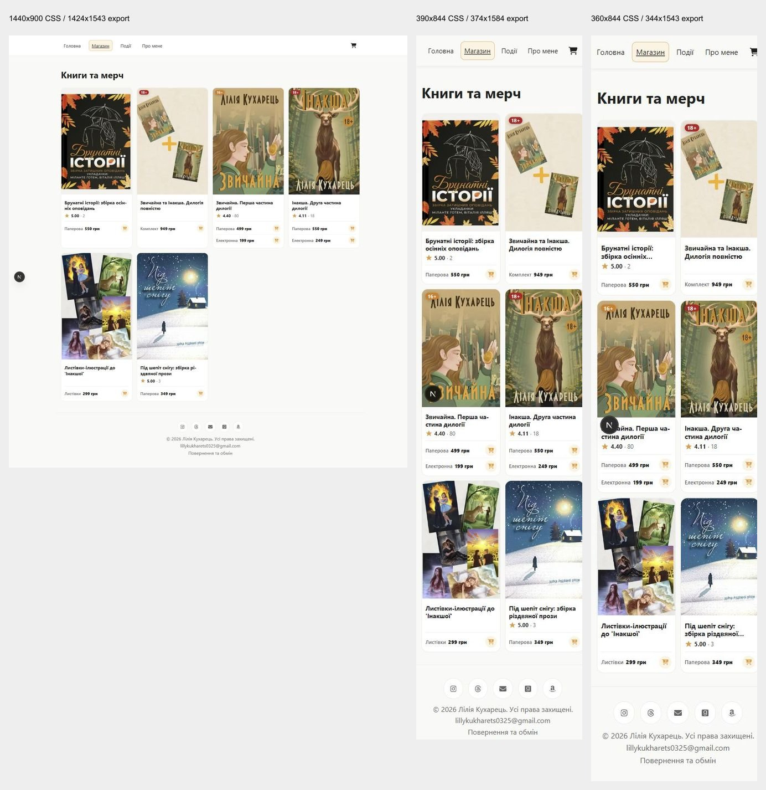
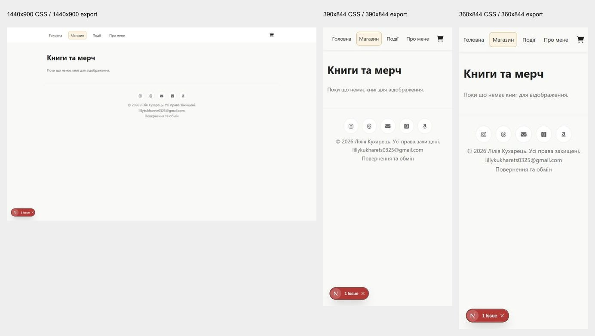

# Storefront discovery audit — ZVY-53

[Issue](https://linear.app/zvychajna/issue/ZVY-53/audit-storefront-discovery-on-desktop-and-mobile) · [Approved shared baseline — ZVY-52](https://linear.app/zvychajna/document/storefront-screen-baseline-zvy-52-desktop-and-mobile-015d372f40b2) · [Local baseline](../storefront-baseline/REFERENCE.md)

Audit date: **2026-10-04, Europe/Kyiv**. Review status: **self-reviewed for source/evidence consistency; accepted for completion by the owner; ready for ZVY-56 consolidation and screen review in ZVY-57**. The owner accepted the audit without an exhaustive manual review and authorized commit, PR and issue closure. Proposals have not been approved or implemented.

Discovery succeeds through the visible shop navigation and product cards at all three viewports. The highest-priority findings are misleading recovery during a catalog outage and missing availability/preorder disclosure on cards. Other findings cover narrow title clipping, dense mobile comparison, unknown-title browsing, featured-offer placement and accessibility debt. Eight stable findings are recorded: five confirmed defects/shortfalls (one already accepted contrast exception), and three usability hypotheses. No purchase blocker was observed in the tested discovery journeys.

## Environment and provenance

- Frontend branch: `codex/zvy-53-discovery-audit`, created from the locally checked-out approved ZVY-52 commit `5f918a2511ccccd8c200427f18a71fe044c61818`. Baseline PR #26 need not be merged to reproduce this audit. No backend files or application behavior were edited.
- Local frontend `http://127.0.0.1:3100`; loopback documentation API `http://127.0.0.1:4100`. Frozen catalog and local images from ZVY-52. No production stock assertions.
- Windows; Codex in-app Chromium browser. Browser version is not exposed. Node 24.11.1, Next.js 16.3.4 development runtime. Responsive desktop-browser views; no physical phones.
- Desktop **1440x900**, mobile **390x844**, narrow mobile **360x844** CSS viewports. DPR approximately 1. All captures record configured DOM dimensions, time, native export dimensions, bytes and SHA-256 in `captures.json`. Browser export surfaces can differ from the configured CSS viewport; scrollbars account for part of that difference. Native JPEG originals are preserved; exact CSS measurements come from DOM, not screenshot pixels.
- 35 original captures and 25 check records. Paired images place desktop/mobile/narrow together with labels. Resizing in paired/contact images is for review only; originals are authoritative. Full-page exports preserve sticky navigation at its capture scroll position; its position within a long image is a capture artifact, not a second navigation bar.
- Next development badges/issue counters are tooling, not customer-facing defects. The in-app browser does not expose touch-device emulation or browser zoom settings.
- Manual audit stopped at product discovery/entry/recovery. Existing regression tests use their separate deterministic fixtures and mock invoice; no real order, Monobank call, persistence or notification occurred.

## Journeys performed before the structured review

| Journey | Desktop 1440x900 | Mobile 390x844 | Narrow 360x844 |
| --- | --- | --- | --- |
| Known title: home -> shop -> Звичайна -> return | Completed; browser Back | Completed; Назад до книг | Completed; browser Back |
| Unknown title: browse and compare all six entries | Completed; subject context limited | Completed; lower cards require scrolling | Completed; collection titles clipped |
| Keyboard: catalog -> first collection -> details | Tab/Enter worked | Tab/Enter worked | Tab/Enter worked |
| Transition recovery: missing/failed product -> catalog | Explanation/actions inspected | Explanation/actions inspected | Explanation/actions inspected and return tested |

The first journey pass was followed by measurements, keyboard/focus checks and a screen/state checklist. Journey/check IDs are in `checks.json`. Manual recovery used the catalog link; successful product retry is additionally verified by the existing regression test.

## Structured screen/state coverage

| Screen/state | Desktop and mobile assessment | Result / disposition |
| --- | --- | --- |
| Home normal | Cover/title/description, minimum price, featured action, shop route, fixed navigation, overflow | Action works; mobile featured action below first viewport; F-DISC-006/007 |
| Home empty | Empty successful API response; surviving navigation/contact paths | Main is blank; recorded as distinct true-empty state |
| Home API offline | Cold load after invalidation | Blank main with no failure/retry explanation; F-DISC-001 |
| Catalog normal / long content | All six cards, titles, effective format prices, ratings, age cues, types, detail links | Formats/currency readable in normal captures; narrow titles clipped; F-DISC-003/004/005 |
| Catalog unavailable / preorder | Controlled unavailable flags and real snapshot preorder flag | Buttons disable correctly; explicit status disclosure absent; F-DISC-002 |
| Catalog empty | Successful `[]` response | Message present; no in-content next action. Consider with recovery review, not proof of outage |
| Catalog API offline | API process stopped, caches invalidated, reload | Same message as true empty; F-DISC-001 |
| Navigation/shared patterns | Named nav, current-page cue, Tab, skip link, focus, scroll, back orientation | Main links and cart reachable; mobile nav fixed; F-DISC-008 |
| Product transition | Correct title, price/format entry, Назад до книг | Works; full selection behavior belongs to ZVY-54 |
| Failed/missing product | Branded error/404, retry/catalog controls | Clear recovery; catalog return works; regression verifies retry |
| Search/filter/sort/no-results | Looked for controls and checked source | Not implemented; no-results search state unavailable, not falsely reported as a tested empty result |
| Open mobile menu | Inspected mobile navigation and source | No separate menu. Visible horizontal link strip; no open-menu capture applicable |
| Initial slow loading | Ordinary loads and source inspected | No distinct discovery skeleton observed; controlled slow SSR/refresh timing not verified |

## Accessibility and practical limits

- Keyboard: normal catalog links were reached by Tab and opened by Enter at all three widths. Skip link focused main at 360px. Home Tab sequence reached navigation, cart, ratings and Детальніше. No keyboard blocker observed in those paths. Named navigation, back links, product alternatives, format groups and quick-add labels were inspected. Disabled actions remain semantically disabled. A screen-reader reading session was not performed.
- Focus: rings are present and keyboard tests pass, but authored low-opacity rings remain below 3:1. F-DISC-008 is separate from the accepted CTA text palette exception.
- Contrast: white on accent = **2.23:1**; muted #666 on white = **5.74:1**. Card ring over white = **1.31:1**; nav ring over cream = **1.51:1**; cart ring over cream = **1.30:1**. DOM colors and alpha composition are recorded; antialiasing pixels were not sampled. [W3C text contrast](https://www.w3.org/WAI/WCAG22/Understanding/contrast-minimum.html) explains the 4.5:1 normal-text threshold; [W3C non-text contrast](https://www.w3.org/WAI/WCAG22/Understanding/non-text-contrast.html) explains 3:1 for visual control/state information.
- Targets/readability: 26px mobile quick-add targets exceed the [W3C 24px minimum](https://www.w3.org/WAI/WCAG22/Understanding/target-size-minimum.html). The small-text/touch concern is a usability hypothesis, not a claimed size violation. Real touch accuracy, hoverless operation and daylight readability remain unverified. Normal actions do not require hover in the inspected source; native browser click/keyboard interactions worked.
- Text enlargement: Ctrl+Plus and Ctrl+Equal were attempted; innerWidth, DPR and body font did not change. **200% text enlargement was not verified**. [W3C Resize Text](https://www.w3.org/WAI/WCAG22/Understanding/resize-text.html) requires assessment without loss of content/function; perform it in a browser with supported zoom/text settings before claiming compliance. Do not treat viewport resizing as text enlargement.
- Overflow/scroll: normal document width did not exceed the configured viewport. Mobile fixed navigation stayed available during scrolling; focused controls scrolled into view. At 360px the nav reports a few pixels of internal overflow and its right edge shares scrollbar space, but all controls were reachable. No real-phone conclusion follows. Complete product descriptions/galleries and every future title were outside discovery scope.
- Not tested: Safari/iOS/Android, physical touch or software keyboards, screen-reader speech/virtual cursor, 200% enlargement, forced colors, controlled slow loading, warm-cache outage/freshness timing, catalog HTTP 500 separately, external links/provider screens.

## Findings and priority conventions

P1: likely wrong availability/recovery expectations or abandonment. P2: comparison/accessibility friction. P3: minor polish. These are proposed audit priorities, not Linear issue priority values; consolidation may revise them with evidence. Confirmed means reproducible observed behavior with source/measurement support. Hypotheses make customer impact explicit and need customer validation.

| ID | Priority | Classification | Finding |
| --- | --- | --- | --- |
| F-DISC-001 | P1 | confirmed defect | Catalog outage is presented as empty stock; home loses its content |
| F-DISC-002 | P1 | confirmed defect | Catalog does not disclose preorder or unavailable status in text |
| F-DISC-003 | P2 | confirmed defect | Two-line card titles hide collection descriptions on narrow screens |
| F-DISC-004 | P2 | usability hypothesis | Compact mobile price rows and quick-add targets may hinder comparison |
| F-DISC-005 | P2 | usability hypothesis | Browsing without a title requires opening books to learn their subject |
| F-DISC-006 | P2 | usability hypothesis | Mobile home places the featured action below a long cover and description |
| F-DISC-007 | P2 | confirmed defect | Featured CTA retains the accepted low text-contrast exception |
| F-DISC-008 | P2 | confirmed defect | Authored focus rings have low contrast despite being present |

## Home — desktop and mobile together

### F-DISC-007 — Featured CTA retains the accepted low text-contrast exception

**P2 · confirmed defect · existing accepted exception; no change approved**

Screen/state: SCR-01-default. Route: `/`. Devices: desktop 1440x900; mobile 390x844; narrow mobile 360x844. Source: 5f918a2511ccccd8c200427f18a71fe044c61818.

Reproduce:

1. Locate Детальніше on home at each viewport.
2. Read computed foreground/background colors and compare their relative luminance.

**Actual:** White text on #f09b30 has approximately 2.23:1 contrast. The CTA label is 16px bold and does not qualify for the large-text exception. ACCESSIBILITY.md explicitly records the owner's acceptance of this palette risk; automated axe scans disable color-contrast.

**Expected:** Normal-size action text meets 4.5:1 contrast, or the existing accepted accessibility debt remains explicit in the screen decision.

**Customer impact:** Customers with reduced contrast sensitivity may have difficulty reading the featured action.

**Suggested improvement:** Carry the existing accepted exception into consolidation. Revisit text/background treatment only if the owner reopens the decision; preserve the current accent pending that review.

Evidence: [screenshots/SCR-01-default-1440x900.jpg](screenshots/SCR-01-default-1440x900.jpg) · [screenshots/SCR-01-default-390x844-full.jpg](screenshots/SCR-01-default-390x844-full.jpg) · [screenshots/SCR-01-cta-focus-360x844.jpg](screenshots/SCR-01-cta-focus-360x844.jpg) · [checks.json#HOME-LAYOUT](checks.json) · [../../ACCESSIBILITY.md](../../ACCESSIBILITY.md). For JSON evidence, the suffix identifies the record ID rather than an HTML anchor.

**Limits:** Confirmed color contrast, not a claim about any particular user's visual acuity, display or lighting. Disabled controls are exempt and were not counted as failures.

### F-DISC-006 — Mobile home places the featured action below a long cover and description

**P2 · usability hypothesis · proposed; screen review required**

Screen/state: SCR-01-default. Route: `/`. Devices: mobile 390x844; narrow mobile 360x844; desktop 1440x900 compared. Source: 5f918a2511ccccd8c200427f18a71fe044c61818.

Reproduce:

1. Open home at 390x844 or 360x844 with the normal catalog snapshot.
2. Locate the featured title, starting price and Детальніше action by scrolling.
3. Compare the first viewport with desktop and open the featured book.

**Actual:** The mobile cover precedes the copy, followed by the full featured description. Детальніше begins around document y=1247px at 390px and y=1244px at 360px, below the 844px viewport; desktop places it around y=583px. 'Від 249 грн' does not name the electronic edition that supplies the minimum price; detail selection initially shows paper at 550 грн. Shop navigation remains visible at the top.

**Expected:** The featured offer and a clear next action are discoverable early, with the meaning of the starting price understandable.

**Customer impact:** Mobile customers may delay finding the featured action or assume the displayed minimum applies to the paper book. Actual confusion was not observed with users.

**Suggested improvement:** Review a compact initial mobile offer with an earlier details/shop action and a format-qualified starting price. Retain the description as supporting content.

Evidence: [screenshots/SCR-01-default-1440x900.jpg](screenshots/SCR-01-default-1440x900.jpg) · [screenshots/SCR-01-default-390x844-full.jpg](screenshots/SCR-01-default-390x844-full.jpg) · [screenshots/SCR-01-default-360x844-full.jpg](screenshots/SCR-01-default-360x844-full.jpg) · [checks.json#HOME-LAYOUT](checks.json) · [../storefront-baseline/REFERENCE.md#scr-03-sequel--sequel-product](../storefront-baseline/REFERENCE.md). For JSON evidence, the suffix identifies the record ID rather than an HTML anchor.

**Limits:** Vertical positions depend on this frozen featured description, fonts and browser scrollbar geometry. This is not proof of abandonment or a misleading-price defect.

### F-DISC-001 — Catalog outage is presented as empty stock; home loses its content

**P1 · confirmed defect · proposed; screen review required**

Screen/state: SCR-01-api-offline, SCR-02-api-offline. Route: `/`, `/books`. Devices: desktop 1440x900; mobile 390x844; narrow mobile 360x844. Source: 5f918a2511ccccd8c200427f18a71fe044c61818.

Reproduce:

1. Start the ZVY-52 loopback API and frontend with the documented capture settings.
2. Stop only the capture-api.mjs process listening on loopback port 4100.
3. Invalidate / and /books using the local revalidation endpoint.
4. Reload /books and then open /.

**Actual:** The catalog displays 'Поки що немає книг для відображення.' without an error or retry action. Home main is empty. The local server logged ECONNREFUSED 127.0.0.1:4100; both routes returned HTTP 200.

**Expected:** Distinguish unavailable catalog data from a successfully loaded empty catalog, preserve the page purpose, and offer recovery.

**Customer impact:** Customers may conclude that no books are sold, abandon discovery, or have no clear way to recover.

**Suggested improvement:** Review separate loading, empty and failure presentations with a retry action and useful navigation. Keep known data during refresh failures with an explicit freshness cue.

Evidence: [screenshots/SCR-02-api-offline-1440x900.jpg](screenshots/SCR-02-api-offline-1440x900.jpg) · [screenshots/SCR-02-api-offline-390x844.jpg](screenshots/SCR-02-api-offline-390x844.jpg) · [screenshots/SCR-02-api-offline-360x844.jpg](screenshots/SCR-02-api-offline-360x844.jpg) · [screenshots/SCR-01-api-offline-1440x900.jpg](screenshots/SCR-01-api-offline-1440x900.jpg) · [screenshots/SCR-01-api-offline-390x844.jpg](screenshots/SCR-01-api-offline-390x844.jpg) · [screenshots/SCR-01-api-offline-360x844.jpg](screenshots/SCR-01-api-offline-360x844.jpg) · [checks.json#CATALOG-OFFLINE](checks.json) · [checks.json#HOME-OFFLINE](checks.json) · [../../src/lib/api.ts](../../src/lib/api.ts) · [../../src/components/molecules/ProductsProvider.tsx](../../src/components/molecules/ProductsProvider.tsx). For JSON evidence, the suffix identifies the record ID rather than an HTML anchor.

**Limits:** Confirmed for a cold load after cache invalidation and a refused loopback connection. Warm-cache retention, HTTP 500 on the catalog endpoint and production outage timing were not separately reproduced.

## Catalog — desktop and mobile together

### F-DISC-002 — Catalog does not disclose preorder or unavailable status in text

**P1 · confirmed defect · proposed; screen review required**

Screen/state: SCR-02-default, SCR-02-unavailable, SCR-03-preorder. Route: `/books`, `/books/pid_shepit_snihu`. Devices: desktop 1440x900; mobile 390x844; narrow mobile 360x844. Source: 5f918a2511ccccd8c200427f18a71fe044c61818.

Reproduce:

1. In the normal snapshot, scroll to Під шепіт снігу in the catalog.
2. Inspect its price and quick-add label; open its detail page to compare the primary action.
3. Set the unavailable scenario, invalidate catalog data, reload and inspect the cards.

**Actual:** The preorder item has isAvailable=false and canPreorder=true but uses the same 'Додати в кошик' label and styling as in-stock items. Its details say 'Передзамовити — 349 грн'. Unavailable rows are faded with disabled quick-add buttons, while their labels still say 'Додати в кошик'; no visible status text explains why.

**Expected:** Customers can identify preorder and unavailable editions during comparison, before deciding to add or open them.

**Customer impact:** Customers may expect immediate availability from a preorder, or waste detail-page visits to understand faded controls.

**Suggested improvement:** Review explicit format-level status text and a preorder-specific action label. Reuse verified backend flags; do not infer delivery dates.

Evidence: [screenshots/SCR-02-default-1440x900-full.jpg](screenshots/SCR-02-default-1440x900-full.jpg) · [screenshots/SCR-02-default-390x844-full.jpg](screenshots/SCR-02-default-390x844-full.jpg) · [screenshots/SCR-02-default-360x844-full.jpg](screenshots/SCR-02-default-360x844-full.jpg) · [screenshots/SCR-02-unavailable-1440x900-full.jpg](screenshots/SCR-02-unavailable-1440x900-full.jpg) · [screenshots/SCR-02-unavailable-390x844-full.jpg](screenshots/SCR-02-unavailable-390x844-full.jpg) · [screenshots/SCR-02-unavailable-360x844-full.jpg](screenshots/SCR-02-unavailable-360x844-full.jpg) · [screenshots/SCR-03-preorder-entry-360x844.jpg](screenshots/SCR-03-preorder-entry-360x844.jpg) · [checks.json#PREORDER](checks.json) · [../storefront-baseline/catalog-snapshot.json](../storefront-baseline/catalog-snapshot.json) · [../../src/components/molecules/BookCard.tsx](../../src/components/molecules/BookCard.tsx). For JSON evidence, the suffix identifies the record ID rather than an HTML anchor.

**Limits:** Availability is the frozen approved snapshot or controlled flags, not current production stock. Shipping promises and subsequent cart disclosure belong to ZVY-54/55.

### F-DISC-003 — Two-line card titles hide collection descriptions on narrow screens

**P2 · confirmed defect · proposed; screen review required**

Screen/state: SCR-02-default. Route: `/books`. Devices: narrow mobile 360x844; desktop 1440x900 and mobile 390x844 compared. Source: 5f918a2511ccccd8c200427f18a71fe044c61818.

Reproduce:

1. Open the normal catalog at 360x844.
2. Read the first collection title and scroll to Під шепіт снігу.
3. Compare visible titles with the complete accessible labels or product headings.

**Actual:** Брунатні історії and Під шепіт снігу titles are clamped to two lines with ellipses. Measured title content is 51px tall within a 34px box. Full titles remain in the accessibility tree, but the visual list hides the collection description. Desktop titles fit in this snapshot.

**Expected:** The visible catalog identifies each book and its collection context without requiring a detail-page visit.

**Customer impact:** Customers comparing collections lose identifying information. The mismatch between visual and accessible titles complicates shared review.

**Suggested improvement:** Review wrapping complete titles or separating a short display title and meaningful subtitle. Preserve the full accessible product name.

Evidence: [screenshots/SCR-02-default-1440x900-full.jpg](screenshots/SCR-02-default-1440x900-full.jpg) · [screenshots/SCR-02-default-390x844-full.jpg](screenshots/SCR-02-default-390x844-full.jpg) · [screenshots/SCR-02-default-360x844-full.jpg](screenshots/SCR-02-default-360x844-full.jpg) · [screenshots/SCR-02-scrolled-360x844.jpg](screenshots/SCR-02-scrolled-360x844.jpg) · [checks.json#NARROW-CLIPPING-SCROLLED](checks.json) · [../../src/components/molecules/BookCard.module.css](../../src/components/molecules/BookCard.module.css). For JSON evidence, the suffix identifies the record ID rather than an HTML anchor.

**Limits:** Confirmed for the two current collection titles at 360px. More extreme future titles and enlarged-text behavior remain unverified.

### F-DISC-004 — Compact mobile price rows and quick-add targets may hinder comparison

**P2 · usability hypothesis · proposed; screen review required**

Screen/state: SCR-02-default. Route: `/books`. Devices: mobile 390x844; narrow mobile 360x844; desktop 1440x900 compared. Source: 5f918a2511ccccd8c200427f18a71fe044c61818.

Reproduce:

1. Browse the catalog at 390x844 and 360x844.
2. Compare paper/electronic rows for Звичайна and Інакша.
3. Measure the rendered price text and quick-add button bounds.

**Actual:** Mobile format/price text is 11.2 CSS px; titles are 13.76px. Quick-add buttons are 26x26px, compared with 28x28px on desktop. Complete currency labels remain visually readable in the captured normal state, despite minimal horizontal spare space.

**Expected:** Customers can comfortably compare formats and prices and reliably choose the intended format on a phone.

**Customer impact:** Small dense rows may require closer reading and increase touch mistakes. No user error rate was measured.

**Suggested improvement:** Review larger readable rows and more generous action targets; evaluate a single-column or less dense layout with representative customers.

Evidence: [screenshots/SCR-02-default-1440x900-full.jpg](screenshots/SCR-02-default-1440x900-full.jpg) · [screenshots/SCR-02-default-390x844-full.jpg](screenshots/SCR-02-default-390x844-full.jpg) · [screenshots/SCR-02-default-360x844-full.jpg](screenshots/SCR-02-default-360x844-full.jpg) · [checks.json#MOBILE-CATALOG](checks.json) · [checks.json#NARROW-CATALOG](checks.json). For JSON evidence, the suffix identifies the record ID rather than an HTML anchor.

**Limits:** 26px targets exceed the WCAG 2.2 24px minimum size. This is an ergonomic hypothesis, not a target-size violation. No physical phone, touch simulation or observed customer mistake is claimed.

### F-DISC-005 — Browsing without a title requires opening books to learn their subject

**P2 · usability hypothesis · proposed; screen review required**

Screen/state: SCR-02-default. Route: `/books`. Devices: desktop 1440x900; mobile 390x844; narrow mobile 360x844. Source: 5f918a2511ccccd8c200427f18a71fe044c61818.

Reproduce:

1. Enter the shop without a known title and compare all six entries.
2. Try to identify a romantic novel, story collection, bundle or merchandise from cards alone.
3. Look for search, filter, sort or descriptive discovery controls.

**Actual:** Cards show covers, titles, age badges where present, embedded ratings and format prices. Genres or short descriptions are absent; books, bundle and postcards share one grid. Search/filter/sort are not implemented. Titles and covers provide some context, and the six-item list can be scanned manually.

**Expected:** Customers can make an informed shortlist from the catalog with enough subject/type context.

**Customer impact:** Unknown-title browsing may require repeated detail-page visits. The small list may make search unnecessary; there is no evidence of a search-related blocker.

**Suggested improvement:** Review concise genre/type/series cues or book/merch grouping first. Add search or filters only if catalog size and customer evidence justify them.

Evidence: [screenshots/SCR-02-default-1440x900-full.jpg](screenshots/SCR-02-default-1440x900-full.jpg) · [screenshots/SCR-02-default-390x844-full.jpg](screenshots/SCR-02-default-390x844-full.jpg) · [screenshots/SCR-02-default-360x844-full.jpg](screenshots/SCR-02-default-360x844-full.jpg) · [checks.json#J-DESKTOP](checks.json) · [checks.json#J-MOBILE](checks.json) · [checks.json#J-NARROW](checks.json). For JSON evidence, the suffix identifies the record ID rather than an HTML anchor.

**Limits:** This is an expert walkthrough, not a usability study. No timed discovery task, demand for filtering, or abandonment rate was measured.

## Shared navigation and focus

### F-DISC-008 — Authored focus rings have low contrast despite being present

**P2 · confirmed defect · proposed; screen review required**

Screen/state: SCR-01-default, SCR-02-default. Route: `/`, `/books`. Devices: desktop 1440x900; mobile 390x844; narrow mobile 360x844. Source: 5f918a2511ccccd8c200427f18a71fe044c61818.

Reproduce:

1. Reload the catalog and use Tab to reach navigation, a card and quick-add controls.
2. Observe the focus outline and inspect its computed authored color.
3. Composite the rgba outline over the adjacent white/cream background and calculate contrast.

**Actual:** Navigation uses rgba(240,155,48,.55), while cards and quick-add use .35 and cart uses .35. These authored focus rings calculate below 3:1 against the adjacent light backgrounds. Keyboard operation succeeds and outlines are present; existence alone does not establish sufficient contrast.

**Expected:** The visual information identifying keyboard focus has at least 3:1 contrast against adjacent colors when author styled.

**Customer impact:** Customers relying on visible focus may struggle to locate their current control even though all inspected controls are keyboard reachable.

**Suggested improvement:** Review a contrasting focus outline independently of the accepted CTA text palette. Preserve focus indication on every navigation, card and quick-add action.

Evidence: [screenshots/SCR-02-card-focus-360x844.jpg](screenshots/SCR-02-card-focus-360x844.jpg) · [screenshots/SCR-02-skip-focus-360x844.jpg](screenshots/SCR-02-skip-focus-360x844.jpg) · [checks.json#KEYBOARD-NARROW](checks.json) · [checks.json#HOME-KEYBOARD](checks.json) · [checks.json#KEYBOARD-CATALOG-1440](checks.json) · [checks.json#KEYBOARD-CATALOG-390](checks.json) · [checks.json#KEYBOARD-CATALOG-360](checks.json) · [../../src/components/organisms/NavBar.module.css](../../src/components/organisms/NavBar.module.css) · [../../src/components/molecules/BookCard.module.css](../../src/components/molecules/BookCard.module.css). For JSON evidence, the suffix identifies the record ID rather than an HTML anchor.

**Limits:** The calculation applies to authored rings only, not the browser's default focus indicator. The existing keyboard tests check for an outline/shadow but do not check its contrast.

## Evidence inventory

| Screen/state | Desktop original | Mobile original | Narrow original |
| --- | --- | --- | --- |
| SCR-01-default | [1440x900](screenshots/SCR-01-default-1440x900.jpg) | [390x844](screenshots/SCR-01-default-390x844-full.jpg) | [360x844](screenshots/SCR-01-default-360x844-full.jpg) |
| SCR-02-default | [1440x900](screenshots/SCR-02-default-1440x900-full.jpg) | [390x844](screenshots/SCR-02-default-390x844-full.jpg) | [360x844](screenshots/SCR-02-default-360x844-full.jpg) |
| SCR-03-entry | [1440x900](screenshots/SCR-03-entry-1440x900.jpg) | [390x844](screenshots/SCR-03-entry-390x844.jpg) | [360x844](screenshots/SCR-03-entry-360x844.jpg) |
| SCR-02-skip-focus | Supplement not captured at this width | Supplement not captured at this width | [360x844](screenshots/SCR-02-skip-focus-360x844.jpg) |
| SCR-02-card-focus | Supplement not captured at this width | Supplement not captured at this width | [360x844](screenshots/SCR-02-card-focus-360x844.jpg) |
| SCR-02-unavailable | [1440x900](screenshots/SCR-02-unavailable-1440x900-full.jpg) | [390x844](screenshots/SCR-02-unavailable-390x844-full.jpg) | [360x844](screenshots/SCR-02-unavailable-360x844-full.jpg) |
| SCR-02-empty | [1440x900](screenshots/SCR-02-empty-1440x900.jpg) | [390x844](screenshots/SCR-02-empty-390x844.jpg) | [360x844](screenshots/SCR-02-empty-360x844.jpg) |
| SCR-01-empty | [1440x900](screenshots/SCR-01-empty-1440x900.jpg) | [390x844](screenshots/SCR-01-empty-390x844.jpg) | [360x844](screenshots/SCR-01-empty-360x844.jpg) |
| SCR-10-error | [1440x900](screenshots/SCR-10-error-1440x900.jpg) | [390x844](screenshots/SCR-10-error-390x844.jpg) | [360x844](screenshots/SCR-10-error-360x844.jpg) |
| SCR-02-api-offline | [1440x900](screenshots/SCR-02-api-offline-1440x900.jpg) | [390x844](screenshots/SCR-02-api-offline-390x844.jpg) | [360x844](screenshots/SCR-02-api-offline-360x844.jpg) |
| SCR-01-api-offline | [1440x900](screenshots/SCR-01-api-offline-1440x900.jpg) | [390x844](screenshots/SCR-01-api-offline-390x844.jpg) | [360x844](screenshots/SCR-01-api-offline-360x844.jpg) |
| SCR-01-cta-focus | Supplement not captured at this width | Supplement not captured at this width | [360x844](screenshots/SCR-01-cta-focus-360x844.jpg) |
| SCR-03-preorder-entry | Supplement not captured at this width | Supplement not captured at this width | [360x844](screenshots/SCR-03-preorder-entry-360x844.jpg) |
| SCR-02-scrolled | Supplement not captured at this width | Supplement not captured at this width | [360x844](screenshots/SCR-02-scrolled-360x844.jpg) |
| SCR-10-not-found | [1440x900](screenshots/SCR-10-not-found-1440x900.jpg) | [390x844](screenshots/SCR-10-not-found-390x844.jpg) | [360x844](screenshots/SCR-10-not-found-360x844.jpg) |

Stable baseline IDs are retained. API-offline, unavailable-catalog and focus captures are supplemental audit states. The narrow preorder capture supplements the approved all-width SCR-03-preorder group. Focus/scroll supplements were captured where relevant rather than counted as full paired state coverage.

## Created and modified files

Created under `docs/storefront-discovery/`: REPORT.md, findings.json, checks.json, captures.json, published-assets.json, contact-sheet.jpg, four paired JPEGs (`SCR-01-default`, `SCR-02-default`, `SCR-02-api-offline`, `SCR-02-unavailable`), and the 35 originals individually listed above and in captures.json. All 45 files are audit evidence or documentation.

Modified shared reference files: `docs/storefront-baseline/REFERENCE.md` and generated `docs/storefront-baseline/index.html` to link this audit. No application, test, dependency, backend or configuration files changed. The Next-generated AGENTS.md block was removed after stopping the local server.

## Reproduction

Follow [ZVY-52 setup](../storefront-baseline/REFERENCE.md#reproduce-a-state) using this frontend revision and the unchanged capture API. Use `normal`, `empty`, `unavailable` and `product-error` scenarios. Invalidate caches and reload after each scenario change; resizing alone does not reset state. Reset cart via a fresh browser session.

For API-offline evidence, start normal, stop only the terminal running `node docs/storefront-baseline/capture-api.mjs`, then revalidate / and /books through the documented local frontend endpoint. Reload /books and /. Inspect terminal ECONNREFUSED and the rendered text. Restart the same API, invalidate and reload to recover. Never substitute a production API.

## Validation and acceptance

- Source and visual evidence were self-reviewed together. Every finding has stable ID, state, viewport, steps, actual/expected, impact, proposal, priority, classification and explicit limits. No application change or new regression test was needed for this documentation-only audit.
- ESLint and TypeScript passed. Four deterministic fixture contracts passed after rerunning outside the sandbox because the initial tsx user-info lookup failed before validation.
- Existing selected browser suite: 28 checks observed passing across desktop Chromium and mobile-320/mobile-390. The suite builds a production application with its local deterministic API first. All 28 test entries reported ok, but the runner stalled during local-server cleanup and was interrupted (exit 1); no successful overall runner exit is claimed. The exact distinction is recorded in checks.json; this is separate from the manual snapshot captures. Axe deliberately excludes color-contrast, and passing tests are not full accessibility certification.
- Validation records above describe the pre-commit audit; no remote pipeline result was retrieved at that stage. The delivery commit, PR and subsequent CI status are recorded on ZVY-53. Documentation commits/PR titles retain `[skip netlify]`; deployment is not required for this audit.

| Acceptance criterion | Outcome |
| --- | --- |
| Required widths, full sizes and environment recorded | Satisfied: environment and captures.json |
| Exploratory journeys followed by structured review | Satisfied: journey table then screen/state checklist |
| Reproducible or labeled hypotheses supported by evidence | Satisfied: eight finding records and original captures |
| Relevant accessibility assessed; limits explicit | Satisfied as a bounded audit; 200% text enlargement and real-device checks remain explicitly unverified |
| Results linked from issue/shared reference; ready for consolidation | Satisfied: published report linked from ZVY-53 and the approved shared reference |

## Conclusion and follow-up

Carry F-DISC-001/002 first into ZVY-56, retain all IDs, and consolidate shared focus/availability patterns with ZVY-54/55. Review proposed screen outcomes with the owner in ZVY-57 before implementation. Preserve the accepted contrast decision unless the owner reopens it. Schedule real-phone and supported 200% text-enlargement verification for later validation; do not silently count them as passed.

Published report: [Storefront discovery audit — ZVY-53](https://linear.app/zvychajna/document/storefront-discovery-audit-zvy-53-desktop-and-mobile-66c998fc4770). Four paired review images and the complete evidence archive are attached to ZVY-53. The shared ZVY-52 reference links this report. The archive preserves the initial audit before the owner's completion acceptance. Self-review is complete and the owner authorized commit, PR and issue closure on 2026-10-04; screen decisions and implementation remain downstream in ZVY-57.
