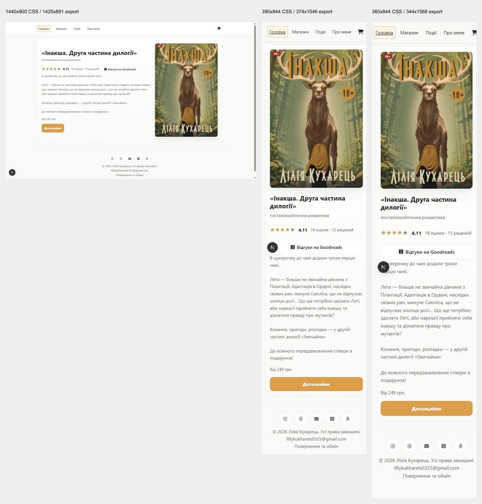
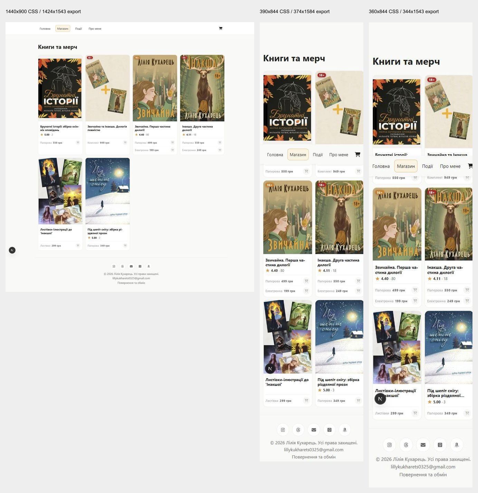
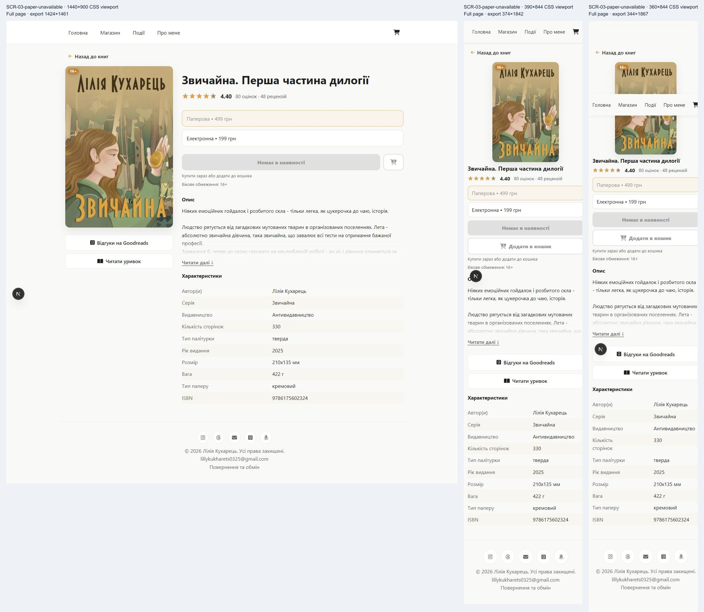
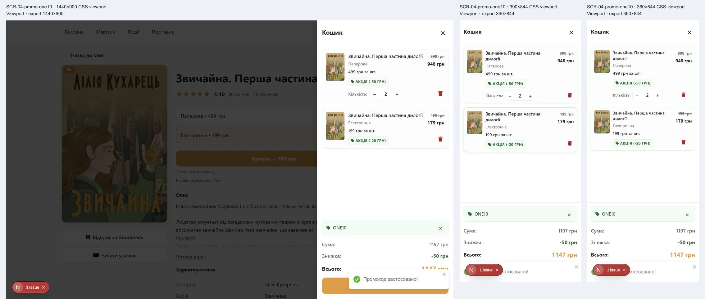
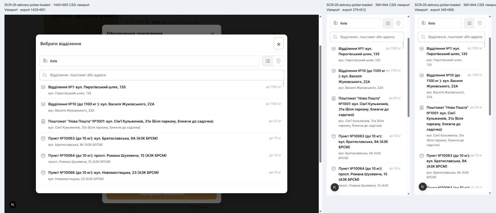

# Storefront findings for desktop and mobile review

This review reconciles the discovery, book-selection and cart/checkout audits for the product owner. **Start with recovery from rejected orders, the mobile delivery-picker exit and payment handoff context before redesigning discovery or visual polish.** Those paths show concrete failures or loss of context; customer abandonment and conversion effects remain unmeasured.

Prepared **2026-10-04, Europe/Kyiv**, for [ZVY-56](https://linear.app/zvychajna/issue/ZVY-56) and the screen decisions in [ZVY-57](https://linear.app/zvychajna/issue/ZVY-57). **Status: checked for source/evidence consistency and correctness; ready for product-owner screen review in ZVY-57.** No proposed storefront improvement is implemented or approved by this document. The existing brand text-contrast exception remains accepted.

## Sources and evidence boundaries

[Approved ZVY-52 baseline](https://linear.app/zvychajna/document/storefront-screen-baseline-zvy-52-desktop-and-mobile-015d372f40b2) · [Local screen/state reference](../storefront-baseline/REFERENCE.md) · [Baseline evidence viewer](../storefront-baseline/index.html) · [Complete reconciliation records](reconciliation.json)

| Audit | Report and comparison viewer | Findings | Original captures | Check records | Application source base |
| --- | --- | --- | --- | --- | --- |
| [ZVY-53](https://linear.app/zvychajna/issue/ZVY-53) | [Report](../storefront-discovery/REPORT.md) | 8 | 35 | 25 | `5f918a2511ccccd8c200427f18a71fe044c61818` |
| [ZVY-54](https://linear.app/zvychajna/issue/ZVY-54) | [Report](../storefront-selection/REPORT.md) · [Viewer](../storefront-selection/index.html) | 8 | 81 | 127 | `e2c94130358aa095bea28e14f54cf1a8057818c9` |
| [ZVY-55](https://linear.app/zvychajna/issue/ZVY-55) | [Report](../storefront-checkout/REPORT.md) · [Viewer](../storefront-checkout/index.html) | 10 | 105 | 145 | `5373680bcb29b2b7a49a315897f9e6bc0d81653a` |

The **26 source findings become 22 canonical findings: 14 confirmed defects/shortfalls, including one accepted text-contrast exception, and eight usability hypotheses**. There are 221 original audit exports and 297 check records; baseline exports are separate. Source records and hashes are preserved in reconciliation.json. The consolidation reads frontend revision `28f0367c1a5b57bb43ea8e03900675a466dc35eb`; it does not recapture or rewrite the earlier evidence.

All audits used Windows and the Codex in-app Chromium browser with **desktop 1440 × 900, mobile 390 × 844 and narrow mobile 360 × 844 CSS viewports**. These are responsive desktop-browser views, not physical phones. Node 24.11.1 and Next.js 16.3.4 served controlled loopback data at ports 3100/4100. Native image dimensions sometimes omit scrollbar space; DOM measurements, not screenshot pixel dimensions, establish CSS geometry. Development badges are tooling. The frozen catalog and controlled availability/prices are not current stock assertions.

ZVY-55 additionally used production builds to confirm reload persistence, corrected-field feedback, narrow promo clipping and the hidden mobile picker control. A development reload that lost cart state was excluded: **normal production reload persistence is not a defect**. No real invoice/payment, fulfillment or notification was performed. The public Nova Post iframe did contact its provider; its list eventually loaded, so an earlier empty search is not proof of an outage.

Local source reports still say owner review is pending in places, whereas Linear records ZVY-53/54/55 as Done and ZVY-54 describes owner-authorized closure. ZVY-55 has no review comment available from the connector. This is a review-history gap; it does not establish an undocumented exhaustive owner review or require reopening completed audits. This consolidation has its own source and correctness checks. Product-owner improvement decisions belong to ZVY-57.

**Capture quality caveat:** the selection audit's SCR-03-suggestion-unavailable comparison has ghosted overlapping content. Treat it as weak evidence of visual layout and a possible transition/export artifact, not another confirmed UI defect. F-BOOK-002 is supported by the clear SCR-04-unavailable-suggestion cart comparison, the recorded cart checks, controlled unavailable flags and the inspected suggestion code. A settled dialog capture would improve presentation evidence. The SCR-06 home return alone does not prove cart loss; the cleared-cart image and handoff checks provide that evidence. Server-error toasts are partly obscured in screenshots, so use their DOM check records and the controlled API/code alongside them.

## Consolidation and stable IDs

Canonical IDs reuse originating IDs. Every source ID has exactly one primary mapping; aliases remain searchable and must accompany later implementation issues. Related defects are not automatically duplicates.

| Canonical ID | Source IDs retained | Reason |
| --- | --- | --- |
| [F-DISC-002](#f-disc-002) | F-DISC-002, F-BOOK-003 | One availability/preorder disclosure decision across catalog, details and cart. |
| [F-DISC-007](#f-disc-007) | F-DISC-007, F-BOOK-007, F-CHECK-009 | One accepted text-contrast exception across purchase surfaces. |
| [F-DISC-008](#f-disc-008) | F-DISC-008, F-BOOK-008 | Shared authored focus treatment. F-CHECK-009 also supports checkout scope without being counted twice. |
| Other 19 findings | Original ID unchanged | Different behavior or different recovery requires its own decision. |

Default-edition selection (F-BOOK-001), unavailable suggestion eligibility (F-BOOK-002) and disclosure (F-DISC-002) remain distinct. Likewise, catalog outage (F-DISC-001), promo outage (F-CHECK-008) and lost validation feedback (F-CHECK-005) share a recovery pattern but have different triggers and corrective actions. No source finding was dropped as cosmetic or because an existing regression passed.

## Priorities and the top five weaknesses

P1 means an observed conditional barrier, loss of purchase/retry context, or a likely selection/amount mistake requiring the earliest discussion. P2 means other friction, an unvalidated usability proposal, or recorded accessibility debt. These are proposed product-review priorities, not Linear priority values. Confirmed classifies the observed UI behavior; it does not make inferred customer impact a measured result. No complete real-provider purchase journey was tested, so no universal end-to-end purchase blocker is claimed.

| Rank | Weakness | Observed consequence | Inferred customer risk and immediate review outcome |
| --- | --- | --- | --- |
| 1 | [F-CHECK-005](#f-check-005) Server rejection gives no actionable correction | Controlled HTTP 400 field/item errors become the same generic retry toast as HTTP 500. | A deterministic rejection can keep failing without showing what must change. Agree field/item mapping and a recoverable next action. |
| 2 | [F-CHECK-002](#f-check-002) Mobile picker hides the visible exit | Host header/close is hidden at 390/360; desktop retains it. | Customers may be unable to find a visible way back without choosing a branch. Agree a persistent host exit and focus return, then verify on real phones. |
| 3 | [F-CHECK-001](#f-check-001) Cart clears before verified payment | Invoice creation clears items/promo; controlled unverified return is empty. A late response still redirects after closing checkout. | Customers may have to rebuild an unpaid order. Agree pending context and restore/retry behavior with ZVY-40. |
| 4 | [F-BOOK-002](#f-book-002) Unavailable suggestion enters cart | Disabled postcard detail offer can still be added from the suggestion, producing an 849 UAH cart. | A selection can contradict eligibility and later be rejected. Agree the shared eligibility rule for every entry point. No later rejection was submitted. |
| 5 | [F-DISC-002](#f-disc-002) Preorder status disappears across screens | Catalog uses ordinary Add; details retain buy-now guidance; cart omits preorder status. | Customers may expect immediate availability. Agree consistent status copy and confirm truthful timing policy. |

The cold catalog outage remains P1 at rank 6: it blocks discovery in that controlled condition and has no retry. It sits below the top five because observed checkout/selection transitions deserve the first decisions; incident frequency is unknown. The rank order is a recommendation, not measured conversion impact.

**Priority change:** F-CHECK-010 moves from source P2 to proposed **P1, rank 8**, because line amounts visibly disagree with the amount payable by 20 UAH. Its correct summary total prevents any claim of a proven overcharge. Other source priorities are retained; merging does not multiply severity. There are eight canonical P1 and fourteen P2 findings. No independent cosmetic-only finding was established; decorative changes should follow the behavioral and readability decisions.

## Recommended screen review order

1. **Checkout and delivery**: F-CHECK-005/002/004/006/007. Decide visible exits, actionable correction, draft continuity and verified delivery disclosure.
2. **Payment handoff and return**: F-CHECK-001 with ZVY-40. Decide verified success versus pending/failed/canceled/unverified presentation, pending-request close behavior and retained retry context.
3. **Cart and promotions**: F-CHECK-010/008/003 plus preorder disclosure. Settle consistent line/summary amounts, temporary failure recovery and the 360 px layout.
4. **Product selection and optional suggestions**: F-BOOK-001/002/004/005/006. Agree eligibility, continued Buy flow and edition-specific information before considering sticky controls.
5. **Catalog and home**: F-DISC-001/002/003/004/005/006. Decide outage recovery and truthful offer labels, then validate discovery/layout hypotheses.
6. **Shared controls across all reviewed screens**: F-DISC-008/007. Apply one focus decision consistently; explicitly retain or reopen the accepted text-contrast exception. Recheck earlier screen proposals against the shared decisions.

## Screen and journey index

Cart and checkout are overlays on the current product route, not dedicated URLs. SCR-06 is a controlled return, not verified payment success. Screen IDs are the approved baseline IDs with audit-specific state suffixes. Every finding below includes exact affected states, routes, setup, device comparison and evidence.

| Screen | Affected journey | Findings to read together |
| --- | --- | --- |
| Home SCR-01, route / | Known-title discovery and entry to shop | [F-DISC-006](#f-disc-006), [F-DISC-001](#f-disc-001), [F-DISC-007](#f-disc-007), [F-DISC-008](#f-disc-008) |
| Catalog SCR-02, route /books | Browse/compare and enter details | [F-DISC-001](#f-disc-001), [F-DISC-002](#f-disc-002), [F-DISC-003](#f-disc-003), [F-DISC-004](#f-disc-004), [F-DISC-005](#f-disc-005), [F-DISC-007](#f-disc-007), [F-DISC-008](#f-disc-008) |
| Details and dialogs SCR-03 | Choose format, read sample, Buy/Add, optional suggestion | [F-BOOK-001](#f-book-001), [F-BOOK-002](#f-book-002), [F-DISC-002](#f-disc-002), [F-BOOK-004](#f-book-004), [F-BOOK-005](#f-book-005), [F-BOOK-006](#f-book-006), [F-DISC-007](#f-disc-007), [F-DISC-008](#f-disc-008) |
| Cart SCR-04 | Review selection/quantity/promo and enter checkout | [F-CHECK-010](#f-check-010), [F-CHECK-008](#f-check-008), [F-CHECK-003](#f-check-003), [F-DISC-002](#f-disc-002), [F-BOOK-002](#f-book-002), [F-BOOK-005](#f-book-005), [F-CHECK-001](#f-check-001), [F-DISC-007](#f-disc-007) |
| Checkout and picker SCR-05 | Physical, digital and mixed purchase/recovery | [F-CHECK-005](#f-check-005), [F-CHECK-002](#f-check-002), [F-CHECK-004](#f-check-004), [F-CHECK-006](#f-check-006), [F-CHECK-007](#f-check-007), [F-CHECK-001](#f-check-001), [F-DISC-007](#f-disc-007), [F-DISC-008](#f-disc-008) |
| Handoff/return SCR-06 | Invoice creation, unverified return and retry | [F-CHECK-001](#f-check-001) with ZVY-40 |

Detailed journey check links below identify a source audit's exploratory journey context. They are not evidence that every later structured finding occurred during that first walkthrough. Finding-specific check IDs and controlled API records establish the reproduction. A checks.json suffix identifies a record ID to search, not a working HTML fragment.

## Home

The comparison places desktop, mobile and narrow home views together. Full-page mobile originals linked below show the distance to the featured action.

### F-DISC-006 Mobile home places the featured action below a long cover and description

**P2 · review rank 17 · usability hypothesis**. Source IDs: F-DISC-006.

**Priority reason:** The action is below the first mobile viewport, but shop navigation remains available. No observed purchase failure or customer confusion justifies P1.

**Affected screens/states:** `SCR-01-default`. **Routes:** `/`.

**Desktop/mobile comparison:** Mobile hierarchy; desktop action is already in the first viewport. Standard audit viewports are 1440 × 900, 390 × 844 and 360 × 844.

**Observed behavior:** The mobile cover precedes the copy, followed by the full featured description. Детальніше begins around document y=1247px at 390px and y=1244px at 360px, below the 844px viewport; desktop places it around y=583px. 'Від 249 грн' does not name the electronic edition that supplies the minimum price; detail selection initially shows paper at 550 грн. Shop navigation remains visible at the top.

**Expected outcome:** The featured offer and a clear next action are discoverable early, with the meaning of the starting price understandable.

**Customer impact, inferred:** Mobile customers may delay finding the featured action or assume the displayed minimum applies to the paper book. Actual confusion was not observed with users. No customer study, error rate or abandonment measurement establishes this impact.

**Suggested improvement, pending owner decision:** Review a compact initial mobile offer with an earlier details/shop action and a format-qualified starting price. Retain the description as supporting content.

**Reproduce F-DISC-006:** use [its documented local setup](../storefront-discovery/REPORT.md), including the correct scenario/cache invalidation and cart reset.

1. Open home at 390x844 or 360x844 with the normal catalog snapshot.
2. Locate the featured title, starting price and Детальніше action by scrolling.
3. Compare the first viewport with desktop and open the featured book.

**Evidence:** [storefront-discovery/screenshots/SCR-01-default-1440x900.jpg](../storefront-discovery/screenshots/SCR-01-default-1440x900.jpg) · [storefront-discovery/screenshots/SCR-01-default-390x844-full.jpg](../storefront-discovery/screenshots/SCR-01-default-390x844-full.jpg) · [storefront-discovery/screenshots/SCR-01-default-360x844-full.jpg](../storefront-discovery/screenshots/SCR-01-default-360x844-full.jpg) · [storefront-discovery/checks.json#HOME-LAYOUT](../storefront-discovery/checks.json#HOME-LAYOUT) · [storefront-baseline/REFERENCE.md#scr-03-sequel--sequel-product](../storefront-baseline/REFERENCE.md#scr-03-sequel--sequel-product)

**Journey context:** [ZVY-53 J-DESKTOP](../storefront-discovery/checks.json#J-DESKTOP) · [ZVY-53 J-MOBILE](../storefront-discovery/checks.json#J-MOBILE) · [ZVY-53 J-NARROW](../storefront-discovery/checks.json#J-NARROW)

**Limits:** Vertical positions depend on this frozen featured description, fonts and browser scrollbar geometry. This is not proof of abandonment or a misleading-price defect.

## Catalog

Comparison image places desktop, mobile and narrow evidence together. Original files and measurements remain authoritative.

### F-DISC-001 Catalog outage is presented as empty stock; home loses its content

**P1 · review rank 6 · confirmed defect**. Source IDs: F-DISC-001.

**Priority reason:** A cold catalog outage removes the offers and supplies no retry; a customer cannot continue discovery in this scenario. Production outage frequency and warm-cache behavior are unknown.

**Affected screens/states:** `SCR-01-api-offline`, `SCR-02-api-offline`. **Routes:** `/`, `/books`.

**Desktop/mobile comparison:** All three widths; cold load after local cache invalidation only. Standard audit viewports are 1440 × 900, 390 × 844 and 360 × 844.

**Observed behavior:** The catalog displays 'Поки що немає книг для відображення.' without an error or retry action. Home main is empty. The local server logged ECONNREFUSED 127.0.0.1:4100; both routes returned HTTP 200.

**Expected outcome:** Distinguish unavailable catalog data from a successfully loaded empty catalog, preserve the page purpose, and offer recovery.

**Customer impact, inferred:** Customers may conclude that no books are sold, abandon discovery, or have no clear way to recover. No customer study, error rate or abandonment measurement establishes this impact.

**Suggested improvement, pending owner decision:** Review separate loading, empty and failure presentations with a retry action and useful navigation. Keep known data during refresh failures with an explicit freshness cue.

**Reproduce F-DISC-001:** use [its documented local setup](../storefront-discovery/REPORT.md), including the correct scenario/cache invalidation and cart reset.

1. Start the ZVY-52 loopback API and frontend with the documented capture settings.
2. Stop only the capture-api.mjs process listening on loopback port 4100.
3. Invalidate / and /books using the local revalidation endpoint.
4. Reload /books and then open /.

**Evidence:** [storefront-discovery/screenshots/SCR-02-api-offline-1440x900.jpg](../storefront-discovery/screenshots/SCR-02-api-offline-1440x900.jpg) · [storefront-discovery/screenshots/SCR-02-api-offline-390x844.jpg](../storefront-discovery/screenshots/SCR-02-api-offline-390x844.jpg) · [storefront-discovery/screenshots/SCR-02-api-offline-360x844.jpg](../storefront-discovery/screenshots/SCR-02-api-offline-360x844.jpg) · [storefront-discovery/screenshots/SCR-01-api-offline-1440x900.jpg](../storefront-discovery/screenshots/SCR-01-api-offline-1440x900.jpg) · [storefront-discovery/screenshots/SCR-01-api-offline-390x844.jpg](../storefront-discovery/screenshots/SCR-01-api-offline-390x844.jpg) · [storefront-discovery/screenshots/SCR-01-api-offline-360x844.jpg](../storefront-discovery/screenshots/SCR-01-api-offline-360x844.jpg) · [storefront-discovery/checks.json#CATALOG-OFFLINE](../storefront-discovery/checks.json#CATALOG-OFFLINE) · [storefront-discovery/checks.json#HOME-OFFLINE](../storefront-discovery/checks.json#HOME-OFFLINE) · [../src/lib/api.ts](../../src/lib/api.ts) · [../src/components/molecules/ProductsProvider.tsx](../../src/components/molecules/ProductsProvider.tsx)

**Journey context:** [ZVY-53 J-DESKTOP](../storefront-discovery/checks.json#J-DESKTOP) · [ZVY-53 J-MOBILE](../storefront-discovery/checks.json#J-MOBILE) · [ZVY-53 J-NARROW](../storefront-discovery/checks.json#J-NARROW)

**Limits:** Confirmed for a cold load after cache invalidation and a refused loopback connection. Warm-cache retention, HTTP 500 on the catalog endpoint and production outage timing were not separately reproduced.

### F-DISC-002 Availability and preorder disclosure is inconsistent from catalog to cart

**P1 · review rank 5 · confirmed defect**. Source IDs: F-DISC-002, F-BOOK-003.

**Priority reason:** Preorder and unavailable status becomes inconsistent across multiple purchase entry points and cart review. Mistaken delivery expectations are plausible but were not observed with customers.

**Affected screens/states:** `SCR-02-default`, `SCR-02-unavailable`, `SCR-03-preorder`, `SCR-04-preorder`, `SCR-03-unavailable`. **Routes:** `/books`, `/books/pid_shepit_snihu`, `/books/zvychajna`.

**Desktop/mobile comparison:** All three widths; catalog, product guidance and cart must agree. Standard audit viewports are 1440 × 900, 390 × 844 and 360 × 844.

**Observed behavior:** Catalog preorder uses the ordinary Add label; unavailable quick-add actions are faded/disabled without status text. Product preorder correctly says Передзамовити, but adjacent guidance says Купити зараз; the cart loses preorder status. Fully unavailable products keep the same buy-now hint. No verified dispatch date is present in the captured offer.

**Expected outcome:** Show truthful edition availability and preorder status consistently at discovery, selection and cart review, without inventing a shipping date.

**Customer impact, inferred:** Customers may expect immediate availability from a preorder, or waste detail-page visits to understand faded controls. No customer study, error rate or abandonment measurement establishes this impact.

**Suggested improvement, pending owner decision:** Review format-level status, availability-specific guidance and a persistent cart preorder label together. Confirm any dispatch wording with the owner; explicitly say timing is unspecified when no verified date exists.

**Reproduce F-DISC-002:** use [its documented local setup](../storefront-discovery/REPORT.md), including the correct scenario/cache invalidation and cart reset.

1. In the normal snapshot, scroll to Під шепіт снігу in the catalog.
2. Inspect its price and quick-add label; open its detail page to compare the primary action.
3. Set the unavailable scenario, invalidate catalog data, reload and inspect the cards.

**Reproduce F-BOOK-003:** use [its documented local setup](../storefront-selection/REPORT.md), including the correct scenario/cache invalidation and cart reset.

1. Open Pid shepit snihu using the normal snapshot.
2. Compare 'Передзамовити — 349 грн' with the guidance underneath.
3. Press Preorder and inspect the cart line.
4. In the unavailable scenario, compare disabled actions with the same guidance.

**Evidence:** [storefront-discovery/screenshots/SCR-02-default-1440x900-full.jpg](../storefront-discovery/screenshots/SCR-02-default-1440x900-full.jpg) · [storefront-discovery/screenshots/SCR-02-default-390x844-full.jpg](../storefront-discovery/screenshots/SCR-02-default-390x844-full.jpg) · [storefront-discovery/screenshots/SCR-02-default-360x844-full.jpg](../storefront-discovery/screenshots/SCR-02-default-360x844-full.jpg) · [storefront-discovery/screenshots/SCR-02-unavailable-1440x900-full.jpg](../storefront-discovery/screenshots/SCR-02-unavailable-1440x900-full.jpg) · [storefront-discovery/screenshots/SCR-02-unavailable-390x844-full.jpg](../storefront-discovery/screenshots/SCR-02-unavailable-390x844-full.jpg) · [storefront-discovery/screenshots/SCR-02-unavailable-360x844-full.jpg](../storefront-discovery/screenshots/SCR-02-unavailable-360x844-full.jpg) · [storefront-discovery/screenshots/SCR-03-preorder-entry-360x844.jpg](../storefront-discovery/screenshots/SCR-03-preorder-entry-360x844.jpg) · [storefront-discovery/checks.json#PREORDER](../storefront-discovery/checks.json#PREORDER) · [storefront-baseline/catalog-snapshot.json](../storefront-baseline/catalog-snapshot.json) · [../src/components/molecules/BookCard.tsx](../../src/components/molecules/BookCard.tsx) · [storefront-selection/paired/SCR-03-preorder.jpg](../storefront-selection/paired/SCR-03-preorder.jpg) · [storefront-selection/paired/SCR-04-preorder.jpg](../storefront-selection/paired/SCR-04-preorder.jpg) · [storefront-selection/paired/SCR-03-unavailable.jpg](../storefront-selection/paired/SCR-03-unavailable.jpg) · [storefront-selection/checks.json#PREORDER-390](../storefront-selection/checks.json#PREORDER-390) · [storefront-selection/checks.json#PREORDER-CART-390](../storefront-selection/checks.json#PREORDER-CART-390) · [storefront-selection/checks.json#UNAVAILABLE-360](../storefront-selection/checks.json#UNAVAILABLE-360) · [../src/components/organisms/BookDetail.tsx](../../src/components/organisms/BookDetail.tsx) · [../src/components/organisms/ShoppingCart.tsx](../../src/components/organisms/ShoppingCart.tsx)

**Journey context:** [ZVY-53 J-DESKTOP](../storefront-discovery/checks.json#J-DESKTOP) · [ZVY-53 J-MOBILE](../storefront-discovery/checks.json#J-MOBILE) · [ZVY-53 J-NARROW](../storefront-discovery/checks.json#J-NARROW) · [ZVY-54 J-DESKTOP-DIGITAL](../storefront-selection/checks.json#J-DESKTOP-DIGITAL) · [ZVY-54 J-MOBILE-SUGGESTION](../storefront-selection/checks.json#J-MOBILE-SUGGESTION) · [ZVY-54 J-NARROW-PREORDER](../storefront-selection/checks.json#J-NARROW-PREORDER)

**Limits:** Availability is the frozen approved snapshot or controlled flags, not current production stock. Shipping promises and subsequent cart disclosure belong to ZVY-54/55. The contradictory hint and missing cart disclosure are confirmed. Actual customer confusion and delivery dates are not established. Cart/checkout consolidation should retain this originating ID.

### F-DISC-003 Two-line card titles hide collection descriptions on narrow screens

**P2 · review rank 13 · confirmed defect**. Source IDs: F-DISC-003.

**Priority reason:** Current collection identification is visibly clipped at 360 px; complete accessible names and detail pages still exist.

**Affected screens/states:** `SCR-02-default`. **Routes:** `/books`.

**Desktop/mobile comparison:** Confirmed narrow 360 px clipping; desktop titles fit this snapshot. Standard audit viewports are 1440 × 900, 390 × 844 and 360 × 844.

**Observed behavior:** Брунатні історії and Під шепіт снігу titles are clamped to two lines with ellipses. Measured title content is 51px tall within a 34px box. Full titles remain in the accessibility tree, but the visual list hides the collection description. Desktop titles fit in this snapshot.

**Expected outcome:** The visible catalog identifies each book and its collection context without requiring a detail-page visit.

**Customer impact, inferred:** Customers comparing collections lose identifying information. The mismatch between visual and accessible titles complicates shared review. No customer study, error rate or abandonment measurement establishes this impact.

**Suggested improvement, pending owner decision:** Review wrapping complete titles or separating a short display title and meaningful subtitle. Preserve the full accessible product name.

**Reproduce F-DISC-003:** use [its documented local setup](../storefront-discovery/REPORT.md), including the correct scenario/cache invalidation and cart reset.

1. Open the normal catalog at 360x844.
2. Read the first collection title and scroll to Під шепіт снігу.
3. Compare visible titles with the complete accessible labels or product headings.

**Evidence:** [storefront-discovery/screenshots/SCR-02-default-1440x900-full.jpg](../storefront-discovery/screenshots/SCR-02-default-1440x900-full.jpg) · [storefront-discovery/screenshots/SCR-02-default-390x844-full.jpg](../storefront-discovery/screenshots/SCR-02-default-390x844-full.jpg) · [storefront-discovery/screenshots/SCR-02-default-360x844-full.jpg](../storefront-discovery/screenshots/SCR-02-default-360x844-full.jpg) · [storefront-discovery/screenshots/SCR-02-scrolled-360x844.jpg](../storefront-discovery/screenshots/SCR-02-scrolled-360x844.jpg) · [storefront-discovery/checks.json#NARROW-CLIPPING-SCROLLED](../storefront-discovery/checks.json#NARROW-CLIPPING-SCROLLED) · [../src/components/molecules/BookCard.module.css](../../src/components/molecules/BookCard.module.css)

**Journey context:** [ZVY-53 J-DESKTOP](../storefront-discovery/checks.json#J-DESKTOP) · [ZVY-53 J-MOBILE](../storefront-discovery/checks.json#J-MOBILE) · [ZVY-53 J-NARROW](../storefront-discovery/checks.json#J-NARROW)

**Limits:** Confirmed for the two current collection titles at 360px. More extreme future titles and enlarged-text behavior remain unverified.

### F-DISC-004 Compact mobile price rows and quick-add targets may hinder comparison

**P2 · review rank 16 · usability hypothesis**. Source IDs: F-DISC-004.

**Priority reason:** Small mobile rows and targets suggest ergonomic friction. The measured 26 px quick-add target is not evidence of a minimum-target violation.

**Affected screens/states:** `SCR-02-default`. **Routes:** `/books`.

**Desktop/mobile comparison:** Mobile 390 and 360 px; desktop is the comparison. Standard audit viewports are 1440 × 900, 390 × 844 and 360 × 844.

**Observed behavior:** Mobile format/price text is 11.2 CSS px; titles are 13.76px. Quick-add buttons are 26x26px, compared with 28x28px on desktop. Complete currency labels remain visually readable in the captured normal state, despite minimal horizontal spare space.

**Expected outcome:** Customers can comfortably compare formats and prices and reliably choose the intended format on a phone.

**Customer impact, inferred:** Small dense rows may require closer reading and increase touch mistakes. No user error rate was measured. No customer study, error rate or abandonment measurement establishes this impact.

**Suggested improvement, pending owner decision:** Review larger readable rows and more generous action targets; evaluate a single-column or less dense layout with representative customers.

**Reproduce F-DISC-004:** use [its documented local setup](../storefront-discovery/REPORT.md), including the correct scenario/cache invalidation and cart reset.

1. Browse the catalog at 390x844 and 360x844.
2. Compare paper/electronic rows for Звичайна and Інакша.
3. Measure the rendered price text and quick-add button bounds.

**Evidence:** [storefront-discovery/screenshots/SCR-02-default-1440x900-full.jpg](../storefront-discovery/screenshots/SCR-02-default-1440x900-full.jpg) · [storefront-discovery/screenshots/SCR-02-default-390x844-full.jpg](../storefront-discovery/screenshots/SCR-02-default-390x844-full.jpg) · [storefront-discovery/screenshots/SCR-02-default-360x844-full.jpg](../storefront-discovery/screenshots/SCR-02-default-360x844-full.jpg) · [storefront-discovery/checks.json#MOBILE-CATALOG](../storefront-discovery/checks.json#MOBILE-CATALOG) · [storefront-discovery/checks.json#NARROW-CATALOG](../storefront-discovery/checks.json#NARROW-CATALOG)

**Journey context:** [ZVY-53 J-DESKTOP](../storefront-discovery/checks.json#J-DESKTOP) · [ZVY-53 J-MOBILE](../storefront-discovery/checks.json#J-MOBILE) · [ZVY-53 J-NARROW](../storefront-discovery/checks.json#J-NARROW)

**Limits:** 26px targets exceed the WCAG 2.2 24px minimum size. This is an ergonomic hypothesis, not a target-size violation. No physical phone, touch simulation or observed customer mistake is claimed.

### F-DISC-005 Browsing without a title requires opening books to learn their subject

**P2 · review rank 18 · usability hypothesis**. Source IDs: F-DISC-005.

**Priority reason:** Missing subject/type cues increase expert-walkthrough effort, but six entries remain browsable and demand for search has not been demonstrated.

**Affected screens/states:** `SCR-02-default`. **Routes:** `/books`.

**Desktop/mobile comparison:** All three widths; do not assume a mobile menu or search state exists. Standard audit viewports are 1440 × 900, 390 × 844 and 360 × 844.

**Observed behavior:** Cards show covers, titles, age badges where present, embedded ratings and format prices. Genres or short descriptions are absent; books, bundle and postcards share one grid. Search/filter/sort are not implemented. Titles and covers provide some context, and the six-item list can be scanned manually.

**Expected outcome:** Customers can make an informed shortlist from the catalog with enough subject/type context.

**Customer impact, inferred:** Unknown-title browsing may require repeated detail-page visits. The small list may make search unnecessary; there is no evidence of a search-related blocker. No customer study, error rate or abandonment measurement establishes this impact.

**Suggested improvement, pending owner decision:** Review concise genre/type/series cues or book/merch grouping first. Add search or filters only if catalog size and customer evidence justify them.

**Reproduce F-DISC-005:** use [its documented local setup](../storefront-discovery/REPORT.md), including the correct scenario/cache invalidation and cart reset.

1. Enter the shop without a known title and compare all six entries.
2. Try to identify a romantic novel, story collection, bundle or merchandise from cards alone.
3. Look for search, filter, sort or descriptive discovery controls.

**Evidence:** [storefront-discovery/screenshots/SCR-02-default-1440x900-full.jpg](../storefront-discovery/screenshots/SCR-02-default-1440x900-full.jpg) · [storefront-discovery/screenshots/SCR-02-default-390x844-full.jpg](../storefront-discovery/screenshots/SCR-02-default-390x844-full.jpg) · [storefront-discovery/screenshots/SCR-02-default-360x844-full.jpg](../storefront-discovery/screenshots/SCR-02-default-360x844-full.jpg) · [storefront-discovery/checks.json#J-DESKTOP](../storefront-discovery/checks.json#J-DESKTOP) · [storefront-discovery/checks.json#J-MOBILE](../storefront-discovery/checks.json#J-MOBILE) · [storefront-discovery/checks.json#J-NARROW](../storefront-discovery/checks.json#J-NARROW)

**Journey context:** [ZVY-53 J-DESKTOP](../storefront-discovery/checks.json#J-DESKTOP) · [ZVY-53 J-MOBILE](../storefront-discovery/checks.json#J-MOBILE) · [ZVY-53 J-NARROW](../storefront-discovery/checks.json#J-NARROW)

**Limits:** This is an expert walkthrough, not a usability study. No timed discovery task, demand for filtering, or abandonment rate was measured.

## Book details and optional suggestions

Comparison image places desktop, mobile and narrow evidence together. Original files and measurements remain authoritative.

### F-BOOK-001 Unavailable paper is the default even when digital is purchasable

**P1 · review rank 7 · confirmed defect**. Source IDs: F-BOOK-001.

**Priority reason:** The initial unavailable paper offer can conceal an eligible digital alternative. Switching to digital works, so this is not a complete purchase blocker.

**Affected screens/states:** `SCR-03-paper-unavailable`. **Routes:** `/books/zvychajna`.

**Desktop/mobile comparison:** All three widths; controlled partial availability. Standard audit viewports are 1440 × 900, 390 × 844 and 360 × 844.

**Observed behavior:** Paper 499 is checked and disabled; the primary action says 'Немає в наявності' although electronic 199 is enabled. The hint still says 'Купити зараз або додати до кошика'. Selecting electronic manually enables purchasing and produces the correct 199 UAH cart item at every width.

**Expected outcome:** The initial offer makes the available edition explicit, through a purchasable default or clear edition-level availability and an alternative action.

**Customer impact, inferred:** A customer may read the unavailable primary action as applying to the book and miss the electronic alternative. No customer study, error rate or abandonment measurement establishes this impact.

**Suggested improvement, pending owner decision:** Review selecting an eligible initial edition, retaining deliberate customer choices during refresh, and naming unavailable editions and alternatives explicitly.

**Reproduce F-BOOK-001:** use [its documented local setup](../storefront-selection/REPORT.md), including the correct scenario/cache invalidation and cart reset.

1. Start the audit API and frontend using REPORT.md.
2. Set paper-unavailable, invalidate zvychajna and reload the product.
3. Inspect the initial format and main action, then select electronic and buy.

**Evidence:** [storefront-selection/paired/SCR-03-paper-unavailable.jpg](../storefront-selection/paired/SCR-03-paper-unavailable.jpg) · [storefront-selection/checks.json#PARTIAL-INITIAL-1440](../storefront-selection/checks.json#PARTIAL-INITIAL-1440) · [storefront-selection/checks.json#PARTIAL-INITIAL-390](../storefront-selection/checks.json#PARTIAL-INITIAL-390) · [storefront-selection/checks.json#PARTIAL-INITIAL-360](../storefront-selection/checks.json#PARTIAL-INITIAL-360) · [storefront-selection/checks.json#PARTIAL-CART-390](../storefront-selection/checks.json#PARTIAL-CART-390) · [../src/components/organisms/BookDetail.tsx](../../src/components/organisms/BookDetail.tsx)

**Journey context:** [ZVY-54 J-DESKTOP-DIGITAL](../storefront-selection/checks.json#J-DESKTOP-DIGITAL) · [ZVY-54 J-MOBILE-SUGGESTION](../storefront-selection/checks.json#J-MOBILE-SUGGESTION) · [ZVY-54 J-NARROW-PREORDER](../storefront-selection/checks.json#J-NARROW-PREORDER)

**Limits:** Controlled flags, not a claim about current stock. Purchasing digital succeeds; this is an initial-state defect, not a complete purchase blocker.

### F-BOOK-002 Suggestion adds an unavailable item that its detail page cannot sell

**P1 · review rank 4 · confirmed defect**. Source IDs: F-BOOK-002.

**Priority reason:** The suggestion bypasses the availability rule observed on the same item detail page and adds an unavailable non-preorder edition. Later rejection/fulfillment is untested.

**Affected screens/states:** `SCR-03-merch-unavailable`, `SCR-03-suggestion-unavailable`, `SCR-04-unavailable-suggestion`. **Routes:** `/books/inaksha`, `/books/inaksha-art`.

**Desktop/mobile comparison:** All three widths; optional suggestion and resulting cart. Standard audit viewports are 1440 × 900, 390 × 844 and 360 × 844.

**Observed behavior:** The postcard edition has isAvailable=false and canPreorder=false. Its own purchase actions disable, but the suggestion still displays an enabled add action at 299 UAH. Adding it opens a cart containing paper Inaksha 550 and unavailable postcards 299, total 849 UAH, without an availability warning.

**Expected outcome:** The suggestion follows the same edition eligibility rules as the detail page and cannot add an unavailable, non-preorder item.

**Customer impact, inferred:** Customers can select an offer the shop cannot fulfill and encounter a later checkout rejection or misleading stock expectations. No customer study, error rate or abandonment measurement establishes this impact.

**Suggested improvement, pending owner decision:** Review suppressing unavailable suggestions or displaying an explicit unavailable state; validate the exact suggested edition before adding it.

**Reproduce F-BOOK-002:** use [its documented local setup](../storefront-selection/REPORT.md), including the correct scenario/cache invalidation and cart reset.

1. Set suggestion-unavailable and invalidate inaksha and inaksha-art.
2. Open the postcard detail page and confirm unavailable purchase actions.
3. Open Inaksha, choose paper 550 and press Buy.
4. Press 'Додати до кошика' in the suggested-postcards dialog and inspect the cart.

**Evidence:** [storefront-selection/paired/SCR-03-merch-unavailable.jpg](../storefront-selection/paired/SCR-03-merch-unavailable.jpg) · [storefront-selection/paired/SCR-03-suggestion-unavailable.jpg](../storefront-selection/paired/SCR-03-suggestion-unavailable.jpg) · [storefront-selection/paired/SCR-04-unavailable-suggestion.jpg](../storefront-selection/paired/SCR-04-unavailable-suggestion.jpg) · [storefront-selection/checks.json#SUGGESTION-UNAVAILABLE-1440](../storefront-selection/checks.json#SUGGESTION-UNAVAILABLE-1440) · [storefront-selection/checks.json#SUGGESTION-UNAVAILABLE-390](../storefront-selection/checks.json#SUGGESTION-UNAVAILABLE-390) · [storefront-selection/checks.json#SUGGESTION-UNAVAILABLE-360](../storefront-selection/checks.json#SUGGESTION-UNAVAILABLE-360) · [storefront-selection/checks.json#SUGGESTION-UNAVAILABLE-CART-390](../storefront-selection/checks.json#SUGGESTION-UNAVAILABLE-CART-390) · [../src/components/molecules/SuggestionDialog.tsx](../../src/components/molecules/SuggestionDialog.tsx)

**Journey context:** [ZVY-54 J-DESKTOP-DIGITAL](../storefront-selection/checks.json#J-DESKTOP-DIGITAL) · [ZVY-54 J-MOBILE-SUGGESTION](../storefront-selection/checks.json#J-MOBILE-SUGGESTION) · [ZVY-54 J-NARROW-PREORDER](../storefront-selection/checks.json#J-NARROW-PREORDER)

**Limits:** Selection and cart acceptance reproduced at all widths. No checkout or invoice was submitted; backend fulfillment or rejection is not claimed.

### F-BOOK-004 Declining the optional suggestion interrupts the Buy journey

**P2 · review rank 14 · usability hypothesis**. Source IDs: F-BOOK-004.

**Priority reason:** Dismissing the suggestion interrupts the observed Buy-to-cart transition, but the book remains in cart and the cart can be opened manually.

**Affected screens/states:** `SCR-03-suggestion`, `SCR-03-sequel`, `SCR-03-bundle`. **Routes:** `/books/inaksha`, `/books/zvychajna-and-inaksha`.

**Desktop/mobile comparison:** All three widths; preserve direct Buy and Add distinctions. Standard audit viewports are 1440 × 900, 390 × 844 and 360 × 844.

**Observed behavior:** The book is added before the suggestion appears. The dialog has Close, Add and Details, but no explicit continue-without-postcards action. Dismissal returns focus to Buy and leaves the cart closed. Other tested Buy actions open the cart directly; the cart is still reachable manually.

**Expected outcome:** Declining an optional add-on clearly continues the purchase intent and explains that the original book is already selected.

**Customer impact, inferred:** Customers may think the purchase was cancelled, hesitate, or repeat Buy to discover the next step. Abandonment was not measured. No customer study, error rate or abandonment measurement establishes this impact.

**Suggested improvement, pending owner decision:** Review an explicit 'continue without' action, confirmation of the selected book, and continuation to cart after declining a suggestion during Buy.

**Reproduce F-BOOK-004:** use [its documented local setup](../storefront-selection/REPORT.md), including the correct scenario/cache invalidation and cart reset.

1. Open Inaksha or the bundle with empty cart.
2. Choose the paper offer and press Buy.
3. Dismiss 'Разом цікавіше?' using Close or Escape.
4. Inspect whether cart review continues and open the cart manually.

**Evidence:** [storefront-selection/paired/SCR-03-suggestion.jpg](../storefront-selection/paired/SCR-03-suggestion.jpg) · [storefront-selection/checks.json#J-MOBILE-SUGGESTION](../storefront-selection/checks.json#J-MOBILE-SUGGESTION) · [storefront-selection/checks.json#J-MOBILE-CART](../storefront-selection/checks.json#J-MOBILE-CART) · [storefront-selection/checks.json#SUGGESTION-DISMISS-1440](../storefront-selection/checks.json#SUGGESTION-DISMISS-1440) · [storefront-selection/checks.json#SUGGESTION-DISMISS-390](../storefront-selection/checks.json#SUGGESTION-DISMISS-390) · [storefront-selection/checks.json#SUGGESTION-DISMISS-360](../storefront-selection/checks.json#SUGGESTION-DISMISS-360) · [../src/components/organisms/BookDetail.tsx](../../src/components/organisms/BookDetail.tsx)

**Journey context:** [ZVY-54 J-DESKTOP-DIGITAL](../storefront-selection/checks.json#J-DESKTOP-DIGITAL) · [ZVY-54 J-MOBILE-SUGGESTION](../storefront-selection/checks.json#J-MOBILE-SUGGESTION) · [ZVY-54 J-NARROW-PREORDER](../storefront-selection/checks.json#J-NARROW-PREORDER)

**Limits:** The transition is observed; the customer impact is a hypothesis. The original book remains in cart and no duplicate quantity was added by repeated detail-page Add.

### F-BOOK-005 Electronic selection does not explain the delivered file or reading requirements

**P2 · review rank 15 · usability hypothesis**. Source IDs: F-BOOK-005.

**Priority reason:** Edition IDs and prices are correct; missing file/delivery information is a comprehension hypothesis awaiting verified copy and customer validation.

**Affected screens/states:** `SCR-03-digital`, `SCR-03-sequel-digital`, `SCR-04-digital`. **Routes:** `/books/zvychajna`, `/books/inaksha`.

**Desktop/mobile comparison:** All three widths; electronic offer and cart. Standard audit viewports are 1440 × 900, 390 × 844 and 360 × 844.

**Observed behavior:** The selected radio, purchase price and cart format clearly say electronic. The page still shows physical specifications (hard cover, paper, dimensions and, for Zvychajna, weight). It provides no visible EPUB/file type, compatible reader, delivery method or timing explanation before cart entry. Backend delivery uses watermarked EPUB attachments; that source fact is not a tested delivery outcome.

**Expected outcome:** The electronic offer explains what is supplied and how it will be received/read; print-only specifications are clearly qualified.

**Customer impact, inferred:** Customers may be uncertain whether their device can read the purchase or whether a physical book is involved. Wrong-format purchases were not observed. No customer study, error rate or abandonment measurement establishes this impact.

**Suggested improvement, pending owner decision:** Review edition-specific supporting information based on verified delivery contracts, with print specifications labelled separately.

**Reproduce F-BOOK-005:** use [its documented local setup](../storefront-selection/REPORT.md), including the correct scenario/cache invalidation and cart reset.

1. Choose the electronic edition of Zvychajna or Inaksha.
2. Read the description, purchase hints and specifications.
3. Buy the electronic edition and inspect its cart line.

**Evidence:** [storefront-selection/paired/SCR-03-digital.jpg](../storefront-selection/paired/SCR-03-digital.jpg) · [storefront-selection/paired/SCR-04-digital.jpg](../storefront-selection/paired/SCR-04-digital.jpg) · [storefront-selection/checks.json#DIGITAL-1440](../storefront-selection/checks.json#DIGITAL-1440) · [storefront-selection/checks.json#DIGITAL-390](../storefront-selection/checks.json#DIGITAL-390) · [storefront-selection/checks.json#DIGITAL-360](../storefront-selection/checks.json#DIGITAL-360) · [../src/components/organisms/BookDetail.tsx](../../src/components/organisms/BookDetail.tsx)

**Journey context:** [ZVY-54 J-DESKTOP-DIGITAL](../storefront-selection/checks.json#J-DESKTOP-DIGITAL) · [ZVY-54 J-MOBILE-SUGGESTION](../storefront-selection/checks.json#J-MOBILE-SUGGESTION) · [ZVY-54 J-NARROW-PREORDER](../storefront-selection/checks.json#J-NARROW-PREORDER)

**Limits:** Correct edition IDs and prices reached the cart. No payment, email delivery or reader compatibility was exercised.

### F-BOOK-006 Mobile sampling follows the description and leaves purchase actions above the reading position

**P2 · review rank 19 · usability hypothesis**. Source IDs: F-BOOK-006.

**Priority reason:** Mobile sampling and return to purchase require scrolling. Actions remain reachable; a sticky control is a proposal with untested keyboard/viewport tradeoffs.

**Affected screens/states:** `SCR-03-paper`, `SCR-03-collection-expanded`, `SCR-03-excerpt`. **Routes:** `/books/zvychajna`, `/books/brunette-stories`.

**Desktop/mobile comparison:** Mobile 390 and 360 px; desktop places sampling under the cover. Standard audit viewports are 1440 × 900, 390 × 844 and 360 × 844.

**Observed behavior:** Mobile places the cover before the title, then formats, purchase actions and description; cover actions including the excerpt move below the description. Long descriptions expand and wrap successfully. The title drops from 36px desktop to 18.4px at 390 and 16.8px at 360. Purchase actions are not sticky, while navigation/cart remain available during scrolling.

**Expected outcome:** Customers can find a sample before committing and easily resume purchasing after reading; title and offer hierarchy remain clear on narrow screens.

**Customer impact, inferred:** Readers may overlook the sample or need extra scrolling to resume a format-specific purchase. No customer study or physical-touch observation confirms this impact. No customer study, error rate or abandonment measurement establishes this impact.

**Suggested improvement, pending owner decision:** Review placing a sample link near the initial offer and a clear return-to-purchase path after reading; compare a compact mobile hierarchy before deciding on any sticky purchase control.

**Reproduce F-BOOK-006:** use [its documented local setup](../storefront-selection/REPORT.md), including the correct scenario/cache invalidation and cart reset.

1. Open a book at 390x844 and 360x844.
2. Locate the format and purchase actions, expand the description and find Read excerpt.
3. Compare desktop's under-cover excerpt action; scroll the mobile page after reading.

**Evidence:** [storefront-selection/paired/SCR-03-paper.jpg](../storefront-selection/paired/SCR-03-paper.jpg) · [storefront-selection/paired/SCR-03-collection-expanded.jpg](../storefront-selection/paired/SCR-03-collection-expanded.jpg) · [storefront-selection/paired/SCR-03-excerpt.jpg](../storefront-selection/paired/SCR-03-excerpt.jpg) · [storefront-selection/checks.json#PAPER-390](../storefront-selection/checks.json#PAPER-390) · [storefront-selection/checks.json#PAPER-360](../storefront-selection/checks.json#PAPER-360) · [storefront-selection/checks.json#STICKY-SCROLLED-MOBILE](../storefront-selection/checks.json#STICKY-SCROLLED-MOBILE) · [storefront-selection/checks.json#STICKY-SCROLLED-NARROW](../storefront-selection/checks.json#STICKY-SCROLLED-NARROW) · [../src/components/organisms/BookDetail.module.css](../../src/components/organisms/BookDetail.module.css)

**Journey context:** [ZVY-54 J-DESKTOP-DIGITAL](../storefront-selection/checks.json#J-DESKTOP-DIGITAL) · [ZVY-54 J-MOBILE-SUGGESTION](../storefront-selection/checks.json#J-MOBILE-SUGGESTION) · [ZVY-54 J-NARROW-PREORDER](../storefront-selection/checks.json#J-NARROW-PREORDER)

**Limits:** All tested actions remain reachable. No initial normal-size document overflow was measured; future longer titles and enlarged-text layouts remain unverified.

## Cart and promotions

Comparison image places desktop, mobile and narrow evidence together. Original files and measurements remain authoritative.

### F-CHECK-010 Limited-use promo item prices do not add up to the cart total

**P1 · review rank 8 · confirmed defect**. Source IDs: F-CHECK-010.

**Priority reason:** Raised from audit P2 to proposed P1: displayed lines disagree with the amount payable by 20 UAH in the controlled mixed cart. This is a monetary explanation defect, not proof of overcharging.

**Affected screens/states:** `SCR-04-promo-one10`. **Routes:** `/books/zvychajna`.

**Desktop/mobile comparison:** All three widths; limited-use percentage promo. Standard audit viewports are 1440 × 900, 390 × 844 and 360 × 844.

**Observed behavior:** The paper line shows 948 UAH and the electronic line shows 179 UAH, adding to 1127 UAH. The cart summary correctly allocates the single discount to one paper unit and shows discount50 and total1147. CartProvider passes an absent map entry as undefined for the electronic item; calculateItemDiscount defaults undefined to the full item quantity. The total calculation instead supplies zero for an absent entry.

**Expected outcome:** All item-level discounts use the same eligible-unit allocation as the cart total. The electronic line remains199 and the displayed lines add to1147.

**Customer impact, inferred:** Customers see an apparent20 UAH discrepancy between discounted items and the amount payable, undermining confidence in the promotion and order total. No customer study, error rate or abandonment measurement establishes this impact.

**Suggested improvement, pending owner decision:** Review consistent item and total discount allocation, including eligible items with zero discounted units. Add a mixed-cart limited-use regression case when the approved fix is implemented.

**Reproduce F-CHECK-010:** use [its documented local setup](../storefront-checkout/REPORT.md), including the correct scenario/cache invalidation and cart reset.

1. Add two paper copies at 499 UAH and one electronic copy at 199 UAH.
2. Apply the controlled ONE10 percentage promo with one remaining discounted unit.
3. Compare the displayed discounted item amounts with the discount summary and total.

**Evidence:** [storefront-checkout/paired/SCR-04-promo-one10.jpg](../storefront-checkout/paired/SCR-04-promo-one10.jpg) · [storefront-checkout/checks.json#SCR-04-promo-one10-1440](../storefront-checkout/checks.json#SCR-04-promo-one10-1440) · [storefront-checkout/checks.json#SCR-04-promo-one10-390](../storefront-checkout/checks.json#SCR-04-promo-one10-390) · [storefront-checkout/checks.json#SCR-04-promo-one10-360](../storefront-checkout/checks.json#SCR-04-promo-one10-360) · [../src/components/molecules/CartProvider.tsx](../../src/components/molecules/CartProvider.tsx) · [../src/lib/promocode.helper.ts](../../src/lib/promocode.helper.ts)

**Journey context:** [ZVY-55 J-DESKTOP-PHYSICAL-VALIDATION](../storefront-checkout/checks.json#J-DESKTOP-PHYSICAL-VALIDATION) · [ZVY-55 J-MOBILE-DIGITAL-HANDOFF](../storefront-checkout/checks.json#J-MOBILE-DIGITAL-HANDOFF) · [ZVY-55 J-NARROW-MIXED](../storefront-checkout/checks.json#J-NARROW-MIXED)

**Limits:** The display defect is confirmed with a controlled API response matching the frontend promo contract and inspected source. No real limited-use promo was consumed, and no incorrect payment amount or backend allocation defect is claimed.

### F-CHECK-008 A promo-service outage is reported as an invalid code

**P2 · review rank 10 · confirmed defect**. Source IDs: F-CHECK-008.

**Priority reason:** A recovered service accepts the unchanged code, but temporary failure is labeled invalid. Customers can continue without a promo; real outage frequency is unknown.

**Affected screens/states:** `SCR-04-promo-invalid`, `SCR-04-promo-outage`, `SCR-04-promo-loading`. **Routes:** `/books/zvychajna`.

**Desktop/mobile comparison:** All three widths; local 503, invalid 404 and recovery. Standard audit viewports are 1440 × 900, 390 × 844 and 360 × 844.

**Observed behavior:** HTTP503 and invalid-code HTTP404 both show 'Невірний або недійсний промокод'. The value remains editable. A recovered service accepts the unchanged code. Loading disables the apply button and displays a spinner.

**Expected outcome:** Distinguish temporary validation-service failure from an invalid/expired code and offer a suitable retry.

**Customer impact, inferred:** Customers may abandon a valid discount or assume the promotion is unavailable, rather than retrying a temporary failure. No customer study, error rate or abandonment measurement establishes this impact.

**Suggested improvement, pending owner decision:** Review separate invalid-code and temporary-failure messages with retained input and clear retry behavior.

**Reproduce F-CHECK-008:** use [its documented local setup](../storefront-checkout/REPORT.md), including the correct scenario/cache invalidation and cart reset.

1. Enter the fixture's valid AUDIT10 code.
2. Set promo-error and apply it; the API returns503.
3. Compare the toast with rejection of INVALID.
4. Restore promo-loading/normal and apply AUDIT10 again.

**Evidence:** [storefront-checkout/paired/SCR-04-promo-outage.jpg](../storefront-checkout/paired/SCR-04-promo-outage.jpg) · [storefront-checkout/paired/SCR-04-promo-invalid.jpg](../storefront-checkout/paired/SCR-04-promo-invalid.jpg) · [storefront-checkout/checks.json#PROMO-OUTAGE-RECOVERED](../storefront-checkout/checks.json#PROMO-OUTAGE-RECOVERED) · [storefront-checkout/promo-outage-evidence.json](../storefront-checkout/promo-outage-evidence.json) · [../src/components/organisms/ShoppingCart.tsx](../../src/components/organisms/ShoppingCart.tsx)

**Journey context:** [ZVY-55 J-DESKTOP-PHYSICAL-VALIDATION](../storefront-checkout/checks.json#J-DESKTOP-PHYSICAL-VALIDATION) · [ZVY-55 J-MOBILE-DIGITAL-HANDOFF](../storefront-checkout/checks.json#J-MOBILE-DIGITAL-HANDOFF) · [ZVY-55 J-NARROW-MIXED](../storefront-checkout/checks.json#J-NARROW-MIXED)

**Limits:** Confirmed using a controlled503; no production promo outage is claimed. Expiry/restriction enforcement in the real backend was not tested.

### F-CHECK-003 The promo application button is clipped at 360 px

**P2 · review rank 12 · confirmed defect**. Source IDs: F-CHECK-003.

**Priority reason:** The visible apply target is clipped at 360 px, while Enter still applies the code. Production geometry supports the defect, not a general touch blocker.

**Affected screens/states:** `SCR-04-promo-entry`. **Routes:** `/books/zvychajna`.

**Desktop/mobile comparison:** 360 px specific; 390 px and desktop fit. Standard audit viewports are 1440 × 900, 390 × 844 and 360 × 844.

**Observed behavior:** At 360 px the apply button's right edge extends beyond the viewport and the cart clips its right side. The measured row overflow is about 9 CSS px. The input has a flexible width with an intrinsic minimum; the button retains its width/padding. Production reproduces the clipping. Keyboard Enter still applies the promo.

**Expected outcome:** The complete input and application action fit in the visible cart at the supported narrow width.

**Customer impact, inferred:** The promo action is visually cut off and provides less visible target area on narrow screens. It did not block keyboard application; actual touch errors were not measured. No customer study, error rate or abandonment measurement establishes this impact.

**Suggested improvement, pending owner decision:** Review a shrinkable input or stacked narrow-screen promo row with a fully visible action.

**Reproduce F-CHECK-003:** use [its documented local setup](../storefront-checkout/REPORT.md), including the correct scenario/cache invalidation and cart reset.

1. Open a populated cart with no applied promo.
2. Enter AUDIT10 without applying it.
3. At 360 px inspect the input/button row and compare it with 390 px and desktop.

**Evidence:** [storefront-checkout/paired/SCR-04-promo-entry.jpg](../storefront-checkout/paired/SCR-04-promo-entry.jpg) · [storefront-checkout/checks.json#SCR-04-promo-entry-360](../storefront-checkout/checks.json#SCR-04-promo-entry-360) · [../src/components/organisms/ShoppingCart.module.css](../../src/components/organisms/ShoppingCart.module.css)

**Journey context:** [ZVY-55 J-DESKTOP-PHYSICAL-VALIDATION](../storefront-checkout/checks.json#J-DESKTOP-PHYSICAL-VALIDATION) · [ZVY-55 J-MOBILE-DIGITAL-HANDOFF](../storefront-checkout/checks.json#J-MOBILE-DIGITAL-HANDOFF) · [ZVY-55 J-NARROW-MIXED](../storefront-checkout/checks.json#J-NARROW-MIXED)

**Limits:** Geometry is from DOM CSS measurements; exported screenshots can omit scrollbar space and must not be used directly as CSS measurements. No universal 390 px overflow defect is asserted.

## Checkout and delivery selection

Comparison image places desktop, mobile and narrow evidence together. Original files and measurements remain authoritative.

### F-CHECK-005 Checkout discards actionable server validation errors

**P1 · review rank 1 · confirmed defect**. Source IDs: F-CHECK-005.

**Priority reason:** A deterministic server rejection gives no actionable correction, and an unchanged retry repeats it. Prioritize recovery from rejected orders; synthetic errors do not prove deployed rejection rates.

**Affected screens/states:** `SCR-05-server-validation`, `SCR-05-invoice-error`. **Routes:** `/books/zvychajna`.

**Desktop/mobile comparison:** All three widths; local invoice-validation and invoice-error scenarios. Standard audit viewports are 1440 × 900, 390 × 844 and 360 × 844.

**Observed behavior:** HTTP400 ProblemDetails with item/field paths produces only 'Помилка при оформленні замовлення. Спробуйте ще раз.' Checkout does not display the specific rejection or associate it with a field/item. HTTP500 uses the same message. The form remains available but an unchanged retry of a deterministic rejection returns the same error.

**Expected outcome:** Explain a correctable server rejection and identify the relevant field/offer; distinguish it from a transient service failure.

**Customer impact, inferred:** Customers receive a retry instruction without learning what must change, and can repeatedly submit an unrecoverable request. No customer study, error rate or abandonment measurement establishes this impact.

**Suggested improvement, pending owner decision:** Review mapping API validation paths to checkout fields and cart lines, preserving entered details and providing actionable recovery for unavailable offers.

**Reproduce F-CHECK-005:** use [its documented local setup](../storefront-checkout/REPORT.md), including the correct scenario/cache invalidation and cart reset.

1. Complete digital checkout with synthetic valid details.
2. Set the local API to invoice-validation and submit.
3. Compare the generic toast with the fixture's HTTP400 errors object.
4. Retry unchanged and compare the feedback with an HTTP500 submission failure.

**Evidence:** [storefront-checkout/paired/SCR-05-server-validation.jpg](../storefront-checkout/paired/SCR-05-server-validation.jpg) · [storefront-checkout/paired/SCR-05-invoice-error.jpg](../storefront-checkout/paired/SCR-05-invoice-error.jpg) · [storefront-checkout/checks.json#SCR-05-server-validation-1440](../storefront-checkout/checks.json#SCR-05-server-validation-1440) · [storefront-checkout/invoice-validation-evidence.json](../storefront-checkout/invoice-validation-evidence.json) · [storefront-checkout/invoice-error-evidence.json](../storefront-checkout/invoice-error-evidence.json) · [../src/components/organisms/NavBar.tsx](../../src/components/organisms/NavBar.tsx) · [../src/lib/api.helper.ts](../../src/lib/api.helper.ts)

**Journey context:** [ZVY-55 J-DESKTOP-PHYSICAL-VALIDATION](../storefront-checkout/checks.json#J-DESKTOP-PHYSICAL-VALIDATION) · [ZVY-55 J-MOBILE-DIGITAL-HANDOFF](../storefront-checkout/checks.json#J-MOBILE-DIGITAL-HANDOFF) · [ZVY-55 J-NARROW-MIXED](../storefront-checkout/checks.json#J-NARROW-MIXED)

**Limits:** The error values are controlled fixture data, not evidence that the backend rejects these synthetic valid customer values. Backend source confirms the ValidationProblemDetails path contract; its deployed validation/availability behavior was not exercised.

### F-CHECK-002 Mobile delivery picker hides the host close control

**P1 · review rank 2 · confirmed defect**. Source IDs: F-CHECK-002.

**Priority reason:** The host close action disappears on mobile, leaving no visible cancellation path in inspected picker states. Treat visible exit as urgent; do not assert a proven iframe keyboard trap.

**Affected screens/states:** `SCR-05-delivery-picker`, `SCR-05-delivery-picker-loaded`, `SCR-05-delivery-picker-production`. **Routes:** `/books/zvychajna`.

**Desktop/mobile comparison:** Mobile 390 and 360 px; desktop host exit exists. Standard audit viewports are 1440 × 900, 390 × 844 and 360 × 844.

**Observed behavior:** Desktop shows a named close button and Escape from the host close control returns to checkout. At both mobile widths the host header, title and close button are display:none and the widget fills the screen. The inspected provider list/search has no visible cancel/close action. Production captures confirm the hidden host control.

**Expected outcome:** Provide a visible, accessible exit that returns to checkout without requiring branch selection or navigation away.

**Customer impact, inferred:** Customers who open the picker accidentally or cannot find a branch have no clear visible way back. Real-phone back-button and keyboard behavior remain unverified. No customer study, error rate or abandonment measurement establishes this impact.

**Suggested improvement, pending owner decision:** Review a persistent mobile close/back control and focus return, including no-results and provider-failure states.

**Reproduce F-CHECK-002:** use [its documented local setup](../storefront-checkout/REPORT.md), including the correct scenario/cache invalidation and cart reset.

1. Open physical checkout and choose the delivery-branch field.
2. Compare the picker at desktop, mobile and narrow widths.
3. Inspect the loaded list or a search with no results and look for an exit without selecting a branch.

**Evidence:** [storefront-checkout/paired/SCR-05-delivery-picker-loaded.jpg](../storefront-checkout/paired/SCR-05-delivery-picker-loaded.jpg) · [storefront-checkout/paired/SCR-05-delivery-picker-production.jpg](../storefront-checkout/paired/SCR-05-delivery-picker-production.jpg) · [storefront-checkout/checks.json#J-NARROW-PICKER-RECOVERY](../storefront-checkout/checks.json#J-NARROW-PICKER-RECOVERY) · [storefront-checkout/checks.json#PICKER-DESKTOP-ESCAPE](../storefront-checkout/checks.json#PICKER-DESKTOP-ESCAPE) · [storefront-checkout/checks.json#DELIVERY-SELECTION-LIMIT](../storefront-checkout/checks.json#DELIVERY-SELECTION-LIMIT) · [../src/components/organisms/NovaPoshtaWidget.module.css](../../src/components/organisms/NovaPoshtaWidget.module.css)

**Journey context:** [ZVY-55 J-DESKTOP-PHYSICAL-VALIDATION](../storefront-checkout/checks.json#J-DESKTOP-PHYSICAL-VALIDATION) · [ZVY-55 J-MOBILE-DIGITAL-HANDOFF](../storefront-checkout/checks.json#J-MOBILE-DIGITAL-HANDOFF) · [ZVY-55 J-NARROW-MIXED](../storefront-checkout/checks.json#J-NARROW-MIXED)

**Limits:** The public branch list loaded on a later fresh opening; the earlier no-results search is not evidence of a provider outage. Branch selection and Escape inside the iframe could not be delivered safely by the browser tool, so a successful physical invoice journey and a keyboard trap inside the provider are not claimed.

### F-CHECK-004 Corrected fields keep stale error messages and invalid semantics

**P2 · review rank 9 · confirmed defect**. Source IDs: F-CHECK-004.

**Priority reason:** Correct entries retain invalid feedback until another submission. Valid submission remains possible; user uncertainty and assistive-technology speech were not measured.

**Affected screens/states:** `SCR-05-validation`, `SCR-05-corrected-errors`. **Routes:** `/books/zvychajna`.

**Desktop/mobile comparison:** All three widths; also reproduced in a production build. Standard audit viewports are 1440 × 900, 390 × 844 and 360 × 844.

**Observed behavior:** All four corrected fields retain their old errors and aria-invalid=true after blur. Validation runs only on Submit, so another submission is required to clear them. Error text also becomes part of the input's wrapped-label accessible name. Invalid submission leaves focus on Submit rather than moving to the first invalid field. The corrected-error behavior also reproduces in production.

**Expected outcome:** Corrected fields no longer report outdated failures; validation feedback helps the customer reach and resolve remaining errors.

**Customer impact, inferred:** The UI tells customers that correct entries are still invalid, creating uncertainty and extra attempts. Screen-reader speech and abandonment were not measured. No customer study, error rate or abandonment measurement establishes this impact.

**Suggested improvement, pending owner decision:** Review clearing/revalidating touched fields after changes and blur, separate label/error descriptions, and first-error focus or an error summary.

**Reproduce F-CHECK-004:** use [its documented local setup](../storefront-checkout/REPORT.md), including the correct scenario/cache invalidation and cart reset.

1. Submit an empty physical checkout.
2. Fill valid first name, last name, email and phone.
3. Leave each field and inspect its message and aria-invalid state before submitting again.

**Evidence:** [storefront-checkout/paired/SCR-05-corrected-errors.jpg](../storefront-checkout/paired/SCR-05-corrected-errors.jpg) · [storefront-checkout/paired/SCR-05-validation.jpg](../storefront-checkout/paired/SCR-05-validation.jpg) · [storefront-checkout/checks.json#SCR-05-corrected-errors-390](../storefront-checkout/checks.json#SCR-05-corrected-errors-390) · [storefront-checkout/checks.json#SCR-05-validation-360](../storefront-checkout/checks.json#SCR-05-validation-360) · [../src/components/organisms/CheckoutForm.tsx](../../src/components/organisms/CheckoutForm.tsx)

**Journey context:** [ZVY-55 J-DESKTOP-PHYSICAL-VALIDATION](../storefront-checkout/checks.json#J-DESKTOP-PHYSICAL-VALIDATION) · [ZVY-55 J-MOBILE-DIGITAL-HANDOFF](../storefront-checkout/checks.json#J-MOBILE-DIGITAL-HANDOFF) · [ZVY-55 J-NARROW-MIXED](../storefront-checkout/checks.json#J-NARROW-MIXED)

**Limits:** Client validation blocks blank invoice submission and error elements have role=alert and descriptions. This finding concerns stale feedback, not missing validation altogether. Actual assistive-technology output was not tested.

### F-CHECK-006 Returning to edit the cart resets all checkout details

**P2 · review rank 11 · usability hypothesis**. Source IDs: F-CHECK-006.

**Priority reason:** The observed reset is intentional behavior; preserving a session draft is a usability proposal that needs retention/reset rules.

**Affected screens/states:** `SCR-05-corrected-errors`, `SCR-05-mixed-promo`. **Routes:** `/books/zvychajna`.

**Desktop/mobile comparison:** All three widths; cart/promo survives while form details reset. Standard audit viewports are 1440 × 900, 390 × 844 and 360 × 844.

**Observed behavior:** Every opening resets names, email, phone, selected branch, note, errors and touched state. The cart/promo survives the transition; there is no dedicated back-to-cart action in checkout. While submission is pending, reopening also resets the fields but keeps the submit button disabled until the original response resolves.

**Expected outcome:** Support cart edits without unexpectedly losing the customer's current checkout draft, subject to an agreed privacy/reset policy.

**Customer impact, inferred:** Customers may have to re-enter details after correcting an order, increasing effort and possible mistakes. Resetting on open is deliberate in the source; actual abandonment and user expectations were not measured. No customer study, error rate or abandonment measurement establishes this impact.

**Suggested improvement, pending owner decision:** Review a back-to-cart action and draft continuity within a purchase session, with explicit reset/expiry behavior.

**Reproduce F-CHECK-006:** use [its documented local setup](../storefront-checkout/REPORT.md), including the correct scenario/cache invalidation and cart reset.

1. Enter customer details and an optional note.
2. Close checkout to return to the cart.
3. Open checkout again, optionally after editing a quantity or promo.

**Evidence:** [storefront-checkout/checks.json#REOPEN-RESET-1440](../storefront-checkout/checks.json#REOPEN-RESET-1440) · [storefront-checkout/checks.json#REOPEN-RESET-390](../storefront-checkout/checks.json#REOPEN-RESET-390) · [storefront-checkout/checks.json#REOPEN-RESET-360](../storefront-checkout/checks.json#REOPEN-RESET-360) · [storefront-checkout/checks.json#SUBMITTING-REOPEN](../storefront-checkout/checks.json#SUBMITTING-REOPEN) · [../src/components/organisms/CheckoutForm.tsx](../../src/components/organisms/CheckoutForm.tsx)

**Journey context:** [ZVY-55 J-DESKTOP-PHYSICAL-VALIDATION](../storefront-checkout/checks.json#J-DESKTOP-PHYSICAL-VALIDATION) · [ZVY-55 J-MOBILE-DIGITAL-HANDOFF](../storefront-checkout/checks.json#J-MOBILE-DIGITAL-HANDOFF) · [ZVY-55 J-NARROW-MIXED](../storefront-checkout/checks.json#J-NARROW-MIXED)

**Limits:** This is a usability proposal around an observed intentional reset, not a claim that a documented functional requirement was violated. No cross-device draft storage is proposed by this audit.

### F-CHECK-007 The physical-order total does not explain delivery charges

**P2 · review rank 20 · usability hypothesis**. Source IDs: F-CHECK-007.

**Priority reason:** The product-only summary lacks delivery-fee explanation. The actual payer/tariff is unknown, so approve truthful policy wording before presentation.

**Affected screens/states:** `SCR-05-paper`, `SCR-05-summary`, `SCR-05-mixed-promo`. **Routes:** `/books/zvychajna`.

**Desktop/mobile comparison:** Physical and mixed checkout at all three widths; digital has no shipping requirement. Standard audit viewports are 1440 × 900, 390 × 844 and 360 × 844.

**Observed behavior:** The form names Nova Post and asks for a branch. The summary labels the product sum minus discounts as the total payable but has no delivery-fee line or explanation of whether delivery is included or paid separately.

**Expected outcome:** Customers can understand the scope of the displayed total and any delivery charges before committing.

**Customer impact, inferred:** Customers may interpret a product-only total as the full order cost and be surprised later. No shipping overcharge or measured misunderstanding was observed. No customer study, error rate or abandonment measurement establishes this impact.

**Suggested improvement, pending owner decision:** Confirm the actual delivery charging policy with the owner, then review a concise disclosure beside the physical-order total.

**Reproduce F-CHECK-007:** use [its documented local setup](../storefront-checkout/REPORT.md), including the correct scenario/cache invalidation and cart reset.

1. Open a physical or mixed checkout.
2. Read the delivery note and scroll to the order summary.
3. Check what is included in 'Всього до сплати' and who pays delivery.

**Evidence:** [storefront-checkout/paired/SCR-05-summary.jpg](../storefront-checkout/paired/SCR-05-summary.jpg) · [storefront-checkout/paired/SCR-05-paper.jpg](../storefront-checkout/paired/SCR-05-paper.jpg) · [storefront-checkout/checks.json#SCR-05-summary-390](../storefront-checkout/checks.json#SCR-05-summary-390) · [../src/components/organisms/CheckoutForm.tsx](../../src/components/organisms/CheckoutForm.tsx)

**Journey context:** [ZVY-55 J-DESKTOP-PHYSICAL-VALIDATION](../storefront-checkout/checks.json#J-DESKTOP-PHYSICAL-VALIDATION) · [ZVY-55 J-MOBILE-DIGITAL-HANDOFF](../storefront-checkout/checks.json#J-MOBILE-DIGITAL-HANDOFF) · [ZVY-55 J-NARROW-MIXED](../storefront-checkout/checks.json#J-NARROW-MIXED)

**Limits:** The carrier tariff, who pays it, and a completed physical purchase were not verified. This finding does not invent a shipping price or require a shipping calculator.

## Payment handoff and return

Comparison image places desktop, mobile and narrow evidence together. Original files and measurements remain authoritative.

### F-CHECK-001 Invoice handoff clears the cart before any payment is verified

**P1 · review rank 3 · confirmed defect**. Source IDs: F-CHECK-001.

**Priority reason:** Invoice creation clears selection and promo before verified payment. The local unverified return loses retry context; real provider cancellation and abandonment remain untested.

**Affected screens/states:** `SCR-05-submitting`, `SCR-06-unverified-return`, `SCR-04-handoff-cleared`. **Routes:** `/books/zvychajna`, `/?audit-handoff=unverified`.

**Desktop/mobile comparison:** All three widths; controlled digital handoff and delayed response. Standard audit viewports are 1440 × 900, 390 × 844 and 360 × 844.

**Observed behavior:** A successful invoice-creation response closes checkout and clears cart/promo before navigation. The unverified return shows an empty cart and no order/payment status. Closing pending checkout does not cancel its request; its late response still redirects and clears the cart. The production source performs clearCart before window.location.href; production refresh separately preserves a populated cart when there has been no handoff.

**Expected outcome:** Keep enough order/cart context to recover from an unverified, failed or cancelled payment and reconcile the eventual outcome without presenting a false success state.

**Customer impact, inferred:** The customer loses selected items and discounts on an unverified return and must reconstruct the purchase to retry. Actual provider cancellation and resulting abandonment were not exercised or measured. No customer study, error rate or abandonment measurement establishes this impact.

**Suggested improvement, pending owner decision:** Review persistence of pending-order context and restoration/retry rules together with ZVY-40. Make the pending-request close behavior clear; distinguish verified success from other outcomes.

**Reproduce F-CHECK-001:** use [its documented local setup](../storefront-checkout/REPORT.md), including the correct scenario/cache invalidation and cart reset.

1. Add an electronic book and complete checkout with the synthetic audit customer.
2. Submit to the loopback invoice fixture, which returns an unverified redirect URL.
3. On the local home return, open the cart.
4. For the delay variant, close and reopen checkout while submission is pending; observe its late completion.

**Evidence:** [storefront-checkout/paired/SCR-04-handoff-cleared.jpg](../storefront-checkout/paired/SCR-04-handoff-cleared.jpg) · [storefront-checkout/paired/SCR-06-unverified-return.jpg](../storefront-checkout/paired/SCR-06-unverified-return.jpg) · [storefront-checkout/paired/SCR-05-submitting.jpg](../storefront-checkout/paired/SCR-05-submitting.jpg) · [storefront-checkout/checks.json#J-MOBILE-DIGITAL-HANDOFF](../storefront-checkout/checks.json#J-MOBILE-DIGITAL-HANDOFF) · [storefront-checkout/checks.json#RETRY-HANDOFF-AFTER-CLOSE](../storefront-checkout/checks.json#RETRY-HANDOFF-AFTER-CLOSE) · [storefront-checkout/checks.json#SUBMITTING-REOPEN](../storefront-checkout/checks.json#SUBMITTING-REOPEN) · [storefront-checkout/invoice-evidence.json](../storefront-checkout/invoice-evidence.json) · [storefront-checkout/invoice-loading-evidence.json](../storefront-checkout/invoice-loading-evidence.json) · [../src/components/organisms/NavBar.tsx](../../src/components/organisms/NavBar.tsx)

**Journey context:** [ZVY-55 J-DESKTOP-PHYSICAL-VALIDATION](../storefront-checkout/checks.json#J-DESKTOP-PHYSICAL-VALIDATION) · [ZVY-55 J-MOBILE-DIGITAL-HANDOFF](../storefront-checkout/checks.json#J-MOBILE-DIGITAL-HANDOFF) · [ZVY-55 J-NARROW-MIXED](../storefront-checkout/checks.json#J-NARROW-MIXED)

**Limits:** Confirmed loss of context at invoice handoff, not a claim of a real payment failure, provider UI test, receipt or fulfillment. The local fixture returns home and never confirms payment.

## Shared accessibility controls

Comparison image places desktop, mobile and narrow evidence together. Original files and measurements remain authoritative.

### F-DISC-008 Authored focus indicators are faint across navigation and purchase controls

**P2 · review rank 21 · confirmed defect**. Source IDs: F-DISC-008, F-BOOK-008.

**Priority reason:** Measured authored indicators are faint even though keyboard operation works. This is independent of the accepted CTA text-color exception.

**Affected screens/states:** `SCR-01-default`, `SCR-02-default`, `SCR-03-format-focus`; supporting cart/checkout states `SCR-04-paper`, `SCR-04-promo-entry`, `SCR-05-summary`. **Routes:** `/`, `/books`, `/books/zvychajna`.

**Desktop/mobile comparison:** Shared navigation, cards and edition selectors; checkout focus is supporting evidence. Standard audit viewports are 1440 × 900, 390 × 844 and 360 × 844.

**Observed behavior:** Keyboard operation and authored outlines are present, but semi-transparent accent rings measure below the reported 3:1 comparison threshold: approximately 1.30–1.51:1 for sampled discovery controls and 1.51:1 for the format selector. Checkout evidence also reports faint authored rings. Presence-only keyboard assertions do not test contrast.

**Expected outcome:** Provide a clearly visible authored focus indicator consistently across shared controls; treat focus separately from the accepted action-text exception.

**Customer impact, inferred:** Customers relying on visible focus may struggle to locate their current control even though all inspected controls are keyboard reachable. No customer study, error rate or abandonment measurement establishes this impact.

**Suggested improvement, pending owner decision:** Review one focus treatment for navigation, cards, quick-add, format selection and checkout. Preserve working keyboard navigation, trapping and focus restoration; verify appearance with supported assistive-technology/device checks.

**Reproduce F-DISC-008:** use [its documented local setup](../storefront-discovery/REPORT.md), including the correct scenario/cache invalidation and cart reset.

1. Reload the catalog and use Tab to reach navigation, a card and quick-add controls.
2. Observe the focus outline and inspect its computed authored color.
3. Composite the rgba outline over the adjacent white/cream background and calculate contrast.

**Reproduce F-BOOK-008:** use [its documented local setup](../storefront-selection/REPORT.md), including the correct scenario/cache invalidation and cart reset.

1. Reach format radios using Tab, then select paper with ArrowUp.
2. Inspect the label's computed focus outline at all widths.
3. Composite rgba(240,155,48,0.55) over the adjacent #faf9f7 page and compare with the 3:1 non-text contrast criterion.

**Evidence:** [storefront-discovery/screenshots/SCR-02-card-focus-360x844.jpg](../storefront-discovery/screenshots/SCR-02-card-focus-360x844.jpg) · [storefront-discovery/screenshots/SCR-02-skip-focus-360x844.jpg](../storefront-discovery/screenshots/SCR-02-skip-focus-360x844.jpg) · [storefront-discovery/checks.json#KEYBOARD-NARROW](../storefront-discovery/checks.json#KEYBOARD-NARROW) · [storefront-discovery/checks.json#HOME-KEYBOARD](../storefront-discovery/checks.json#HOME-KEYBOARD) · [storefront-discovery/checks.json#KEYBOARD-CATALOG-1440](../storefront-discovery/checks.json#KEYBOARD-CATALOG-1440) · [storefront-discovery/checks.json#KEYBOARD-CATALOG-390](../storefront-discovery/checks.json#KEYBOARD-CATALOG-390) · [storefront-discovery/checks.json#KEYBOARD-CATALOG-360](../storefront-discovery/checks.json#KEYBOARD-CATALOG-360) · [../src/components/organisms/NavBar.module.css](../../src/components/organisms/NavBar.module.css) · [../src/components/molecules/BookCard.module.css](../../src/components/molecules/BookCard.module.css) · [storefront-selection/paired/SCR-03-format-focus.jpg](../storefront-selection/paired/SCR-03-format-focus.jpg) · [storefront-selection/checks.json#FORMAT-KEYBOARD-1440](../storefront-selection/checks.json#FORMAT-KEYBOARD-1440) · [storefront-selection/checks.json#FORMAT-KEYBOARD-390](../storefront-selection/checks.json#FORMAT-KEYBOARD-390) · [storefront-selection/checks.json#FORMAT-KEYBOARD-360](../storefront-selection/checks.json#FORMAT-KEYBOARD-360) · [../src/components/organisms/BookDetail.module.css](../../src/components/organisms/BookDetail.module.css) · [storefront-checkout/paired/SCR-05-summary.jpg](../storefront-checkout/paired/SCR-05-summary.jpg) · [storefront-checkout/checks.json#SCR-05-summary-390](../storefront-checkout/checks.json#SCR-05-summary-390) · [storefront-checkout/checks.json#CONTRAST-CALCULATION](../storefront-checkout/checks.json#CONTRAST-CALCULATION) · [../ACCESSIBILITY.md](../../ACCESSIBILITY.md)

**Journey context:** [ZVY-53 J-DESKTOP](../storefront-discovery/checks.json#J-DESKTOP) · [ZVY-53 J-MOBILE](../storefront-discovery/checks.json#J-MOBILE) · [ZVY-53 J-NARROW](../storefront-discovery/checks.json#J-NARROW) · [ZVY-54 J-DESKTOP-DIGITAL](../storefront-selection/checks.json#J-DESKTOP-DIGITAL) · [ZVY-54 J-MOBILE-SUGGESTION](../storefront-selection/checks.json#J-MOBILE-SUGGESTION) · [ZVY-54 J-NARROW-PREORDER](../storefront-selection/checks.json#J-NARROW-PREORDER)

**Limits:** The calculation applies to authored rings only, not the browser's default focus indicator. The existing keyboard tests check for an outline/shadow but do not check its contrast. Keyboard operation and restoration succeeded. This is separate from the accepted CTA text palette exception; presence-only regression assertions do not establish sufficient contrast.

**Additional scope evidence:** F-CHECK-009 reports checkout focus; its primary mapping remains the text-contrast exception.

### F-DISC-007 Purchase labels and totals retain the accepted low contrast treatment

**P2 · review rank 22 · confirmed shortfall; accepted exception**. Source IDs: F-DISC-007, F-BOOK-007, F-CHECK-009.

**Priority reason:** The confirmed 2.23:1 text treatment is already accepted by the owner. Keep the cost explicit and do not silently reopen the brand decision.

**Affected screens/states:** `SCR-01-default`, `SCR-03-paper`, `SCR-03-suggestion`, `SCR-04-paper`, `SCR-04-promo-entry`, `SCR-05-summary`. **Routes:** `/`, `/books/zvychajna`, `/books/inaksha`.

**Desktop/mobile comparison:** Home, product, suggestion, cart, promo and checkout at all three widths. Standard audit viewports are 1440 × 900, 390 × 844 and 360 × 844.

**Observed behavior:** Enabled white text on #f09b30 and accent text on white measure approximately 2.23:1. Affected surfaces include home Details, product Buy/Add, suggestion price, cart checkout/total, promo apply and checkout submit/total. ACCESSIBILITY.md records the accepted text-color exception; automated axe scans omit color-contrast. This acceptance does not establish accessibility conformance.

**Expected outcome:** Keep the accepted text-contrast debt explicit. Change treatment only if the owner reopens that decision; retain the current accent until then.

**Customer impact, inferred:** Customers with reduced contrast sensitivity may have difficulty reading the featured action. No customer study, error rate or abandonment measurement establishes this impact.

**Suggested improvement, pending owner decision:** Record one shared exception and its full affected surface list. Ask whether to retain or reopen it during ZVY-57; do not create repeated palette tasks.

**Reproduce F-DISC-007:** use [its documented local setup](../storefront-discovery/REPORT.md), including the correct scenario/cache invalidation and cart reset.

1. Locate Детальніше on home at each viewport.
2. Read computed foreground/background colors and compare their relative luminance.

**Reproduce F-BOOK-007:** use [its documented local setup](../storefront-selection/REPORT.md), including the correct scenario/cache invalidation and cart reset.

1. Inspect enabled Buy and Add labels and the suggested-item price.
2. Compare their computed white/accent colors with WCAG relative-luminance thresholds and ACCESSIBILITY.md.

**Reproduce F-CHECK-009:** use [its documented local setup](../storefront-checkout/REPORT.md), including the correct scenario/cache invalidation and cart reset.

1. Inspect enabled checkout, submit and promo-apply actions at the recorded widths.
2. Read computed foreground/background colors and compare their contrast with the existing accessibility exception.

**Evidence:** [storefront-discovery/screenshots/SCR-01-default-1440x900.jpg](../storefront-discovery/screenshots/SCR-01-default-1440x900.jpg) · [storefront-discovery/screenshots/SCR-01-default-390x844-full.jpg](../storefront-discovery/screenshots/SCR-01-default-390x844-full.jpg) · [storefront-discovery/screenshots/SCR-01-cta-focus-360x844.jpg](../storefront-discovery/screenshots/SCR-01-cta-focus-360x844.jpg) · [storefront-discovery/checks.json#HOME-LAYOUT](../storefront-discovery/checks.json#HOME-LAYOUT) · [../ACCESSIBILITY.md](../../ACCESSIBILITY.md) · [storefront-selection/paired/SCR-03-paper.jpg](../storefront-selection/paired/SCR-03-paper.jpg) · [storefront-selection/checks.json#READABILITY-390](../storefront-selection/checks.json#READABILITY-390) · [storefront-selection/checks.json#PAPER-1440](../storefront-selection/checks.json#PAPER-1440) · [storefront-selection/checks.json#PAPER-360](../storefront-selection/checks.json#PAPER-360) · [storefront-checkout/paired/SCR-05-summary.jpg](../storefront-checkout/paired/SCR-05-summary.jpg) · [storefront-checkout/checks.json#SCR-05-summary-390](../storefront-checkout/checks.json#SCR-05-summary-390) · [storefront-checkout/checks.json#CONTRAST-CALCULATION](../storefront-checkout/checks.json#CONTRAST-CALCULATION)

**Journey context:** [ZVY-53 J-DESKTOP](../storefront-discovery/checks.json#J-DESKTOP) · [ZVY-53 J-MOBILE](../storefront-discovery/checks.json#J-MOBILE) · [ZVY-53 J-NARROW](../storefront-discovery/checks.json#J-NARROW) · [ZVY-54 J-DESKTOP-DIGITAL](../storefront-selection/checks.json#J-DESKTOP-DIGITAL) · [ZVY-54 J-MOBILE-SUGGESTION](../storefront-selection/checks.json#J-MOBILE-SUGGESTION) · [ZVY-54 J-NARROW-PREORDER](../storefront-selection/checks.json#J-NARROW-PREORDER) · [ZVY-55 J-DESKTOP-PHYSICAL-VALIDATION](../storefront-checkout/checks.json#J-DESKTOP-PHYSICAL-VALIDATION) · [ZVY-55 J-MOBILE-DIGITAL-HANDOFF](../storefront-checkout/checks.json#J-MOBILE-DIGITAL-HANDOFF) · [ZVY-55 J-NARROW-MIXED](../storefront-checkout/checks.json#J-NARROW-MIXED)

**Limits:** Confirmed color contrast, not a claim about any particular user's visual acuity, display or lighting. Disabled controls are exempt and were not counted as failures. This is an existing accepted exception, not a newly approved change. Disabled actions are excluded from the contrast finding. No physical-screen sunlight check was performed. The text-contrast shortfall is confirmed from computed colors, not JPEG sampling. The product owner previously accepted it; this audit does not authorize palette changes or claim a complete accessibility conformance assessment.

## Shared patterns and desktop mobile tradeoffs

| Pattern | Consolidated evidence | Recommended decision and tradeoff |
| --- | --- | --- |
| Navigation and continuation | F-BOOK-004, F-CHECK-002/006/001; normal shop/cart navigation works and the mobile strip has no separate menu. | Preserve orientation and make every overlay's return/continue action explicit. A mobile picker exit needs space but must remain visible; normal navigation reachability is not a mobile-menu defect. |
| Typography and content hierarchy | F-DISC-003/004/005/006, F-BOOK-005/006. Narrow collection titles clip; mobile catalog text is 11.2 px, current detail titles 18.4/16.8 px. | Complete product identification and edition-specific content before decorative changes. More legible rows or one column increase vertical scrolling; test that tradeoff rather than assuming denser browsing is faster. |
| Buttons and targets | F-DISC-004, F-CHECK-003, F-BOOK-004, F-DISC-007/008. | Use explicit actions and a shared focus treatment. Quick-add 26 px is not a confirmed target-size violation. Larger controls trade grid density for comfort; brand text contrast remains an accepted separate exception. |
| Spacing and responsive layout | F-CHECK-003/002, F-DISC-006, F-BOOK-006. | Fix the evidenced 360 px promo clipping and preserve a picker exit on mobile. Earlier sample/offer placement and sticky purchase are hypotheses; a sticky control could obstruct content or a software keyboard and requires device checks. |
| Forms and feedback | F-CHECK-005/004/006, F-CHECK-008, F-DISC-001. | Distinguish invalid data from temporary failure, clear stale feedback after correction and preserve useful context. Draft retention needs explicit scope/expiry; it is not a requirement to persist personal data across devices. |
| Availability and totals | F-DISC-002, F-BOOK-001/002, F-CHECK-010/007. | Reuse verified eligibility/status and consistent discount allocation across screens. Do not infer dispatch dates, carrier prices or actual payment amounts from display captures. |
| Accessibility | F-DISC-007/008 and checkout feedback/exit findings. | Working keyboard tests and skipped contrast scans do not prove conformance. Review faint focus separately from accepted text color; manually assess real devices and assistive technology. |

## Existing issues and scope boundaries

| Existing issue | Overlap and recommendation |
| --- | --- |
| [ZVY-40 Payment success confirmation](https://linear.app/zvychajna/issue/ZVY-40) — Backlog | F-CHECK-001. Reuse the confirmation work; agree retained pending/cart context and close/retry behavior as an explicit scope extension if needed. Its verified-success, non-success and no-repeat-side-effect requirements remain relevant. Mock home return is not implemented confirmation. |
| [ZVY-22 Frontend errors and not found](https://linear.app/zvychajna/issue/ZVY-22) — Done | Product failure/retry is working in the audits. F-DISC-001 identifies a remaining home/catalog boundary that returns empty data. Plan focused extension rather than declaring all prior error handling broken. |
| [ZVY-24 Accessibility regression coverage](https://linear.app/zvychajna/issue/ZVY-24) — Done | Shared contrast/focus and stale form feedback overlap the tested surfaces. Presence-only focus assertions and the documented contrast exclusion explain why passing tests do not settle these findings. Keep the existing exception explicit. |
| [ZVY-33 Currency precision](https://linear.app/zvychajna/issue/ZVY-33) — Done | F-CHECK-010 concerns eligible-unit display allocation, not the earlier floating-point precision defect. Keep that regression intact and add a distinct limited-use mixed-cart case after approval. |
| [ZVY-48 Commerce policies and Merchant listings](https://linear.app/zvychajna/issue/ZVY-48) — Backlog | F-CHECK-007 needs truthful shipping-policy information; F-DISC-002 touches availability. Coordinate verified copy/data with this issue, without claiming the UI findings explain Merchant rejection reasons. |

Events/about/returns pages are documented in the baseline but were outside these three purchasing audits. They have no new prioritized finding here. Backend payment-side-effect/idempotency work, performance fixes and their deployed verification are separate scopes. No duplicate implementation issues are created before ZVY-57 approval.

## Evidence gaps and verification follow ups

| Gap | What the evidence does establish | Follow up before claiming the broader outcome |
| --- | --- | --- |
| Real phones, Safari, touch and software keyboards | CSS-width comparisons, normal overflow and 500 px reduced-height supplements. | Check iOS/Android picker exit, back navigation, keyboard obstruction, touch accuracy and scrolling; reduced height is not a keyboard test. |
| 200 percent text enlargement and forced colors | Zoom shortcuts did not change measurements. | Use supported browser/text settings at 200 percent and check content/action loss, labels and reflow. No enlargement pass is claimed. |
| Screen-reader reading and iframe keyboard operation | DOM names/errors and host keyboard behavior; no speech session. | Run a screen-reader journey and cross-origin picker checks. Review background reading behind overlays documented in ACCESSIBILITY.md; do not turn this gap into an observed trap. |
| Completed physical order | Provider list loaded and host desktop Escape worked. | Select a branch in a controlled authorized session, exercise failed/no-result states and complete a test physical invoice; no real order is needed for UI review. |
| Real provider payment, cancellation, pending return and fulfillment | Local invoice response, delayed response and unverified home return. | ZVY-40 verification must distinguish verified success and non-success, preserve retry context and avoid duplicate processing/delivery. No paid/free order or EPUB reading compatibility pass exists here. |
| Live stock, exhausted promos and catalog incident timing | Controlled flags, limited-use response and local outage/error contracts. | Verify changing eligibility after cart entry and real contract boundaries with deterministic integration tests; separately observe production outage/freshness when authorized. |
| Dispatch timing and delivery payer/price | Missing or inconsistent disclosure in captured screens. | Owner confirms truthful preorder timing and delivery policy before approving copy. Do not invent a date or fee. |
| Customer comprehension and conversion | Expert walkthroughs and reproducible UI behavior. | Validate unknown-title browsing, mobile density, sample placement, suggestion dismissal and draft expectations with representative customers. No quantified uplift or abandonment is established. |
| Capture and prior review history | One suggestion comparison is ghosted; settled cart/check/code evidence supports eligibility. Linear Done statuses conflict with older local pending-review text. | Obtain a settled suggestion capture when verifying an approved change. Preserve prior statuses as source history; this consolidation's correctness check does not substitute for owner screen decisions in ZVY-57. |

## Product owner handoff

Recommend accepting this evidence reconciliation as the input to ZVY-57, then deciding the top five outcomes before visual redesign. Keep proposed priorities adjustable: evidence supports the behavior, while business impact and frequency still need owner judgment. Resolve the shared eligibility/disclosure, feedback and focus rules once and apply them to every listed screen.

1. Check the 22 canonical findings and 26-ID mapping for completeness/correctness. Record acceptance or corrections before screen decisions.
2. In ZVY-57 record approved, deferred or rejected for every canonical proposal, including explicit retention or reopening of the accepted contrast exception. No decision is prefilled by this review.
3. Confirm dispatch wording, delivery charges and draft/reset policy; choose desktop/mobile behavior with the tradeoffs above.
4. Write observable acceptance criteria for approved outcomes and failure states. Retain canonical and alias IDs, baseline/state evidence and verification gaps in each focused implementation issue; reuse overlapping issues where appropriate.
5. Make approved implementation issues block [ZVY-58 final verification](https://linear.app/zvychajna/issue/ZVY-58); verify agreed desktop/mobile states and material device/accessibility gaps before claiming completion of those improvements.

ZVY-56 has not changed application behavior or authorized deployments, payment calls or new implementation work. The report and source packages remain repository files; Linear receives a ticket summary/link only. Commit/PR publication, any required remote pipeline and product-owner acceptance are reported when they actually occur.

## Correctness checks and acceptance criteria

The source-evidence check verified **221 original hashes and byte counts**, all source finding evidence paths, and every finding-specific check-record reference. The final reconciliation check verifies every source ID maps once, canonical counts/classification/priorities agree, original evidence survives consolidation and all review links resolve. Priority screenshots and their associated check/source records are reviewed together. Reproduction instructions were compared against audit setup, scenario helpers and current purchase/recovery code; no new browser journey is claimed by this consolidation.

| ZVY-56 acceptance criterion | Deliverable and status |
| --- | --- |
| All three audits reconciled and duplicates consolidated | 26 source records → 22 canonical findings; complete mapping and source snapshots in reconciliation.json. Implemented. |
| Every finding has evidence, impact, priority and screen/journey links | Detailed findings include setup/steps, expected/actual, inferred impact, reason for priority, state/route and evidence/check links. Implemented. |
| Shared patterns and device-specific issues identified | Screen index, each device comparison and the shared-pattern/tradeoff table. Implemented. |
| Top five and review order explicit | Ranked top five plus checkout-to-discovery review sequence. Implemented. |
| Gaps and overlapping issues recorded | Verification-gap matrix and ZVY-40/22/24/33/48 scope table. Implemented. |
| Document linked and checked before screen decisions | Linked from the shared local baseline; repository paths are recorded on ZVY-56 and the implementation chat supplies the local file link. Source/evidence consistency and correctness self-review complete. Implemented; product-owner screen decisions remain in ZVY-57. |

Validation on 2026-10-04 passed: 26 unique primary mappings, 22 canonical findings, 14 confirmed/eight hypothesis classifications, eight P1/fourteen P2 priorities, 221 original hashes/byte counts/native dimensions, 297 check records, 328 local links/anchors and complete preservation of all source finding records/evidence. Priority comparisons were inspected with the associated DOM checks, controlled request records and relevant source code; the capture caveats above are retained. The full change was self-reviewed against all six criteria.

Documentation-only validation does not certify unfixed product behavior. Application tests/builds in earlier reports are historical audit results; this task does not relabel them as new runs. Remote pipeline status is unverified until a published revision has a successfully retrieved result. Markdown preview layout remains unverified; image files and links were checked independently.
