# Book selection audit — ZVY-54

Audit completed on 2026-10-04; ready for owner correctness review and ZVY-56 consolidation. Eight findings: five confirmed defects (one existing accepted palette exception) and three usability hypotheses. Proposed priorities: three P1, five P2. Improvement proposals require ZVY-57 screen approval before implementation. All evidence is stored locally. Per owner instruction, Linear is used only for ticket updates. The four uploaded attachments were removed, the shared Linear reference addition was reverted, and the audit document content was cleared. The empty document entry cannot be deleted through the connector and remains pending manual deletion in a logged-in Linear session.

Issue: [ZVY-54](https://linear.app/zvychajna/issue/ZVY-54/audit-book-selection-on-desktop-and-mobile). Shared reference: [approved ZVY-52 baseline](https://linear.app/zvychajna/document/storefront-screen-baseline-zvy-52-desktop-and-mobile-015d372f40b2). Related evidence: [ZVY-53 discovery audit](https://linear.app/zvychajna/document/storefront-discovery-audit-zvy-53-desktop-and-mobile-66c998fc4770).

## Scope and environment

Six product pages and all eight normal offers were reviewed, including the transition into cart. Checkout, payment and fulfillment are outside this audit. Application behavior was left unchanged; the branch adds evidence, a controlled audit API, its tests and review documentation.

- Frontend branch: `codex/zvy-54-book-selection-audit`, based on reviewed discovery revision `e2c94130358aa095bea28e14f54cf1a8057818c9`. Backend source reference: `2e95266e5daed16671eb4dbff72d453db9ec0bcd`.
- Windows host; Codex in-app Chromium browser; Next.js 16.3.4 / React 19.2.8 development server at `http://127.0.0.1:3100`; loopback audit API at port 4100. The browser version was not exposed by the supported inventory. Automated validation separately used desktop Chromium against a local production build.
- CSS viewports: desktop **1440 × 900**, mobile **390 × 844**, narrow mobile **360 × 844**. Device pixel ratio approximately 1. Browser exports sometimes omit scrollbar space: exact exported dimensions and UTC capture times are preserved in `captures.json`.
- Frozen six-product baseline catalog in `../storefront-baseline/catalog-snapshot.json`; only remote image URLs were mapped to existing local assets. Controlled scenarios alter stock flags, discounts, response failure or delay. These are reproducible states, not current production stock claims.
- 81 unmodified browser exports, 27 paired state comparisons, 127 recorded checks, and five visual QA contact sheets. Viewport images document action/dialog visibility; full-page supplements document complete content. Three incomplete desktop renders and one wrong-size gallery export were replaced during visual QA; journal history retains those attempts while `captures.json` selects the latest valid file. Development badges are tooling, not storefront defects.

## Customer journeys before the structured review

| Journey | Result | Evidence checks |
| --- | --- | --- |
| Desktop: home → catalog → Zvychajna → electronic → Buy; then paper → Add twice | Electronic 199 UAH and paper 499 UAH remain distinct cart lines, quantity one each, total 698 UAH. Repeated detail Add opens the existing cart without increasing quantity. | `J-DESKTOP-DIGITAL`, `J-DESKTOP-PAPER-REPEAT` |
| Mobile 390: catalog → Inaksha paper → Buy → decline suggested postcards → open cart manually | Book 550 UAH is already in cart; dismissal closes the suggestion without continuing to cart. Manual cart entry succeeds. | `J-MOBILE-SUGGESTION`, `J-MOBILE-CART` |
| Narrow 360: catalog → Pid shepit snihu → Preorder → cart | Correct paper offer at 349 UAH; cart entry omits preorder status. | `J-NARROW-PREORDER` |

These exploratory journeys preceded the systematic product, variant and recovery checks below. They were performed against controlled local data; no invoice request or real order was submitted through the audited UI.

## Structured screen and state coverage

The result in each row applies to all three widths unless a narrower scope is stated.

| Product / state | Offers and action result | Screens / checks |
| --- | --- | --- |
| `/books/brunette-stories` | Paper 550; cart preserves offer and price. Long description expands and wraps at every width. | `SCR-03-collection`, `SCR-03-collection-expanded`; `COLLECTION-*` |
| `/books/zvychajna-and-inaksha` | Bundle 949; suggestion can be dismissed and the bundle reaches cart. | `SCR-03-bundle`; `BUNDLE-*` |
| `/books/zvychajna` | Paper 499, electronic 199; format-specific actions and cart lines agree. | `SCR-03-paper`, `SCR-03-digital`, `SCR-04-paper`, `SCR-04-digital`; `PAPER-*`, `DIGITAL-*` |
| `/books/inaksha` | Paper 550, electronic 249; correct prices and formats reach cart. Paper Buy opens optional postcards; electronic Buy opens cart directly. | `SCR-03-sequel`, `SCR-03-sequel-digital`, `SCR-03-suggestion`; `SEQUEL-*`, `SUGGESTION-*` |
| `/books/inaksha-art` | Postcards 299; correct cart line. Representative second gallery image loads at each width; narrow/mobile carousel navigation was also inspected. | `SCR-03-merch`, `SCR-03-gallery`; `MERCH-*`, `GALLERY-390` |
| `/books/pid_shepit_snihu` | Paper preorder 349; offer and price are correct, but preorder guidance/status loses clarity (F-BOOK-003). | `SCR-03-preorder`, `SCR-04-preorder`; `PREORDER-*` |
| Paper unavailable, digital available | Default disabled paper is misleading; manually choosing electronic succeeds at 199 (F-BOOK-001). | `SCR-03-paper-unavailable`; `PARTIAL-*` |
| Both formats unavailable | Both radios/actions disable. Generic buy-now guidance remains (F-BOOK-003). | `SCR-03-unavailable`; `UNAVAILABLE-*` |
| Controlled paper/electronic discounts | Base 499/199 becomes effective 399/149, consistently in selector, purchase action and cart. No pricing discrepancy observed. | `SCR-03-discount-paper`, `SCR-03-discount-digital`; `DISCOUNT-*` |
| Unavailable suggested postcards | Own detail action disables; suggestion still adds unavailable 299 offer beside Inaksha 550, cart total 849 (F-BOOK-002). | `SCR-03-merch-unavailable`, `SCR-03-suggestion-unavailable`, `SCR-04-unavailable-suggestion`; `SUGGESTION-UNAVAILABLE-*` |
| Product API 500 and recovery | Branded error offers retry/catalog at each width. Restored-data Retry succeeds on desktop and narrow mobile. Recovered state also captured at 390; Retry interaction there was not independently recorded. | `SCR-10-error`, `SCR-10-recovered`; `PRODUCT-ERROR-*`, `PRODUCT-RETRY-1440`, `PRODUCT-RETRY-360` |
| Missing product | `/books/zvy54-missing-book` shows a branded missing-page message with catalog return at each width. | `SCR-10-not-found`; `PRODUCT-MISSING-*` |
| Five-second detail delay | Navigation returned after approximately 5.1–5.2 seconds at each width. Browser navigation waits for completion; screenshots show arrival, not the pending SSR state. Pending-state presentation remains unverified. | `SCR-03-slow-arrival`; `LOADING-DESKTOP`, `LOADING-MOBILE`, `LOADING-NARROW` |

## Accessibility and responsive assessment

- **Keyboard and focus:** native Tab and arrow keys reach/change formats at all widths; Enter on electronic Buy opens the correct 199 UAH cart; Escape closes and restores Buy focus. Excerpt opens, focus stays within the dialog, and narrow Escape restores the excerpt trigger. Focus visibility has a separate contrast defect (F-BOOK-008). Checks: `FORMAT-KEYBOARD-*`, `BUY-KEYBOARD-*`, `CART-RESTORE-*`, `EXCERPT-FOCUS-*`, `EXCERPT-RESTORE`.
- **Labels:** format radio group and edition/price labels, Buy/Add, cart, previous/next gallery controls, excerpt Close, error Retry/catalog and product headings have accessible names in inspected DOM. Main cover has product alt text; secondary gallery images use empty alt. A screen reader's reading experience and descriptions of every secondary illustration were not tested.
- **Readability and contrast:** current titles fit at normal text size; font measures are 36 px desktop, 18.4 px mobile and 16.8 px narrow. Muted text sampled against page is approximately 5.46:1. Enabled white/accent purchase text is 2.23:1, an existing accepted exception (F-BOOK-007); format focus outline approximately 1.51:1 (F-BOOK-008). Calculations use computed CSS colors and WCAG relative luminance, not JPEG color sampling (`CONTRAST-CALCULATION`). [WCAG text contrast](https://www.w3.org/WAI/WCAG22/Understanding/contrast-minimum.html) and [non-text contrast](https://www.w3.org/WAI/WCAG22/Understanding/non-text-contrast.html) describe the respective criteria. Existing axe tests exclude color contrast, so their passing result does not resolve these findings.
- **Text enlargement:** attempted browser zoom shortcuts at 390 and 1440 did not change viewport, DPR or the 16 px root/body font. The documented [200% text-resize criterion](https://www.w3.org/WAI/WCAG22/Understanding/resize-text.html) is **unverified**. No claim of enlarged-text or reflow compliance is made (`TEXT-ENLARGEMENT-*`).
- **Touch targets:** inspected mobile Buy height ≈47.6 px, Add ≈51.6 px, format row ≈40.6 px with label ≈45 px, description toggle ≈25.6 px high, carousel controls 40 × 40 px. No violation is concluded from these dimensions alone; target width, spacing and exceptions matter under [WCAG minimum target size](https://www.w3.org/WAI/WCAG22/Understanding/target-size-minimum.html). This browser reports fine pointer/hover support, not physical touch. Thumb reach, gestures and glare remain untested (`READABILITY-390`, product checks).
- **Overflow and sticky elements:** no document-width overflow at normal text size on tested routes/states. Long descriptions and excerpt text wrap; gallery horizontal scrolling is intentional. Fixed navigation/cart stays available during scrolling; format-specific Buy is not sticky (F-BOOK-006). Current title fitting does not establish support for future longer titles or enlarged text (`STICKY-SCROLLED-*`).

Physical iOS/Android phones, Safari, touch gestures, screen-reader output, software keyboard, forced colors, 200% enlargement, pending SSR loading visuals, live stock changes after cart entry, payment, email delivery and device reading compatibility remain untested. These limits should travel with the findings into consolidation.

## Reproduce the controlled audit

Use the repository's existing Node dependencies. From the frontend root, start the audit API in one terminal:

```powershell
node docs/storefront-selection/capture-api.mjs
```

Start the frontend in another terminal; this secret is an audit-only local value:

```powershell
$env:NEXT_PUBLIC_API_URL='http://127.0.0.1:4100'
$env:NEXT_PUBLIC_SITE_BASE='http://127.0.0.1:3100'
$env:REVALIDATION_SECRET='zvy54-local-capture'
$env:NEXT_TELEMETRY_DISABLED='1'
node node_modules/next/dist/bin/next dev --hostname 127.0.0.1 --port 3100
```

Choose a scenario, invalidate each affected product, then reload its browser page. For the suggestion scenario, invalidate both `inaksha` and `inaksha-art`. Clear existing cart lines using their Remove controls before reproducing a journey.

```powershell
Invoke-RestMethod -Method Post -Uri 'http://127.0.0.1:4100/__control/scenario' -ContentType 'application/json' -Body '{"scenario":"paper-unavailable"}'
Invoke-RestMethod -Method Post -Uri 'http://127.0.0.1:3100/api/revalidate' -Headers @{'x-revalidation-secret'='zvy54-local-capture'} -ContentType 'application/json' -Body '{"slug":"zvychajna"}'
```

Scenarios: `normal`, `paper-unavailable`, `unavailable`, `discount`, `suggestion-unavailable`, `product-error`, `product-loading`. The API binds loopback and refuses invoice submission with HTTP 409. The fixture invoice refusal test intentionally sends one local dummy request; no provider or notification service is contacted.

Open `index.html` for all paired screens and original links. `checks.json` is an array keyed by record `id`; evidence references such as `checks.json#PARTIAL-INITIAL-390` mean search that record ID, not an HTML fragment. Capture grouping reuses ZVY-52 screen IDs with audit-specific suffixes; exact routes/setup live in `captures.json`. Rebuild derived review files with `node docs/storefront-selection/assemble-reference.mjs`.

## Verification and review handoff

| Check | Result |
| --- | --- |
| `node --test docs/storefront-selection/capture-api.test.mjs` | 5 passed: fixture integrity, partial availability isolation, discount/base prices, unavailable suggestion eligibility and local failure/invoice refusal. |
| `npm run test:fixtures` | 4 deterministic catalog fixtures passed. Initial sandbox OS-user lookup failed; authorized rerun succeeded. |
| `npm run lint` | Passed. |
| `npm run typecheck` | Passed. |
| `npm run test:e2e -- accessibility keyboard-navigation purchase-flow error-experiences --project=desktop-chromium` | 18 passed, local production build succeeded. Runner required manual cleanup of its own test servers before exiting 0; this harness cleanup limitation remains. Tests protect existing flows, not the unfixed audit findings. |
| Evidence QA | 81 exports checked for dimensions/hashes; all 27 paired states visually reviewed across five contact sheets; incomplete desktop exports replaced and individually checked. |
| Remote pipeline / deployment | Not run or retrieved. No deployment is required for this audit. |

Each acceptance criterion has supporting artifacts: **AC1 implemented** by environment/coverage/capture manifest; **AC2 implemented** by ordered journeys and structured coverage; **AC3 implemented** by stable detailed records, steps and evidence; **AC4 implemented with explicit limits** by the assessment above (200% and physical touch need follow-up); **AC5 implemented under the updated owner instruction: ticket records the local report path; the local shared reference links the report and evidence viewer**. Owner correctness review is pending; preserve all `F-BOOK-*` IDs in ZVY-56 and consolidate related `F-DISC-*` entries rather than creating duplicate improvement work. ZVY-57 should review the availability default, suggestion eligibility and preorder disclosure first. Keep the issue In Progress pending owner correctness review. Reports and evidence remain local; Linear contains only the ticket summary. The empty cleared document entry still requires manual deletion.

## Files created or modified

- Created in `docs/storefront-selection/`: `REPORT.md`, `findings.json`, `checks.json`, `capture-journal.ndjson`, `capture-api.mjs`, `capture-api.test.mjs`, `assemble-reference.mjs`, generated `captures.json`, `upload-manifest.json`, `index.html`, `priority-evidence.json`, `published-assets.json`, 81 `screenshots/*.jpg`, 27 `paired/*.jpg`, and five `qa/contact-*.jpg`. Exact screenshot names and hashes are enumerated in the manifests; the generated inventory below lists every evidence file. An offline ZIP is supplied separately as a delivery artifact.
- Modified `docs/storefront-baseline/REFERENCE.md` to link this audit after publication.
- `AGENTS.md` received the standard Next.js guidance block automatically from `next dev`; no application instructions were manually rewritten. Application/backend sources and existing tests are unchanged.

## Detailed findings

<!-- GENERATED-FINDINGS -->

### Edition selection and availability

#### F-BOOK-001 — Unavailable paper is the default even when digital is purchasable

**P1 · confirmed defect** · proposed; screen review required

Screens: SCR-03-paper-unavailable. Routes: /books/zvychajna. Devices: desktop 1440x900, mobile 390x844, narrow mobile 360x844. Scenario: paper-unavailable.

1. Start the audit API and frontend using REPORT.md.
2. Set paper-unavailable, invalidate zvychajna and reload the product.
3. Inspect the initial format and main action, then select electronic and buy.

**Actual:** Paper 499 is checked and disabled; the primary action says 'Немає в наявності' although electronic 199 is enabled. The hint still says 'Купити зараз або додати до кошика'. Selecting electronic manually enables purchasing and produces the correct 199 UAH cart item at every width.

**Expected:** The initial offer makes the available edition explicit, through a purchasable default or clear edition-level availability and an alternative action.

**Customer impact:** A customer may read the unavailable primary action as applying to the book and miss the electronic alternative.

**Proposed improvement:** Review selecting an eligible initial edition, retaining deliberate customer choices during refresh, and naming unavailable editions and alternatives explicitly.

**Limits:** Controlled flags, not a claim about current stock. Purchasing digital succeeds; this is an initial-state defect, not a complete purchase blocker.

**Related discovery findings:** F-DISC-002.

**Evidence:** [paired/SCR-03-paper-unavailable.jpg](paired/SCR-03-paper-unavailable.jpg) · `checks.json#PARTIAL-INITIAL-1440` · `checks.json#PARTIAL-INITIAL-390` · `checks.json#PARTIAL-INITIAL-360` · `checks.json#PARTIAL-CART-390` · [../../src/components/organisms/BookDetail.tsx](../../src/components/organisms/BookDetail.tsx)


#### F-BOOK-003 — Preorder wording is contradicted by the hint and lost on cart entry

**P1 · confirmed defect** · proposed; screen review required

Screens: SCR-03-preorder, SCR-04-preorder, SCR-03-unavailable. Routes: /books/pid_shepit_snihu, /books/zvychajna. Devices: desktop 1440x900, mobile 390x844, narrow mobile 360x844. Scenario: normal; unavailable for the secondary hint check.

1. Open Pid shepit snihu using the normal snapshot.
2. Compare 'Передзамовити — 349 грн' with the guidance underneath.
3. Press Preorder and inspect the cart line.
4. In the unavailable scenario, compare disabled actions with the same guidance.

**Actual:** The preorder action correctly says 'Передзамовити', but nearby guidance says 'Купити зараз або додати до кошика'. The cart shows only paper, price and quantity, with no preorder status. Fully unavailable products retain the same buy-now guidance. No availability date or dispatch timing is provided in the captured offer.

**Expected:** Purchase guidance reflects availability, and the selected preorder status remains visible when entering the cart. Timing should be stated only when reliable data exists.

**Customer impact:** Customers may mistake a preorder for an immediately available physical book, especially after leaving the detail page.

**Proposed improvement:** Review availability-specific guidance, a persistent preorder badge in cart, and a verified timing explanation or an explicit statement that timing is unspecified.

**Limits:** The contradictory hint and missing cart disclosure are confirmed. Actual customer confusion and delivery dates are not established. Cart/checkout consolidation should retain this originating ID.

**Related discovery findings:** F-DISC-002.

**Evidence:** [paired/SCR-03-preorder.jpg](paired/SCR-03-preorder.jpg) · [paired/SCR-04-preorder.jpg](paired/SCR-04-preorder.jpg) · [paired/SCR-03-unavailable.jpg](paired/SCR-03-unavailable.jpg) · `checks.json#PREORDER-390` · `checks.json#PREORDER-CART-390` · `checks.json#UNAVAILABLE-360` · [../../src/components/organisms/BookDetail.tsx](../../src/components/organisms/BookDetail.tsx) · [../../src/components/organisms/ShoppingCart.tsx](../../src/components/organisms/ShoppingCart.tsx)

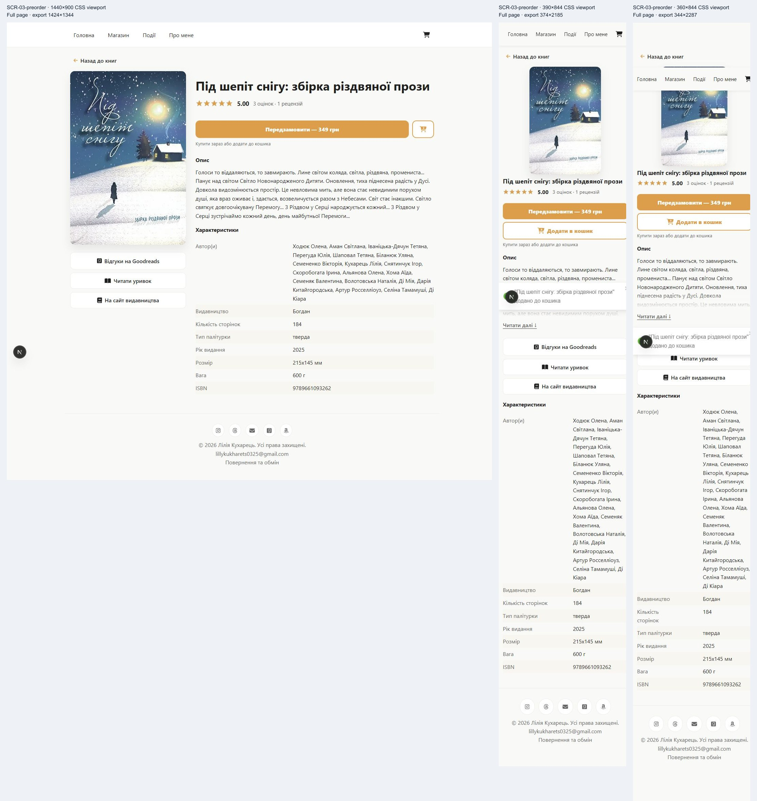

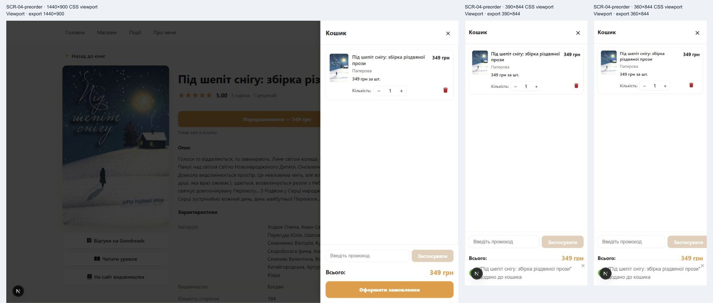

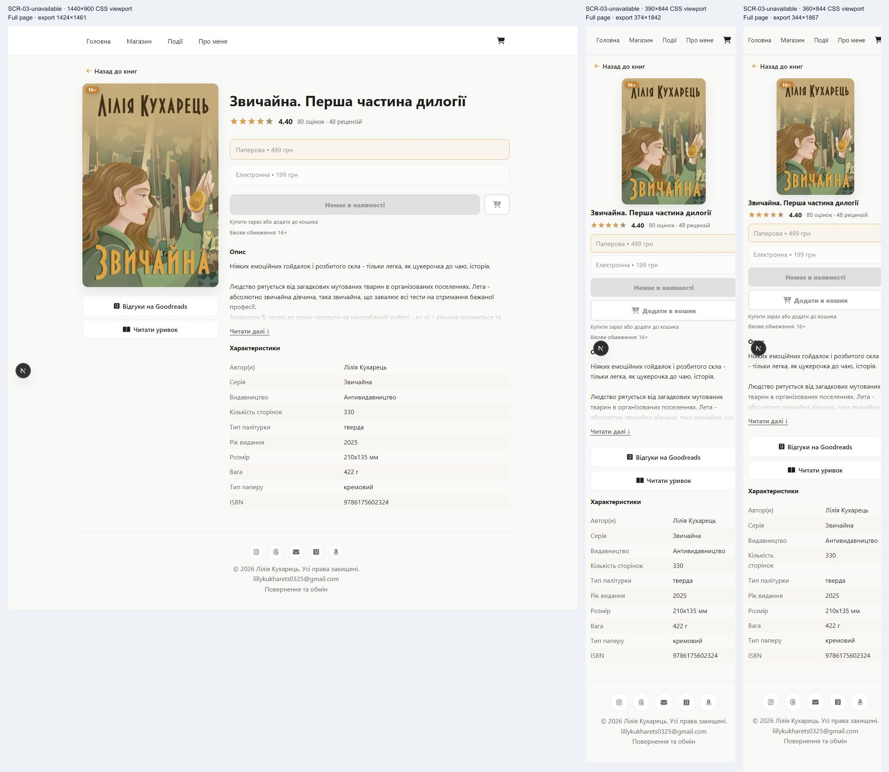

### Purchase actions and suggestions

#### F-BOOK-002 — Suggestion adds an unavailable item that its detail page cannot sell

**P1 · confirmed defect** · proposed; screen review required

Screens: SCR-03-merch-unavailable, SCR-03-suggestion-unavailable, SCR-04-unavailable-suggestion. Routes: /books/inaksha, /books/inaksha-art. Devices: desktop 1440x900, mobile 390x844, narrow mobile 360x844. Scenario: suggestion-unavailable.

1. Set suggestion-unavailable and invalidate inaksha and inaksha-art.
2. Open the postcard detail page and confirm unavailable purchase actions.
3. Open Inaksha, choose paper 550 and press Buy.
4. Press 'Додати до кошика' in the suggested-postcards dialog and inspect the cart.

**Actual:** The postcard edition has isAvailable=false and canPreorder=false. Its own purchase actions disable, but the suggestion still displays an enabled add action at 299 UAH. Adding it opens a cart containing paper Inaksha 550 and unavailable postcards 299, total 849 UAH, without an availability warning.

**Expected:** The suggestion follows the same edition eligibility rules as the detail page and cannot add an unavailable, non-preorder item.

**Customer impact:** Customers can select an offer the shop cannot fulfill and encounter a later checkout rejection or misleading stock expectations.

**Proposed improvement:** Review suppressing unavailable suggestions or displaying an explicit unavailable state; validate the exact suggested edition before adding it.

**Limits:** Selection and cart acceptance reproduced at all widths. No checkout or invoice was submitted; backend fulfillment or rejection is not claimed.

**Related discovery findings:** none.

**Evidence:** [paired/SCR-03-merch-unavailable.jpg](paired/SCR-03-merch-unavailable.jpg) · [paired/SCR-03-suggestion-unavailable.jpg](paired/SCR-03-suggestion-unavailable.jpg) · [paired/SCR-04-unavailable-suggestion.jpg](paired/SCR-04-unavailable-suggestion.jpg) · `checks.json#SUGGESTION-UNAVAILABLE-1440` · `checks.json#SUGGESTION-UNAVAILABLE-390` · `checks.json#SUGGESTION-UNAVAILABLE-360` · `checks.json#SUGGESTION-UNAVAILABLE-CART-390` · [../../src/components/molecules/SuggestionDialog.tsx](../../src/components/molecules/SuggestionDialog.tsx)

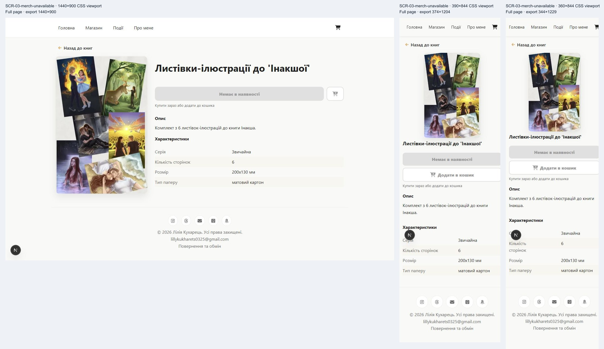

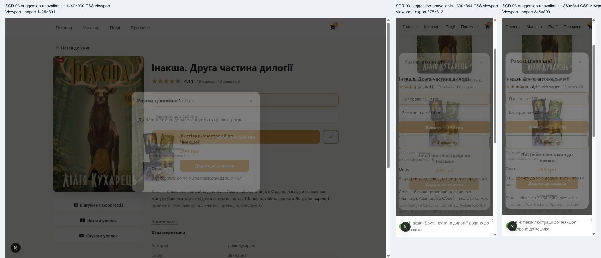

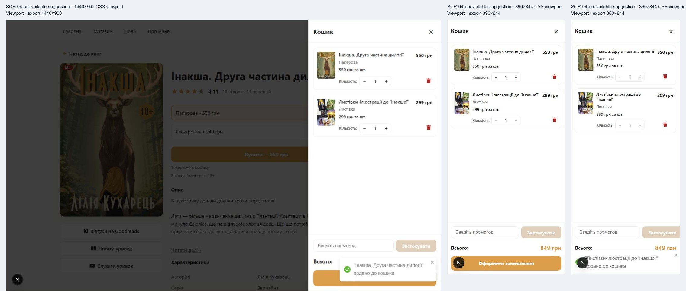

#### F-BOOK-004 — Declining the optional suggestion interrupts the Buy journey

**P2 · usability hypothesis** · proposed; screen review required

Screens: SCR-03-suggestion, SCR-03-sequel, SCR-03-bundle. Routes: /books/inaksha, /books/zvychajna-and-inaksha. Devices: desktop 1440x900, mobile 390x844, narrow mobile 360x844. Scenario: normal; empty cart.

1. Open Inaksha or the bundle with empty cart.
2. Choose the paper offer and press Buy.
3. Dismiss 'Разом цікавіше?' using Close or Escape.
4. Inspect whether cart review continues and open the cart manually.

**Actual:** The book is added before the suggestion appears. The dialog has Close, Add and Details, but no explicit continue-without-postcards action. Dismissal returns focus to Buy and leaves the cart closed. Other tested Buy actions open the cart directly; the cart is still reachable manually.

**Expected:** Declining an optional add-on clearly continues the purchase intent and explains that the original book is already selected.

**Customer impact:** Customers may think the purchase was cancelled, hesitate, or repeat Buy to discover the next step. Abandonment was not measured.

**Proposed improvement:** Review an explicit 'continue without' action, confirmation of the selected book, and continuation to cart after declining a suggestion during Buy.

**Limits:** The transition is observed; the customer impact is a hypothesis. The original book remains in cart and no duplicate quantity was added by repeated detail-page Add.

**Related discovery findings:** none.

**Evidence:** [paired/SCR-03-suggestion.jpg](paired/SCR-03-suggestion.jpg) · `checks.json#J-MOBILE-SUGGESTION` · `checks.json#J-MOBILE-CART` · `checks.json#SUGGESTION-DISMISS-1440` · `checks.json#SUGGESTION-DISMISS-390` · `checks.json#SUGGESTION-DISMISS-360` · [../../src/components/organisms/BookDetail.tsx](../../src/components/organisms/BookDetail.tsx)

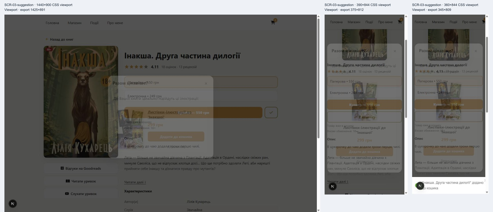

### Offer content and mobile layout

#### F-BOOK-005 — Electronic selection does not explain the delivered file or reading requirements

**P2 · usability hypothesis** · proposed; screen review required

Screens: SCR-03-digital, SCR-03-sequel-digital, SCR-04-digital. Routes: /books/zvychajna, /books/inaksha. Devices: desktop 1440x900, mobile 390x844, narrow mobile 360x844. Scenario: normal.

1. Choose the electronic edition of Zvychajna or Inaksha.
2. Read the description, purchase hints and specifications.
3. Buy the electronic edition and inspect its cart line.

**Actual:** The selected radio, purchase price and cart format clearly say electronic. The page still shows physical specifications (hard cover, paper, dimensions and, for Zvychajna, weight). It provides no visible EPUB/file type, compatible reader, delivery method or timing explanation before cart entry. Backend delivery uses watermarked EPUB attachments; that source fact is not a tested delivery outcome.

**Expected:** The electronic offer explains what is supplied and how it will be received/read; print-only specifications are clearly qualified.

**Customer impact:** Customers may be uncertain whether their device can read the purchase or whether a physical book is involved. Wrong-format purchases were not observed.

**Proposed improvement:** Review edition-specific supporting information based on verified delivery contracts, with print specifications labelled separately.

**Limits:** Correct edition IDs and prices reached the cart. No payment, email delivery or reader compatibility was exercised.

**Related discovery findings:** none.

**Evidence:** [paired/SCR-03-digital.jpg](paired/SCR-03-digital.jpg) · [paired/SCR-04-digital.jpg](paired/SCR-04-digital.jpg) · `checks.json#DIGITAL-1440` · `checks.json#DIGITAL-390` · `checks.json#DIGITAL-360` · [../../src/components/organisms/BookDetail.tsx](../../src/components/organisms/BookDetail.tsx)

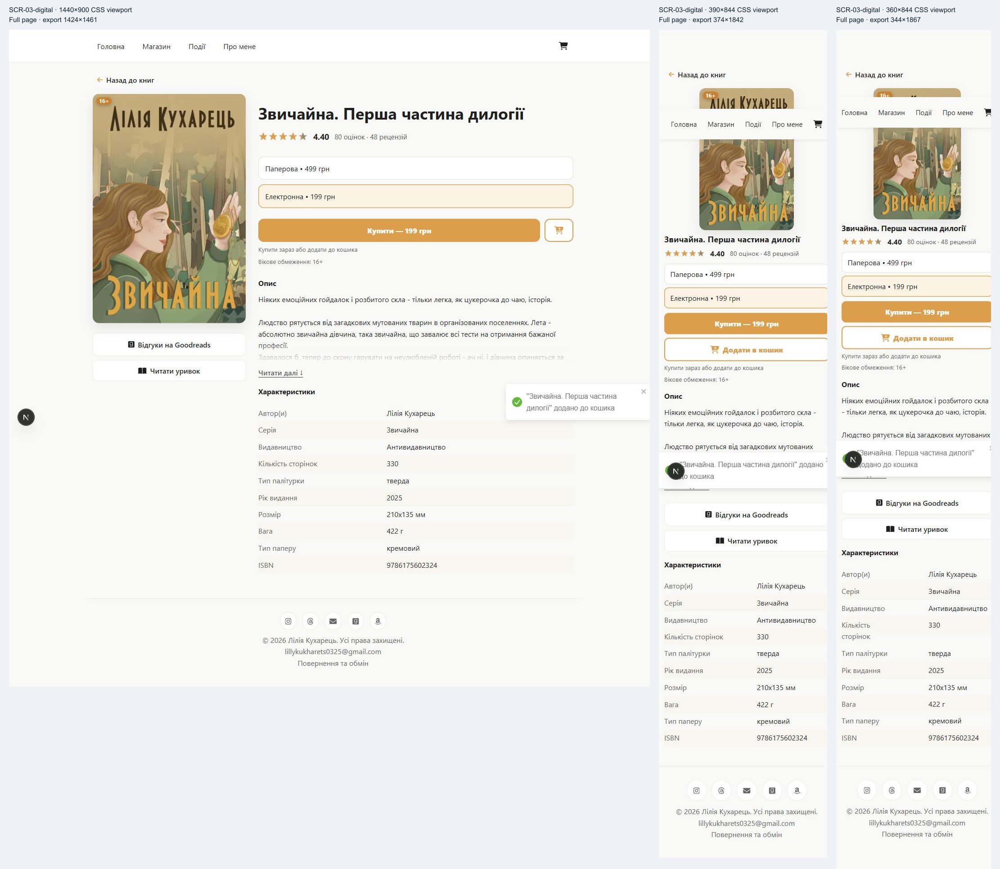

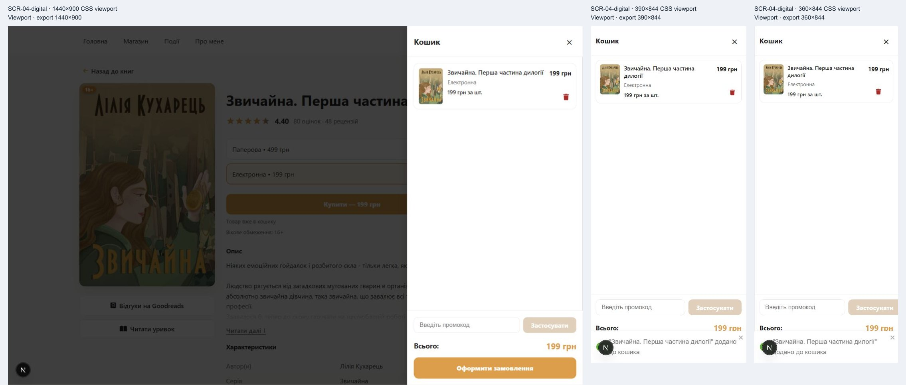

#### F-BOOK-006 — Mobile sampling follows the description and leaves purchase actions above the reading position

**P2 · usability hypothesis** · proposed; screen review required

Screens: SCR-03-paper, SCR-03-collection-expanded, SCR-03-excerpt. Routes: /books/zvychajna, /books/brunette-stories. Devices: mobile 390x844, narrow mobile 360x844, desktop 1440x900 compared. Scenario: normal.

1. Open a book at 390x844 and 360x844.
2. Locate the format and purchase actions, expand the description and find Read excerpt.
3. Compare desktop's under-cover excerpt action; scroll the mobile page after reading.

**Actual:** Mobile places the cover before the title, then formats, purchase actions and description; cover actions including the excerpt move below the description. Long descriptions expand and wrap successfully. The title drops from 36px desktop to 18.4px at 390 and 16.8px at 360. Purchase actions are not sticky, while navigation/cart remain available during scrolling.

**Expected:** Customers can find a sample before committing and easily resume purchasing after reading; title and offer hierarchy remain clear on narrow screens.

**Customer impact:** Readers may overlook the sample or need extra scrolling to resume a format-specific purchase. No customer study or physical-touch observation confirms this impact.

**Proposed improvement:** Review placing a sample link near the initial offer and a clear return-to-purchase path after reading; compare a compact mobile hierarchy before deciding on any sticky purchase control.

**Limits:** All tested actions remain reachable. No initial normal-size document overflow was measured; future longer titles and enlarged-text layouts remain unverified.

**Related discovery findings:** F-DISC-006.

**Evidence:** [paired/SCR-03-paper.jpg](paired/SCR-03-paper.jpg) · [paired/SCR-03-collection-expanded.jpg](paired/SCR-03-collection-expanded.jpg) · [paired/SCR-03-excerpt.jpg](paired/SCR-03-excerpt.jpg) · `checks.json#PAPER-390` · `checks.json#PAPER-360` · `checks.json#STICKY-SCROLLED-MOBILE` · `checks.json#STICKY-SCROLLED-NARROW` · [../../src/components/organisms/BookDetail.module.css](../../src/components/organisms/BookDetail.module.css)

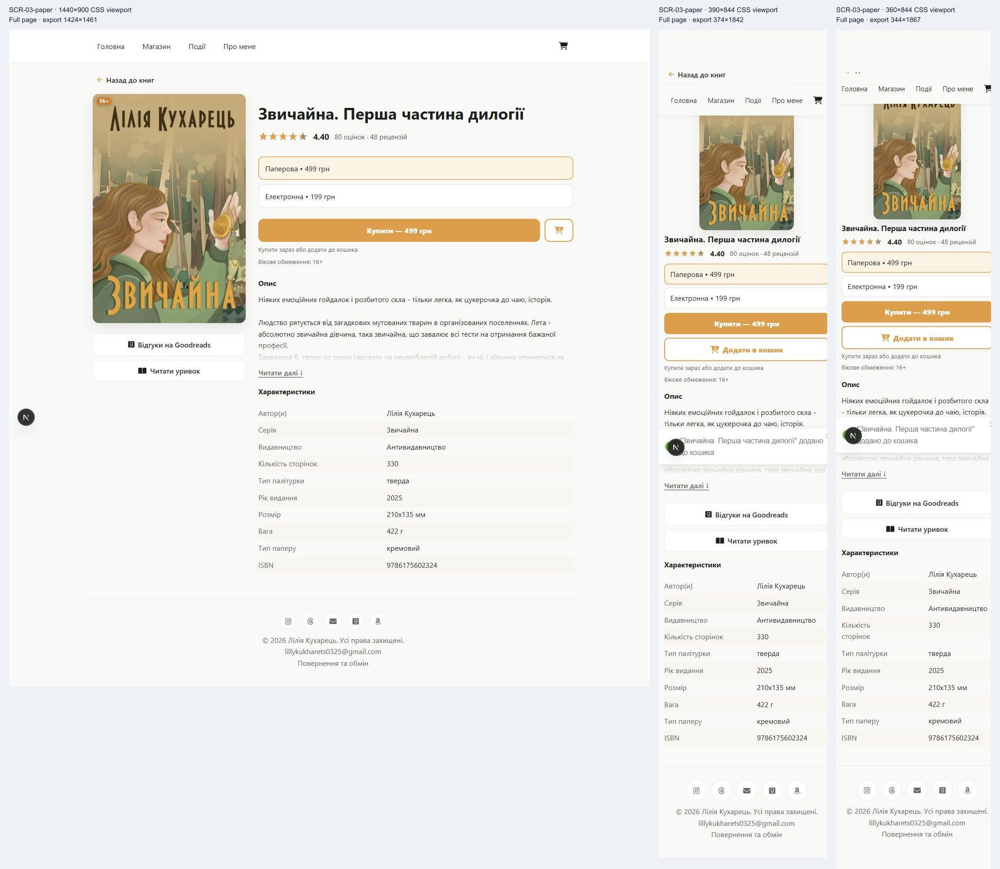

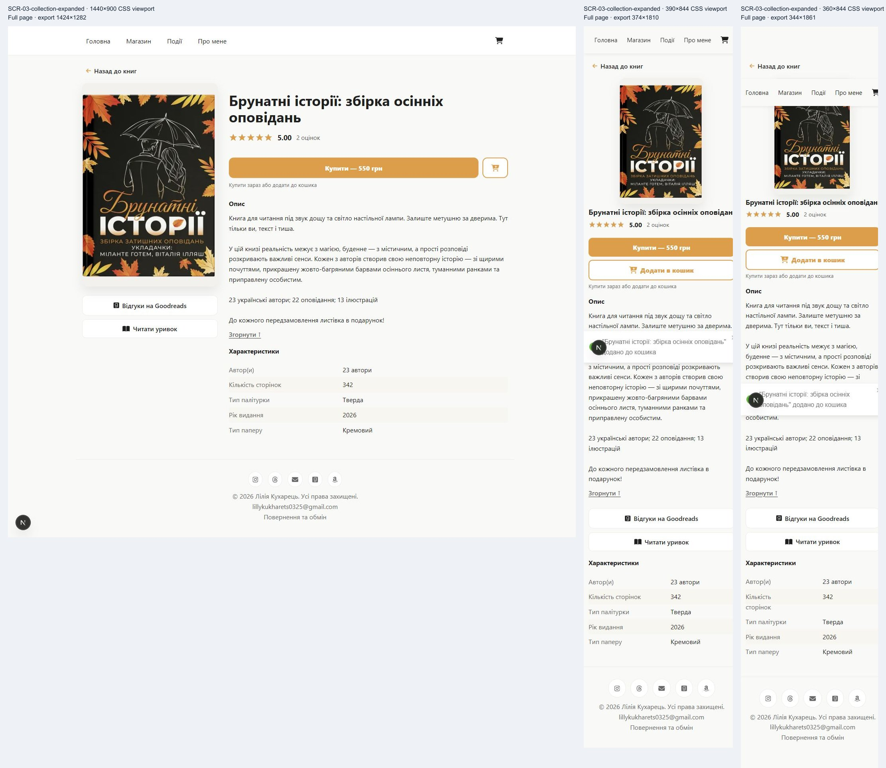

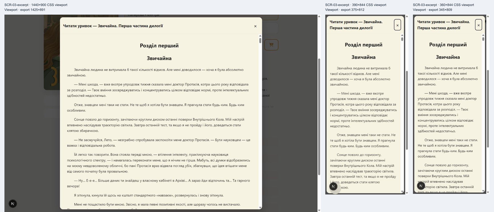

### Shared accessibility

#### F-BOOK-007 — Purchase labels retain the accepted low-contrast brand treatment

**P2 · confirmed defect** · existing accepted exception; screen decision required before changes

Screens: SCR-03-paper, SCR-03-suggestion. Routes: /books/zvychajna, /books/inaksha. Devices: desktop 1440x900, mobile 390x844, narrow mobile 360x844. Scenario: normal.

1. Inspect enabled Buy and Add labels and the suggested-item price.
2. Compare their computed white/accent colors with WCAG relative-luminance thresholds and ACCESSIBILITY.md.

**Actual:** Buy uses 16px white text on #f09b30, approximately 2.23:1; accent-colored Add text on white has the same ratio. This is the deliberately accepted palette exception documented in ACCESSIBILITY.md. Existing axe scans skip color-contrast.

**Expected:** Normal-size labels meet 4.5:1, or the owner retains the explicitly acknowledged accessibility debt when reviewing these screens.

**Customer impact:** Customers with reduced contrast sensitivity may struggle to read purchase actions or the add-on price.

**Proposed improvement:** Consolidate with the accepted discovery contrast exception. Reopen treatment only through owner screen review; preserve the current accent pending that decision.

**Limits:** This is an existing accepted exception, not a newly approved change. Disabled actions are excluded from the contrast finding. No physical-screen sunlight check was performed.

**Related discovery findings:** F-DISC-007.

**Evidence:** [paired/SCR-03-paper.jpg](paired/SCR-03-paper.jpg) · `checks.json#READABILITY-390` · `checks.json#PAPER-1440` · `checks.json#PAPER-360` · [../../ACCESSIBILITY.md](../../ACCESSIBILITY.md)


#### F-BOOK-008 — Format focus rings are present but faint against the page

**P2 · confirmed defect** · proposed; screen review required

Screens: SCR-03-format-focus. Routes: /books/zvychajna. Devices: desktop 1440x900, mobile 390x844, narrow mobile 360x844. Scenario: normal.

1. Reach format radios using Tab, then select paper with ArrowUp.
2. Inspect the label's computed focus outline at all widths.
3. Composite rgba(240,155,48,0.55) over the adjacent #faf9f7 page and compare with the 3:1 non-text contrast criterion.

**Actual:** Native radios work with arrow keys and the label paints a focus outline, but the authored semi-transparent accent outline has less than 3:1 contrast against the page. The focus styling follows the same faint-ring pattern already reported in discovery.

**Expected:** The focus indicator is distinguishable against adjacent surfaces, including for customers with reduced contrast sensitivity.

**Customer impact:** A keyboard user may lose track of the active edition despite the controls being keyboard operable.

**Proposed improvement:** Consolidate the focus-ring treatment with F-DISC-008 and review a stronger indicator across selectors and shared controls.

**Limits:** Keyboard operation and restoration succeeded. This is separate from the accepted CTA text palette exception; presence-only regression assertions do not establish sufficient contrast.

**Related discovery findings:** F-DISC-008.

**Evidence:** [paired/SCR-03-format-focus.jpg](paired/SCR-03-format-focus.jpg) · `checks.json#FORMAT-KEYBOARD-1440` · `checks.json#FORMAT-KEYBOARD-390` · `checks.json#FORMAT-KEYBOARD-360` · [../../src/components/organisms/BookDetail.module.css](../../src/components/organisms/BookDetail.module.css)


## Generated evidence inventory

- [screenshots/SCR-03-bundle-1440x900-full.jpg](screenshots/SCR-03-bundle-1440x900-full.jpg)
- [screenshots/SCR-03-bundle-360x844-full.jpg](screenshots/SCR-03-bundle-360x844-full.jpg)
- [screenshots/SCR-03-bundle-390x844-full.jpg](screenshots/SCR-03-bundle-390x844-full.jpg)
- [screenshots/SCR-03-collection-1440x900-full.jpg](screenshots/SCR-03-collection-1440x900-full.jpg)
- [screenshots/SCR-03-collection-360x844-full.jpg](screenshots/SCR-03-collection-360x844-full.jpg)
- [screenshots/SCR-03-collection-390x844-full.jpg](screenshots/SCR-03-collection-390x844-full.jpg)
- [screenshots/SCR-03-collection-expanded-1440x900-full.jpg](screenshots/SCR-03-collection-expanded-1440x900-full.jpg)
- [screenshots/SCR-03-collection-expanded-360x844-full.jpg](screenshots/SCR-03-collection-expanded-360x844-full.jpg)
- [screenshots/SCR-03-collection-expanded-390x844-full.jpg](screenshots/SCR-03-collection-expanded-390x844-full.jpg)
- [screenshots/SCR-03-digital-1440x900-full.jpg](screenshots/SCR-03-digital-1440x900-full.jpg)
- [screenshots/SCR-03-digital-360x844-full.jpg](screenshots/SCR-03-digital-360x844-full.jpg)
- [screenshots/SCR-03-digital-390x844-full.jpg](screenshots/SCR-03-digital-390x844-full.jpg)
- [screenshots/SCR-03-discount-digital-1440x900-full.jpg](screenshots/SCR-03-discount-digital-1440x900-full.jpg)
- [screenshots/SCR-03-discount-digital-360x844-full.jpg](screenshots/SCR-03-discount-digital-360x844-full.jpg)
- [screenshots/SCR-03-discount-digital-390x844-full.jpg](screenshots/SCR-03-discount-digital-390x844-full.jpg)
- [screenshots/SCR-03-discount-paper-1440x900-full.jpg](screenshots/SCR-03-discount-paper-1440x900-full.jpg)
- [screenshots/SCR-03-discount-paper-360x844-full.jpg](screenshots/SCR-03-discount-paper-360x844-full.jpg)
- [screenshots/SCR-03-discount-paper-390x844-full.jpg](screenshots/SCR-03-discount-paper-390x844-full.jpg)
- [screenshots/SCR-03-excerpt-1440x900.jpg](screenshots/SCR-03-excerpt-1440x900.jpg)
- [screenshots/SCR-03-excerpt-360x844.jpg](screenshots/SCR-03-excerpt-360x844.jpg)
- [screenshots/SCR-03-excerpt-390x844.jpg](screenshots/SCR-03-excerpt-390x844.jpg)
- [screenshots/SCR-03-format-focus-1440x900.jpg](screenshots/SCR-03-format-focus-1440x900.jpg)
- [screenshots/SCR-03-format-focus-360x844.jpg](screenshots/SCR-03-format-focus-360x844.jpg)
- [screenshots/SCR-03-format-focus-390x844.jpg](screenshots/SCR-03-format-focus-390x844.jpg)
- [screenshots/SCR-03-gallery-1440x900.jpg](screenshots/SCR-03-gallery-1440x900.jpg)
- [screenshots/SCR-03-gallery-360x844.jpg](screenshots/SCR-03-gallery-360x844.jpg)
- [screenshots/SCR-03-gallery-390x844.jpg](screenshots/SCR-03-gallery-390x844.jpg)
- [screenshots/SCR-03-merch-1440x900-full.jpg](screenshots/SCR-03-merch-1440x900-full.jpg)
- [screenshots/SCR-03-merch-360x844-full.jpg](screenshots/SCR-03-merch-360x844-full.jpg)
- [screenshots/SCR-03-merch-390x844-full.jpg](screenshots/SCR-03-merch-390x844-full.jpg)
- [screenshots/SCR-03-merch-unavailable-1440x900-full.jpg](screenshots/SCR-03-merch-unavailable-1440x900-full.jpg)
- [screenshots/SCR-03-merch-unavailable-360x844-full.jpg](screenshots/SCR-03-merch-unavailable-360x844-full.jpg)
- [screenshots/SCR-03-merch-unavailable-390x844-full.jpg](screenshots/SCR-03-merch-unavailable-390x844-full.jpg)
- [screenshots/SCR-03-paper-1440x900-full.jpg](screenshots/SCR-03-paper-1440x900-full.jpg)
- [screenshots/SCR-03-paper-360x844-full.jpg](screenshots/SCR-03-paper-360x844-full.jpg)
- [screenshots/SCR-03-paper-390x844-full.jpg](screenshots/SCR-03-paper-390x844-full.jpg)
- [screenshots/SCR-03-paper-unavailable-1440x900-full.jpg](screenshots/SCR-03-paper-unavailable-1440x900-full.jpg)
- [screenshots/SCR-03-paper-unavailable-360x844-full.jpg](screenshots/SCR-03-paper-unavailable-360x844-full.jpg)
- [screenshots/SCR-03-paper-unavailable-390x844-full.jpg](screenshots/SCR-03-paper-unavailable-390x844-full.jpg)
- [screenshots/SCR-03-preorder-1440x900-full.jpg](screenshots/SCR-03-preorder-1440x900-full.jpg)
- [screenshots/SCR-03-preorder-360x844-full.jpg](screenshots/SCR-03-preorder-360x844-full.jpg)
- [screenshots/SCR-03-preorder-390x844-full.jpg](screenshots/SCR-03-preorder-390x844-full.jpg)
- [screenshots/SCR-03-sequel-1440x900-full.jpg](screenshots/SCR-03-sequel-1440x900-full.jpg)
- [screenshots/SCR-03-sequel-360x844-full.jpg](screenshots/SCR-03-sequel-360x844-full.jpg)
- [screenshots/SCR-03-sequel-390x844-full.jpg](screenshots/SCR-03-sequel-390x844-full.jpg)
- [screenshots/SCR-03-sequel-digital-1440x900-full.jpg](screenshots/SCR-03-sequel-digital-1440x900-full.jpg)
- [screenshots/SCR-03-sequel-digital-360x844-full.jpg](screenshots/SCR-03-sequel-digital-360x844-full.jpg)
- [screenshots/SCR-03-sequel-digital-390x844-full.jpg](screenshots/SCR-03-sequel-digital-390x844-full.jpg)
- [screenshots/SCR-03-slow-arrival-1440x900.jpg](screenshots/SCR-03-slow-arrival-1440x900.jpg)
- [screenshots/SCR-03-slow-arrival-360x844.jpg](screenshots/SCR-03-slow-arrival-360x844.jpg)
- [screenshots/SCR-03-slow-arrival-390x844.jpg](screenshots/SCR-03-slow-arrival-390x844.jpg)
- [screenshots/SCR-03-suggestion-1440x900.jpg](screenshots/SCR-03-suggestion-1440x900.jpg)
- [screenshots/SCR-03-suggestion-360x844.jpg](screenshots/SCR-03-suggestion-360x844.jpg)
- [screenshots/SCR-03-suggestion-390x844.jpg](screenshots/SCR-03-suggestion-390x844.jpg)
- [screenshots/SCR-03-suggestion-unavailable-1440x900.jpg](screenshots/SCR-03-suggestion-unavailable-1440x900.jpg)
- [screenshots/SCR-03-suggestion-unavailable-360x844.jpg](screenshots/SCR-03-suggestion-unavailable-360x844.jpg)
- [screenshots/SCR-03-suggestion-unavailable-390x844.jpg](screenshots/SCR-03-suggestion-unavailable-390x844.jpg)
- [screenshots/SCR-03-unavailable-1440x900-full.jpg](screenshots/SCR-03-unavailable-1440x900-full.jpg)
- [screenshots/SCR-03-unavailable-360x844-full.jpg](screenshots/SCR-03-unavailable-360x844-full.jpg)
- [screenshots/SCR-03-unavailable-390x844-full.jpg](screenshots/SCR-03-unavailable-390x844-full.jpg)
- [screenshots/SCR-04-digital-1440x900.jpg](screenshots/SCR-04-digital-1440x900.jpg)
- [screenshots/SCR-04-digital-360x844.jpg](screenshots/SCR-04-digital-360x844.jpg)
- [screenshots/SCR-04-digital-390x844.jpg](screenshots/SCR-04-digital-390x844.jpg)
- [screenshots/SCR-04-paper-1440x900.jpg](screenshots/SCR-04-paper-1440x900.jpg)
- [screenshots/SCR-04-paper-360x844.jpg](screenshots/SCR-04-paper-360x844.jpg)
- [screenshots/SCR-04-paper-390x844.jpg](screenshots/SCR-04-paper-390x844.jpg)
- [screenshots/SCR-04-preorder-1440x900.jpg](screenshots/SCR-04-preorder-1440x900.jpg)
- [screenshots/SCR-04-preorder-360x844.jpg](screenshots/SCR-04-preorder-360x844.jpg)
- [screenshots/SCR-04-preorder-390x844.jpg](screenshots/SCR-04-preorder-390x844.jpg)
- [screenshots/SCR-04-unavailable-suggestion-1440x900.jpg](screenshots/SCR-04-unavailable-suggestion-1440x900.jpg)
- [screenshots/SCR-04-unavailable-suggestion-360x844.jpg](screenshots/SCR-04-unavailable-suggestion-360x844.jpg)
- [screenshots/SCR-04-unavailable-suggestion-390x844.jpg](screenshots/SCR-04-unavailable-suggestion-390x844.jpg)
- [screenshots/SCR-10-error-1440x900.jpg](screenshots/SCR-10-error-1440x900.jpg)
- [screenshots/SCR-10-error-360x844.jpg](screenshots/SCR-10-error-360x844.jpg)
- [screenshots/SCR-10-error-390x844.jpg](screenshots/SCR-10-error-390x844.jpg)
- [screenshots/SCR-10-not-found-1440x900.jpg](screenshots/SCR-10-not-found-1440x900.jpg)
- [screenshots/SCR-10-not-found-360x844.jpg](screenshots/SCR-10-not-found-360x844.jpg)
- [screenshots/SCR-10-not-found-390x844.jpg](screenshots/SCR-10-not-found-390x844.jpg)
- [screenshots/SCR-10-recovered-1440x900.jpg](screenshots/SCR-10-recovered-1440x900.jpg)
- [screenshots/SCR-10-recovered-360x844.jpg](screenshots/SCR-10-recovered-360x844.jpg)
- [screenshots/SCR-10-recovered-390x844.jpg](screenshots/SCR-10-recovered-390x844.jpg)
- [paired/SCR-03-bundle.jpg](paired/SCR-03-bundle.jpg)
- [paired/SCR-03-collection.jpg](paired/SCR-03-collection.jpg)
- [paired/SCR-03-collection-expanded.jpg](paired/SCR-03-collection-expanded.jpg)
- [paired/SCR-03-digital.jpg](paired/SCR-03-digital.jpg)
- [paired/SCR-03-discount-digital.jpg](paired/SCR-03-discount-digital.jpg)
- [paired/SCR-03-discount-paper.jpg](paired/SCR-03-discount-paper.jpg)
- [paired/SCR-03-excerpt.jpg](paired/SCR-03-excerpt.jpg)
- [paired/SCR-03-format-focus.jpg](paired/SCR-03-format-focus.jpg)
- [paired/SCR-03-gallery.jpg](paired/SCR-03-gallery.jpg)
- [paired/SCR-03-merch.jpg](paired/SCR-03-merch.jpg)
- [paired/SCR-03-merch-unavailable.jpg](paired/SCR-03-merch-unavailable.jpg)
- [paired/SCR-03-paper.jpg](paired/SCR-03-paper.jpg)
- [paired/SCR-03-paper-unavailable.jpg](paired/SCR-03-paper-unavailable.jpg)
- [paired/SCR-03-preorder.jpg](paired/SCR-03-preorder.jpg)
- [paired/SCR-03-sequel.jpg](paired/SCR-03-sequel.jpg)
- [paired/SCR-03-sequel-digital.jpg](paired/SCR-03-sequel-digital.jpg)
- [paired/SCR-03-slow-arrival.jpg](paired/SCR-03-slow-arrival.jpg)
- [paired/SCR-03-suggestion.jpg](paired/SCR-03-suggestion.jpg)
- [paired/SCR-03-suggestion-unavailable.jpg](paired/SCR-03-suggestion-unavailable.jpg)
- [paired/SCR-03-unavailable.jpg](paired/SCR-03-unavailable.jpg)
- [paired/SCR-04-digital.jpg](paired/SCR-04-digital.jpg)
- [paired/SCR-04-paper.jpg](paired/SCR-04-paper.jpg)
- [paired/SCR-04-preorder.jpg](paired/SCR-04-preorder.jpg)
- [paired/SCR-04-unavailable-suggestion.jpg](paired/SCR-04-unavailable-suggestion.jpg)
- [paired/SCR-10-error.jpg](paired/SCR-10-error.jpg)
- [paired/SCR-10-not-found.jpg](paired/SCR-10-not-found.jpg)
- [paired/SCR-10-recovered.jpg](paired/SCR-10-recovered.jpg)
- [qa/contact-1.jpg](qa/contact-1.jpg)
- [qa/contact-2.jpg](qa/contact-2.jpg)
- [qa/contact-3.jpg](qa/contact-3.jpg)
- [qa/contact-4.jpg](qa/contact-4.jpg)
- [qa/contact-5.jpg](qa/contact-5.jpg)
